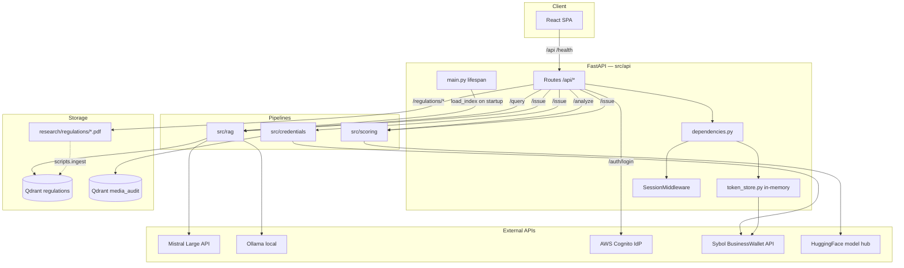
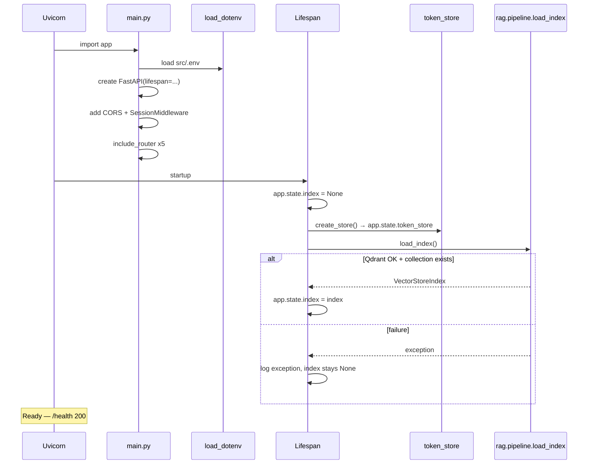
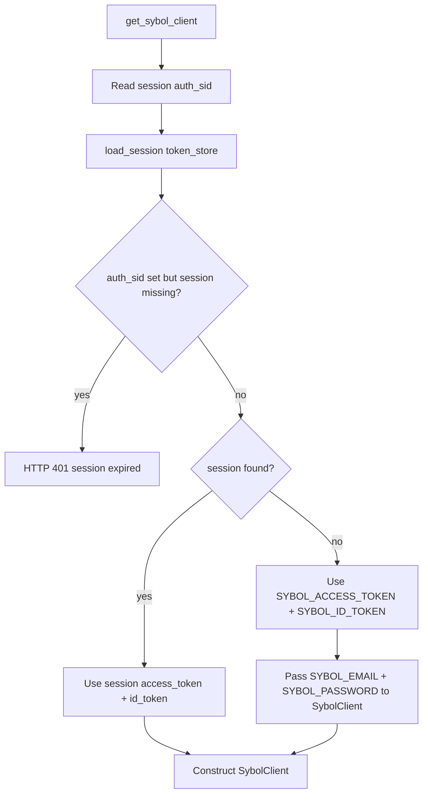
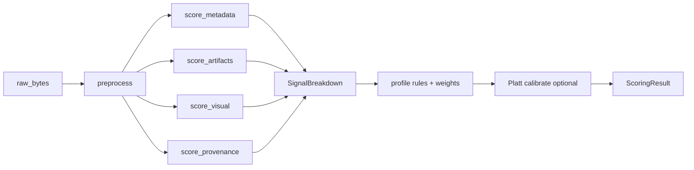
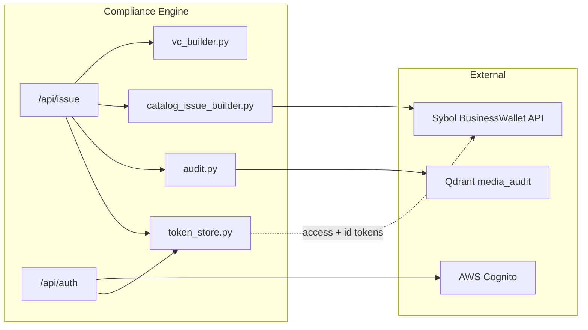
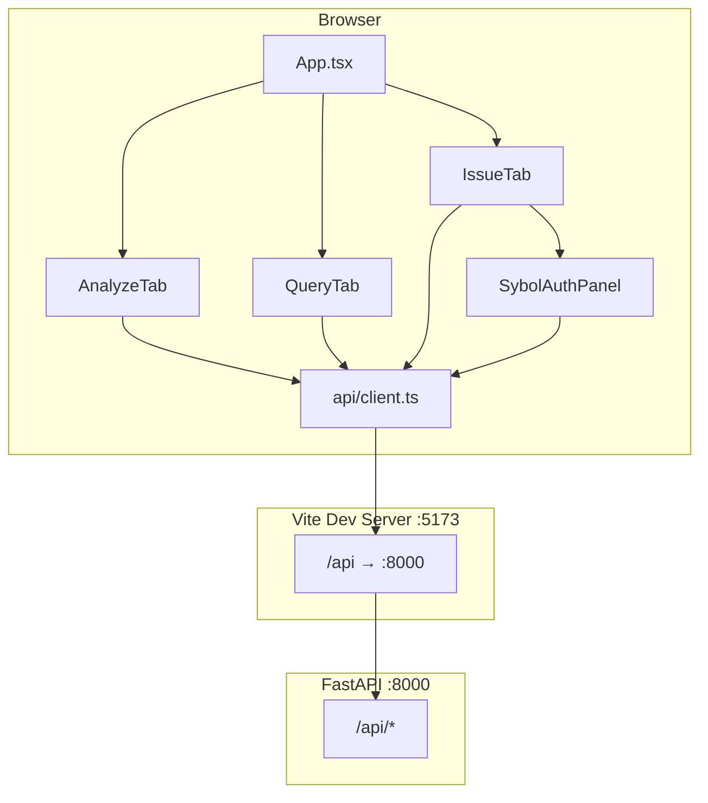
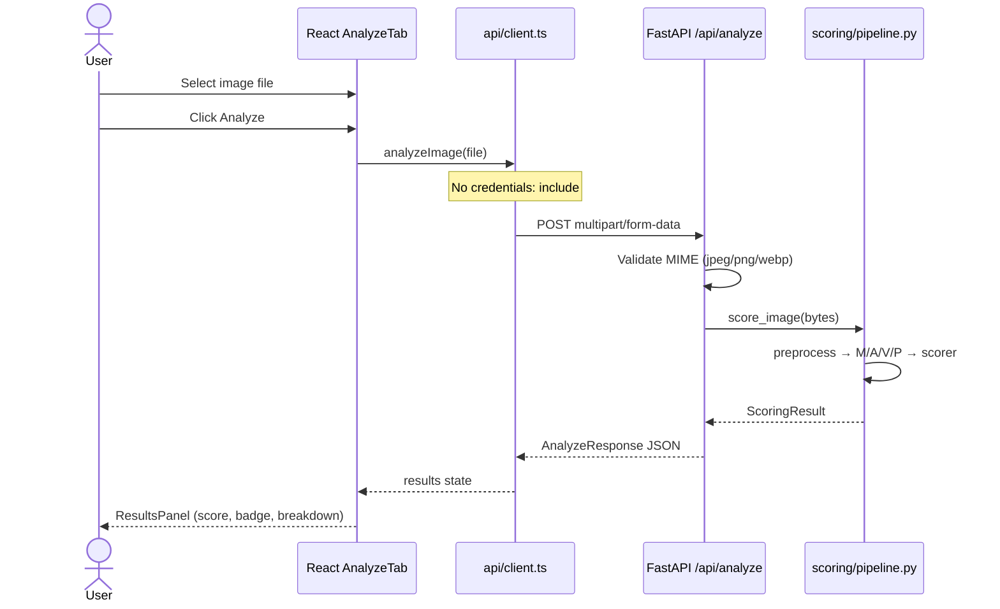
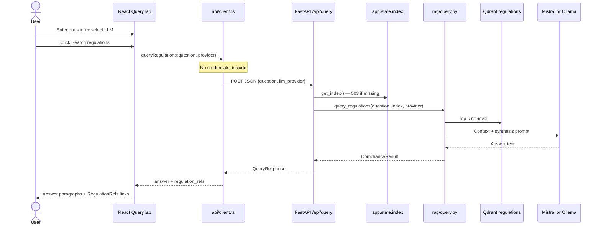
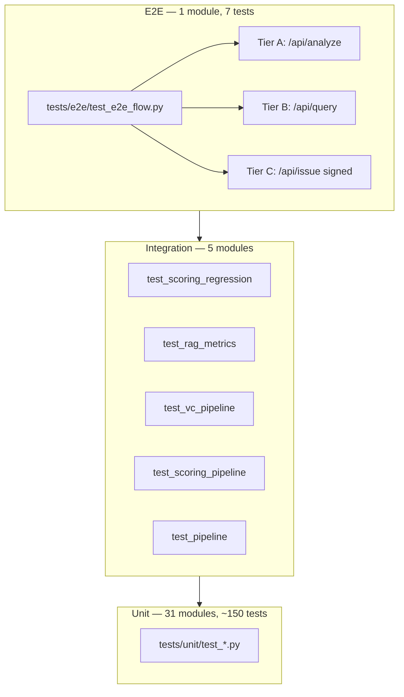
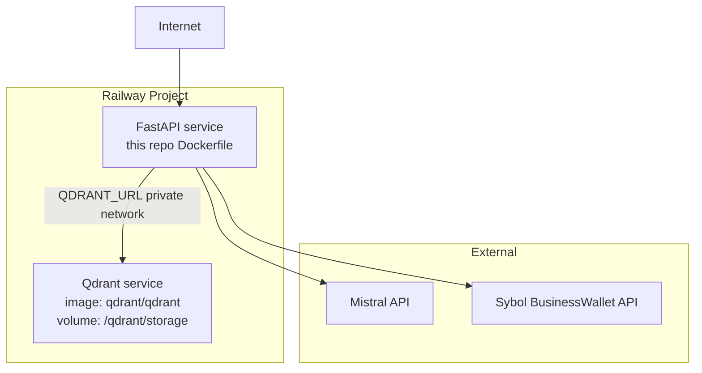

# Sybol Compliance Engine — Technical Reference

> **Canonical technical encyclopedia** for the IEU Labs × Sybol media compliance engine.  
> Documents **actual code behavior** as implemented in this repository.  
> Operational runbooks remain in companion docs — this guide explains *how everything works*.

**Last verified:** June 25, 2026 against the `devel` branch worktree.

---

## Document conventions

| Convention | Meaning |
|---|---|
| **Paths** | File paths are relative to the repository root unless noted (e.g. `src/api/main.py`). Links from this file use `../` to reach repo-root assets. |
| **API fields** | snake_case on JSON wire keys (`authenticity_score`, `llm_provider`) unless noted; W3C VC `credentialSubject` uses camelCase (`mediaHash`, `scoreBreakdown`). |
| **Signals** | **M**etadata, **A**rtifacts, **V**isual, **P**rovenance — abbreviated M/A/V/P in tables and diagrams. |
| **Env vars** | Canonical names come from `Settings` in `src/api/dependencies.py`. Stale names (`SYBOL_API_URL`) appear only in README-drift notes. |
| **Runbooks** | Step-by-step procedures live in [TESTING_GUIDE.md](TESTING_GUIDE.md), [RAILWAY_SETUP.md](RAILWAY_SETUP.md), and [INTEGRATION_AND_QA_RUNBOOK.md](INTEGRATION_AND_QA_RUNBOOK.md) — not duplicated here. |
| **Sections** | Numbered §1–66 across eleven parts; anchor links use lowercase hyphenated headings. |

---

## Table of Contents

### Part I — System Overview
1. [Purpose and Scope](#1-purpose-and-scope)
2. [Confirmed Technology Stack](#2-confirmed-technology-stack)
3. [High-Level Architecture](#3-high-level-architecture)
4. [Repository Layout](#4-repository-layout)
5. [Runtime Modes](#5-runtime-modes)

### Part II — Configuration and Boot
6. [Environment Variables](#6-environment-variables)
7. [Application Startup](#7-application-startup)
8. [Poetry Packaging](#8-poetry-packaging)
9. [Middleware Stack](#9-middleware-stack)

### Part III — API Layer
10. [Route Inventory](#10-route-inventory)
11. [dependencies.py](#11-dependenciespy)
12. [Per-Route Deep Dives](#12-per-route-deep-dives)
13. [Error Model](#13-error-model)
14. [OpenAPI](#14-openapi)

### Part IV — Scoring Pipeline
15. [Pipeline Orchestration](#15-pipeline-orchestration)
16. [Preprocessing](#16-preprocessing)
17. [Signal M — Metadata](#17-signal-m--metadata)
18. [Signal A — Artifacts](#18-signal-a--artifacts)
19. [Signal V — Visual](#19-signal-v--visual)
20. [Signal P — Provenance](#20-signal-p--provenance)
21. [Scoring Engine](#21-scoring-engine)
22. [Data Models](#22-data-models)
23. [Golden Dataset](#23-golden-dataset)

### Part V — RAG Compliance Engine
24. [Ingestion](#24-ingestion)
25. [Indexing](#25-indexing)
26. [Retrieval and Synthesis](#26-retrieval-and-synthesis)
27. [LLM Providers](#27-llm-providers)
28. [Pipeline Facade](#28-pipeline-facade)
29. [Regulation URLs](#29-regulation-urls)
30. [RAG Evaluation](#30-rag-evaluation)

### Part VI — Credentials and Sybol Integration
31. [W3C VC Payload](#31-w3c-vc-payload)
32. [Catalog Issue Builder](#32-catalog-issue-builder)
33. [Sybol HTTP Client](#33-sybol-http-client)
34. [Authentication Tokens](#34-authentication-tokens)
35. [Session Store](#35-session-store)
36. [Audit Trail](#36-audit-trail)
37. [Sybol Platform Context](#37-sybol-platform-context)
38. [CLI Discovery Scripts](#38-cli-discovery-scripts)

### Part VII — Frontend
39. [Stack and Build](#39-stack-and-build)
40. [App Shell](#40-app-shell)
41. [API Client](#41-api-client)
42. [Types](#42-types)
43. [Tab Flows](#43-tab-flows)
44. [Component Catalog](#44-component-catalog)
45. [Regulation Link Resolution](#45-regulation-link-resolution)

### Part VIII — End-to-End Data Flows
46. [Analyze Flow](#46-analyze-flow)
47. [Query Flow](#47-query-flow)
48. [Issue Flow](#48-issue-flow)
49. [Auth Flow](#49-auth-flow)

### Part IX — Testing, QA, and Quality
50. [Test Pyramid](#50-test-pyramid)
51. [Fixtures](#51-fixtures)
52. [Coverage Policy](#52-coverage-policy)
53. [QA Assets](#53-qa-assets)
54. [Property Tests](#54-property-tests)
55. [VC Schema Validation](#55-vc-schema-validation)

### Part X — Infrastructure and Operations
56. [CI](#56-ci)
57. [Dockerfile](#57-dockerfile)
58. [Railway](#58-railway)
59. [Branch Policy](#59-branch-policy)
60. [Security and Privacy](#60-security-and-privacy)

### Part XI — Appendices
61. [Complete File Index](#61-complete-file-index)
62. [API Request/Response Examples](#62-api-requestresponse-examples)
63. [Dependency Matrix](#63-dependency-matrix)
64. [Known Gaps and README Drift](#64-known-gaps-and-readme-drift)
65. [Glossary](#65-glossary)
66. [Further Reading](#66-further-reading)

---


## Part I — System Overview

## 1. Purpose and Scope

The **Sybol Compliance Engine** (`sybol-compliance-engine`) is a compliance AI service built by **IEU Labs** in collaboration with **Sybol**. It evaluates uploaded media for authenticity against EU and Spanish regulatory context, and can issue a **W3C Verifiable Credential (VC)** signed through Sybol's BusinessWallet API.

The engine delivers four integrated capabilities:

| Capability | Module(s) | User-facing surface |
|---|---|---|
| **Authenticity scoring** | `src/scoring/` | `POST /api/analyze`, Issue tab (internal) |
| **Regulation RAG** | `src/rag/` | `POST /api/query`, Issue tab (internal RAG step) |
| **Audit trail** | `src/credentials/audit.py` | Issue flow only — metadata stored in Qdrant |
| **Signed VC issuance** | `src/credentials/` | `POST /api/issue`, Issue tab + Sybol auth |

Scoring is **self-contained**: `/api/analyze` does not require Qdrant, Mistral, or Sybol credentials. Query and Issue routes depend on a populated Qdrant `regulations` collection and (for synthesis) either `MISTRAL_API_KEY` or a local Ollama instance.

**README drift:** [`README.md`](../README.md) still states the Issue tab is a "placeholder until Sybol VC signing is wired up." The Issue tab and `POST /api/issue` are **live** in code (`src/api/routes/issue.py`, `frontend/src/components/IssueTab.tsx`). README also references `SYBOL_API_URL`; the actual setting is **`SYBOL_API_BASE_URL`** (`src/api/dependencies.py`).

---

## 2. Confirmed Technology Stack

Versions below are taken from [`pyproject.toml`](../pyproject.toml) and [`frontend/package.json`](../frontend/package.json).

#### Backend (Python)

| Component | Technology | Version constraint (Poetry) |
|---|---|---|
| Runtime | Python | `>=3.10,<3.14` |
| API framework | FastAPI | `>=0.110,<1.0` |
| ASGI server | Uvicorn (standard extras) | `>=0.27,<1.0` |
| Validation | Pydantic | `>=2.6,<3.0` |
| RAG orchestration | LlamaIndex | `>=0.10` |
| Vector store client | qdrant-client | `>=1.8,<2.0` |
| Embeddings | sentence-transformers / HuggingFace | `all-MiniLM-L6-v2` via `llama-index-embeddings-huggingface` |
| LLM (cloud) | Mistral Large | `mistral-large-latest` via `llama-index-llms-mistralai` |
| LLM (local) | Ollama | `qwen2.5:7b-instruct` default via `llama-index-llms-ollama` |
| Deepfake CNN | HuggingFace Transformers | `dima806/deepfake_vs_real_image_detection` |
| Vision | OpenCV (headless) | `>=4.9,<5.0` |
| EXIF | ExifRead | `>=3.0,<4.0` |
| Perceptual hash | imagehash | `>=4.3,<5.0` |
| PDF parsing | PyMuPDF (ingest path) | `>=1.24,<2.0` |
| HTTP client | httpx | `>=0.27,<1.0` |
| Sessions | Starlette SessionMiddleware + itsdangerous | via FastAPI / `itsdangerous` |
| Env loading | python-dotenv | `>=1.0,<2.0` |

#### Frontend (reference — detailed in Part VII companion doc)

| Component | Version |
|---|---|
| React | `^18.3.1` |
| TypeScript | `^5.6.3` |
| Vite | `^7.3.6` |

#### External services

| Service | Role |
|---|---|
| **Qdrant** | `regulations` vector collection (RAG); `media_audit` metadata collection (audit) |
| **Mistral API** | RAG answer synthesis when `llm_provider=mistral` |
| **Ollama** | Local RAG synthesis when `llm_provider=ollama` |
| **AWS Cognito** | Issue-tab password auth (`InitiateAuth`) |
| **Sybol BusinessWallet API** | Catalog credential signing (`POST /api/bl/credentials`) |

#### Deployment targets

| Target | Entry |
|---|---|
| Local dev | `PYTHONPATH=src uvicorn api.main:app` + Vite proxy |
| Docker | [`Dockerfile`](../Dockerfile) — Python 3.12, no frontend bake-in |
| Railway | [`railway.toml`](../railway.toml) — uvicorn on `$PORT` |

**CI note:** `pyproject.toml` sets `mypy` `python_version = "3.11"` while the Dockerfile uses **Python 3.12**.

---

## 3. High-Level Architecture

The system is layered: a React SPA (optional in dev) talks to FastAPI routes, which delegate to scoring, RAG, and credentials pipelines. External services sit behind those pipelines.



#### Request path summary

| Route | Scoring | RAG | Qdrant | LLM | Sybol | Cognito |
|---|---|---|---|---|---|---|
| `GET /health` | — | — | — | — | — | — |
| `POST /api/analyze` | ✓ | — | — | — | — | — |
| `POST /api/query` | — | ✓ | ✓ (read) | ✓ | — | — |
| `POST /api/issue` | ✓ | ✓ | ✓ (read + audit write) | ✓ | ✓ | optional (session) |
| `POST /api/auth/login` | — | — | — | — | — | ✓ |
| `GET /api/regulations/{file}` | — | — | — | — | — | — |

---

## 4. Repository Layout

Top-level directories and their roles:

| Path | Purpose |
|---|---|
| [`src/`](../src/) | All Python application code (API, scoring, RAG, credentials, CLI scripts) |
| [`src/api/`](../src/api/) | FastAPI app, routes, schemas, dependencies, token store |
| [`src/scoring/`](../src/scoring/) | Four-signal authenticity pipeline (M/A/V/P) |
| [`src/rag/`](../src/rag/) | Regulation ingest, index, query, LLM providers |
| [`src/credentials/`](../src/credentials/) | VC builder, Sybol client, Cognito, audit |
| [`src/scripts/`](../src/scripts/) | One-off CLIs: ingest, OpenAPI export, Sybol probes |
| [`frontend/`](../frontend/) | React SPA (Analyze, Query, Issue tabs) |
| [`tests/`](../tests/) | Unit, integration, e2e pytest suites |
| [`qa/`](../qa/) | Golden dataset, RAG eval queries, QA logs |
| [`research/regulations/`](../research/regulations/) | Five regulation PDFs for RAG ingest |
| [`scripts/`](../scripts/) | Repo-level utilities (e.g. Platt calibration fit) |
| [`docs/`]() | Runbooks, status, this technical reference |
| [`sybol_docs/`](../sybol_docs/) | Sybol platform architecture and API contracts |
| [`.github/workflows/`](../.github/workflows/) | CI (ruff, black, mypy, pytest+cov) |

#### `src/` module index (backend focus)

| File | Responsibility |
|---|---|
| `api/main.py` | App factory, lifespan, CORS, sessions, router mount, SPA fallback |
| `api/dependencies.py` | `Settings` dataclass, `get_index`, `get_qdrant_client`, `get_sybol_client` |
| `api/schemas.py` | Pydantic request/response models for HTTP API |
| `api/token_store.py` | In-memory Cognito JWT storage keyed by session id |
| `api/routes/analyze.py` | Multipart image upload → scoring |
| `api/routes/query.py` | JSON question → RAG |
| `api/routes/issue.py` | Full issue pipeline |
| `api/routes/auth.py` | Cognito login, status, logout |
| `api/routes/regulations.py` | PDF whitelist static serve |
| `scoring/pipeline.py` | `score_image()` orchestration |
| `scoring/preprocess.py` | Hash, EXIF, resize, validation |
| `scoring/metadata.py` | Signal M |
| `scoring/artifacts.py` | Signal A |
| `scoring/detector.py` | HuggingFace CNN loader |
| `scoring/visual.py` | Signal V |
| `scoring/provenance.py` | Signal P (pHash) |
| `scoring/scorer.py` | Weighted sum + profile rules |
| `scoring/constants.py` | Weights, thresholds, model IDs |
| `scoring/models.py` | `ScoringResult`, `SignalBreakdown`, `ComplianceStatus` |
| `rag/pipeline.py` | `build_index`, `load_index`, `ingest_and_index` facade |
| `rag/ingest.py` | PDF load + chunking |
| `rag/indexer.py` | Qdrant vector store wiring |
| `rag/embeder.py` | HuggingFace embedding singleton |
| `rag/query.py` | Retrieval + LLM synthesis |
| `rag/llm.py` | Mistral vs Ollama provider selection |
| `rag/source_urls.py` | Filesystem path → `/api/regulations/...` URL |
| `rag/models.py` | `ComplianceResult`, `RegulationRef` |

---

## 5. Runtime Modes

#### 5.1 Local development (split processes)

1. Copy `src/.env.example` → `src/.env` and configure secrets.
2. Start Qdrant (optional for analyze; required for query/issue RAG):

   ```bash
   docker run -p 6333:6333 qdrant/qdrant
   ```

3. Ingest regulations (one-time per Qdrant volume):

   ```bash
   PYTHONPATH=src poetry run python -m scripts.ingest
   ```

4. Start API from repo root:

   ```bash
   PYTHONPATH=src poetry run uvicorn api.main:app --reload --host 127.0.0.1 --port 8000
   ```

   `main.py` loads env via `load_dotenv(Path(__file__).resolve().parents[1] / ".env")` — i.e. **`src/.env`**, not repo-root `.env`.

5. Start frontend:

   ```bash
   cd frontend && npm ci && npm run dev
   ```

   Vite ([`frontend/vite.config.ts`](../frontend/vite.config.ts)) proxies `/api` and `/health` to `http://localhost:8000`. Browser origin is `http://localhost:5173`, which matches CORS allowlist in `main.py`.

#### 5.2 Production (single process + built SPA)

```bash
cd frontend && npm ci && npm run build
PYTHONPATH=src poetry run uvicorn api.main:app --host 0.0.0.0 --port 8000
```

When `frontend/dist/` exists, `main.py` mounts `/assets` and registers a catch-all SPA fallback that serves `index.html` for non-API paths. API paths under `api/` that miss a route return 404 from the fallback guard.

#### 5.3 Docker

[`Dockerfile`](../Dockerfile) multi-stage build:

- **Builder:** Poetry install `--only main`
- **Runtime:** copies `src/`, runs `uvicorn src.api.main:app` on `$PORT` (default 8000)

The image does **not** build or copy `frontend/dist`. Production SPA serving requires a separate build step or alternate deployment layout.

#### 5.4 Railway

[`railway.toml`](../railway.toml):

```toml
startCommand = "sh -c 'uvicorn src.api.main:app --host 0.0.0.0 --port ${PORT}'"
healthcheckPath = "/health"
```

Typical topology (see [RAILWAY_SETUP.md](RAILWAY_SETUP.md)): FastAPI service + Qdrant service; env vars set in Railway dashboard.

#### 5.5 Graceful degradation at startup

`lifespan` in `main.py`:

```python
app.state.index = None
try:
    index, _ = load_index()
    app.state.index = index
except Exception:
    logger.exception("Failed to build index during startup")
```

If Qdrant is down or the collection is empty, startup **continues**. `/api/analyze` works; `/api/query` and `/api/issue` return **503** via `get_index()` when `app.state.index` is `None`.

Scoring model warmup is **lazy**: the deepfake CNN loads on first `score_image()` call inside `predict_authenticity_score()` (`src/scoring/detector.py`), not at API startup.

---

## Part II — Configuration and Boot

## 6. Environment Variables

Configuration is split between the `Settings` dataclass (`src/api/dependencies.py`), direct `os.environ` reads in RAG LLM code (`src/rag/llm.py`), and `main.py` session secret.

#### 6.1 `Settings` dataclass (dependencies.py)

| Variable | Default | Required for | Description |
|---|---|---|---|
| `APP_ENV` | `dev` | — | Ambient environment label (not heavily branched in code) |
| `QDRANT_URL` | `http://localhost:6333` | `/query`, `/issue`, startup index | Qdrant HTTP URL |
| `QDRANT_API_KEY` | `None` | Cloud Qdrant | Optional API key |
| `QDRANT_COLLECTION` | `regulations` | Ingest (implicit) | Regulations collection name — **note:** indexer hardcodes `"regulations"` in `COLLECTION_NAME`; this setting is defined but not wired to indexer |
| `QDRANT_AUDIT_COLLECTION` | `media_audit` | `/issue` audit write | Audit metadata collection |
| `SYBOL_API_BASE_URL` | `https://api.develop.wallet.sybol.id` | `/issue` | Sybol BusinessWallet base URL. Production host: `https://api.sybol.io` |
| `SYBOL_ACCESS_TOKEN` | `None` | `/issue` (fallback auth) | Cognito access token (Bearer) |
| `SYBOL_ID_TOKEN` | `None` | `/issue` (fallback auth) | Cognito ID token (`x-id-token` header) |
| `SYBOL_EMAIL` | `None` | `/issue` (on-demand login) | Email for Sybol `POST /auth/login` fallback |
| `SYBOL_PASSWORD` | `None` | `/issue` (on-demand login) | Password for Sybol login fallback |
| `SYBOL_DOCUMENT_ID` | `None` | `/issue` signing | Catalog document id |
| `SYBOL_ISSUER_KEY` | `None` | `/issue` signing | Catalog issuer key |
| `SYBOL_SUBJECT_DID` | `None` | `/issue` signing | Alternate recipient DID |
| `SYBOL_RECIPIENT_DID` | `None` | `/issue` signing | Primary recipient DID |
| `SYBOL_CREDENTIAL_FORMAT` | `jwt_vc_json` | `/issue` | Credential format field in issue request |
| `SYBOL_LEVEL_OF_ASSURANCE` | `None` | `/issue` (optional) | Integer LoA if set |
| `SYBOL_REQUEST_TIMEOUT` | `30.0` | Sybol + Cognito HTTP | Request timeout seconds |
| `SYBOL_COGNITO_CLIENT_ID` | `None` | `/auth/login` | Cognito app client id. Alias: `COGNITO_CLIENT_ID` |
| `SYBOL_COGNITO_REGION` | `eu-west-1` | `/auth/login` | Cognito region. Alias: `COGNITO_REGION` |
| `DEFAULT_LLM_PROVIDER` | `mistral` | `/issue` RAG step | `mistral` or `ollama` — **not** the Query tab UI toggle |
| `OLLAMA_BASE_URL` | `http://localhost:11434` | Ollama paths | Ollama API base |
| `OLLAMA_MODEL` | `qwen2.5:7b-instruct` | Ollama paths | Model tag |

#### 6.2 Variables in `src/.env.example` but outside `Settings`

| Variable | Read in | Required for | Description |
|---|---|---|---|
| `MISTRAL_API_KEY` | `src/rag/llm.py` | Mistral synthesis | API key for `mistral-large-latest` |
| `OLLAMA_REQUEST_TIMEOUT` | `src/rag/llm.py` | Ollama synthesis | Default `120` seconds |
| `SESSION_SECRET_KEY` | `src/api/main.py` | Session cookies | Starlette `SessionMiddleware` secret. Default in code: `dev-only-change-in-production` |

#### 6.3 Test-only overrides

| Variable | Used in | Purpose |
|---|---|---|
| `SYBOL_GOLDEN_DATASET` | `tests/integration/test_scoring_regression.py` | Override path to golden manifest root |

#### 6.4 Feature dependency matrix

| Feature | Minimum env / infra |
|---|---|
| Health check | — |
| Analyze | — (optional: HF cache for CNN) |
| Query | Qdrant up + ingested `regulations` + (`MISTRAL_API_KEY` or Ollama) |
| Issue — scoring + RAG + audit | Same as Query |
| Issue — Sybol sign | Above + (`session login` or `SYBOL_ACCESS_TOKEN`+`SYBOL_ID_TOKEN` or email/password) + `SYBOL_DOCUMENT_ID` + `SYBOL_ISSUER_KEY` + `SYBOL_RECIPIENT_DID` (or `SYBOL_SUBJECT_DID`) |
| Auth login | `SYBOL_COGNITO_CLIENT_ID` |
| Regulation PDF links | PDFs present under `research/regulations/` |

#### 6.5 Security notes

- Never commit `src/.env`. Example file uses empty placeholders.
- `SESSION_SECRET_KEY` must be strong in production; default is explicitly dev-only.
- JWTs are stored **server-side** in `token_store` because Cognito tokens exceed practical cookie size limits (`src/api/token_store.py` module docstring).
- Restarting the API process **invalidates** in-memory sessions; clients must re-login.

---

## 7. Application Startup

Source: [`src/api/main.py`](../src/api/main.py).

#### 7.1 Boot sequence



#### 7.2 `load_index()` behavior

`rag.pipeline.load_index()`:

1. `get_embedding_model()` — loads `sentence-transformers/all-MiniLM-L6-v2` on CPU.
2. `indexer.load_index(embed_model)` — attaches to existing Qdrant collection `regulations` via `QdrantVectorStore`.
3. Does **not** re-ingest PDFs. Ingest is explicit via `python -m scripts.ingest`.

#### 7.3 Router registration

All API routers mount under `/api` prefix:

| Router module | Prefix in router | Full path examples |
|---|---|---|
| `analyze.py` | — | `/api/analyze` |
| `auth.py` | `/auth` | `/api/auth/login`, `/api/auth/status`, `/api/auth/logout` |
| `query.py` | — | `/api/query` |
| `issue.py` | — | `/api/issue` |
| `regulations.py` | — | `/api/regulations/{filename}` |

Plus un-prefixed `GET /health`.

#### 7.4 Static / SPA serving

Conditional on `frontend/dist` directory existing (repo root relative):

- `StaticFiles` mount at `/assets`
- Catch-all `GET /{full_path:path}`:
  - Rejects paths starting with `api/` → 404
  - Serves file if exists under `dist/`
  - Else serves `dist/index.html`

---

## 8. Poetry Packaging

From [`pyproject.toml`](../pyproject.toml):

#### 8.1 Installable packages

Poetry packages (from `src/`):

```toml
packages = [
  { include = "rag", from = "src" },
  { include = "credentials", from = "src" },
  { include = "scoring", from = "src" },
]
```

The **`api`** package is not listed as a Poetry package but is imported as `src.api` when `PYTHONPATH=src` or when running `uvicorn src.api.main:app` (Docker/Railway).

#### 8.2 PYTHONPATH convention

Local README and scripts use:

```bash
PYTHONPATH=src poetry run uvicorn api.main:app ...
```

This exposes top-level imports `scoring`, `rag`, `credentials`, and `api` without the `src.` prefix. Route modules use absolute imports `from src.api...` and `from src.scoring...` consistently.

#### 8.3 Dev vs production dependencies

| Group | Packages | Purpose |
|---|---|---|
| Main | FastAPI, LlamaIndex, torch (cpu), transformers, etc. | Runtime |
| Dev | pytest, pytest-cov, hypothesis, ruff, black, mypy | CI and local quality gates |

Install dev deps: `poetry install --with dev`.

#### 8.4 Coverage policy

```toml
[tool.coverage.report]
fail_under = 80
```

#### 8.5 First-run model downloads

- **Deepfake CNN:** `AutoImageProcessor.from_pretrained("dima806/deepfake_vs_real_image_detection")` on first scoring request (~100 MB).
- **Embeddings:** `all-MiniLM-L6-v2` on first RAG operation.

---

## 9. Middleware Stack

Middleware is applied in **reverse order** of registration (last added runs first on ingress).

Registration order in `main.py`:

1. `CORSMiddleware`
2. `SessionMiddleware`

#### 9.1 CORS

```python
app.add_middleware(
    CORSMiddleware,
    allow_origins=["http://localhost:5173", "http://127.0.0.1:5173"],
    allow_methods=["*"],
    allow_headers=["*"],
    allow_credentials=True,
)
```

`allow_credentials=True` is required for session cookies on `/api/auth/*` and `/api/issue`. Production deployments behind a single origin (SPA served from same host) may not need CORS; current code only whitelists Vite dev origins.

#### 9.2 Session middleware

```python
_session_secret = os.getenv("SESSION_SECRET_KEY", "dev-only-change-in-production")
app.add_middleware(SessionMiddleware, secret_key=_session_secret)
```

Session data stores **`auth_sid`** — a random key into `app.state.token_store` (`src/api/routes/auth.py`). Note: `token_store.SESSION_COOKIE = "sybol_auth_sid"` is defined but **unused**; the actual session key is `auth_sid` inside the signed session cookie managed by Starlette.

#### 9.3 No global rate limiting in main

Files `src/api/rate_limit.py`, `src/api/security.py`, and `src/api/uploads.py` appear in git status on some branches but are **not present** in the current tree wired by `main.py`. Upload validation lives inline in route handlers.

---

## Part III — API Layer

## 10. Route Inventory

Complete HTTP surface from route modules and `main.py`.

| Method | Path | Auth | Depends | Success | Error codes |
|---|---|---|---|---|---|
| `GET` | `/health` | None | — | `200 {"status":"ok"}` | — |
| `POST` | `/api/analyze` | None | — | `200 AnalyzeResponse` | `400` bad file |
| `POST` | `/api/query` | None | `get_index` | `200 QueryResponse` | `503` no index; `500` LLM errors bubble |
| `POST` | `/api/issue` | Sybol tokens (session or env) | `get_index`, `get_qdrant_client`, `get_settings`, `get_sybol_client` | `200 IssueResponse` | `400`, `401`, `502`, `503` |
| `POST` | `/api/auth/login` | None | `get_settings` | `200 AuthLoginResponse` | `401` Cognito failure; `503` no token store |
| `GET` | `/api/auth/status` | None | `get_settings` | `200 AuthStatusResponse` | — |
| `POST` | `/api/auth/logout` | None | `get_settings` | `200 AuthLoginResponse` | — |
| `GET` | `/api/regulations/{filename}` | None | — | PDF `FileResponse` | `404` |
| `GET` | `/{path}` | None | SPA fallback | HTML/assets | `404` for `api/*` misses |

#### 10.1 `AnalyzeResponse` (`schemas.py`)

| Field | Type | Notes |
|---|---|---|
| `authenticity_score` | `float` [0,1] | Weighted + rule-adjusted score |
| `score_breakdown` | `ScoreBreakdown` | Aliases: `m`, `a`, `v`, `p` |
| `compliance_status` | `compliant` \| `non-compliant` \| `review` | Threshold mapping |
| `media_hash` | `str` | SHA-256 of raw bytes pre-resize |
| `model_version` | `str` | CNN revision string |
| `analysis_timestamp` | `str` | ISO UTC from route (not scoring pipeline) |
| `evidence_url` | `str \| null` | Optional; not set by analyze route today |

#### 10.2 `QueryRequest` / `QueryResponse`

**Request:**

| Field | Type | Default |
|---|---|---|
| `question` | `str` min 1 | — |
| `llm_provider` | `mistral` \| `ollama` | `mistral` |

**Response:**

| Field | Type |
|---|---|
| `answer` | `str` |
| `regulation_refs` | `list[dict]` with `regulation`, `article`, `url` |
| `llm_provider` | `str` |
| `llm_model` | `str` |

#### 10.3 `IssueResponse`

| Field | Type | When set |
|---|---|---|
| `status` | `str` | `"signed_vc_issued"` on success |
| `vc_id` | `str \| null` | From unsigned VC payload `id` |
| `detail` | `str \| null` | Human message |
| `signed` | `bool` | `True` on success |
| `vc_payload` | `dict \| null` | Unsigned W3C VC 1.1 reference |
| `signed_vc` | `dict \| null` | Sybol API `data` envelope |

#### 10.4 Auth models

**`AuthLoginRequest`:** `email`, `password`

**`AuthStatusResponse` / `AuthLoginResponse`:**

| Field | Meaning |
|---|---|
| `authenticated` | Session, env tokens, or env login credentials present |
| `email` | From session or `SYBOL_EMAIL` |
| `catalog_configured` | `SYBOL_DOCUMENT_ID` and `SYBOL_ISSUER_KEY` both set |
| `session_active` | Valid in-memory session for current `auth_sid` |

---

## 11. dependencies.py

#### 11.1 `get_settings()`

Returns a fresh `Settings()` dataclass on each call (reads `os.getenv` via `field(default_factory=...)`). No caching.

#### 11.2 `get_index(request)`

```python
index = getattr(request.app.state, "index", None)
if index is None:
    raise HTTPException(503, detail="RAG pipeline not available...")
return index
```

Used by `/api/query` and `/api/issue`.

#### 11.3 `get_qdrant_client(settings)`

Constructs `QdrantClient(url=settings.qdrant_url, api_key=settings.qdrant_api_key)`.

#### 11.4 `get_sybol_client(request, settings)` — token resolution chain



Priority:

1. **Browser session** (Issue tab login): `request.session["auth_sid"]` → `token_store.load_session`.
2. If `auth_sid` present but session missing → **401** (typical after API restart).
3. Else **environment tokens** `SYBOL_ACCESS_TOKEN` + `SYBOL_ID_TOKEN` (normalized via `normalize_token`).
4. Else pass **email/password** to `SybolClient` for on-demand `POST /auth/login` inside `ensure_authenticated()`.

`SybolClient.is_configured` additionally requires non-placeholder `SYBOL_DOCUMENT_ID` and `SYBOL_ISSUER_KEY`.

---

## 12. Per-Route Deep Dives

#### 12.1 `POST /api/analyze`

**Source:** [`src/api/routes/analyze.py`](../src/api/routes/analyze.py)


**MIME whitelist:** `image/jpeg`, `image/png`, `image/webp` — checked on `UploadFile.content_type` only (not magic-byte re-check at route layer; preprocess validates bytes).


---

#### 12.2 `POST /api/query`

**Source:** [`src/api/routes/query.py`](../src/api/routes/query.py)


**`llm_provider` passthrough:** Query tab sends per-request provider; issue route uses `settings.default_llm_provider` only.


---

#### 12.3 `POST /api/issue`

**Source:** [`src/api/routes/issue.py`](../src/api/routes/issue.py)

Full pipeline: **score → RAG → audit → VC payload → catalog issue → Sybol sign**.


**Auto-generated RAG question** (fixed template):

```python
rag_query = (
    f"What EU regulations apply to media with authenticity score "
    f"{result.authenticity_score:.2f} and compliance status "
    f"{result.compliance_status.value}?"
)
```

**Credential ID:** `urn:uuid:{uuid4()}` — used consistently in audit point id, VC `id`, and Qdrant point key (uuid part).

---

#### 12.4 Auth routes (`/api/auth/*`)

**Source:** [`src/api/routes/auth.py`](../src/api/routes/auth.py)


**MFA / challenges:** Cognito challenges raise `CognitoAuthError` with message to complete MFA in Sybol wallet — not supported server-side.

**`authenticated` on status** is true if any of: active session, env token pair, or env email/password — even before a successful Sybol API call.

---

#### 12.5 `GET /api/regulations/{filename}`

**Source:** [`src/api/routes/regulations.py`](../src/api/routes/regulations.py)

- Builds whitelist `_ALLOWED_PDFS` from `REGULATIONS_DIR.glob("*.pdf")` at import time.
- Serves files from [`research/regulations/`](../research/regulations/) with `Content-Type: application/pdf`.
- Used by RAG `source_urls.resolve_source_url()` for browser-openable citation links.

---

## 13. Error Model

| HTTP | Source | Typical `detail` |
|---|---|---|
| **400** | `analyze`, `issue` | Unsupported file type; `ScoringError` message (empty, corrupt, unsupported format) |
| **401** | `auth/login` | Cognito failure; `get_sybol_client` session expired |
| **404** | `regulations`, SPA fallback | Unknown PDF; unknown non-API path |
| **502** | `issue` | `SybolSigningError` — Sybol API error, invalid JWT, schema mismatch |
| **503** | `get_index` | RAG index not loaded at startup |
| **503** | `issue` | RAG step exception; audit write failure; `not sybol.is_configured` |
| **503** | `auth` | Token store not initialized (should not happen post-startup) |

**ScoringError codes** (`preprocess.py`): `empty_file`, `unsupported_format`, `corrupted_file`.

**RAG LLM errors** inside `query_regulations`: `RuntimeError` with Ollama or Mistral hint — may surface as 500 unless caught (issue route catches and maps to 503).

**Sybol client** validates id token structure (`is_valid_jwt` — three dot-separated parts) before API calls.

---

## 14. OpenAPI

- **Interactive docs:** `GET /docs` (Swagger UI) and `GET /redoc` — auto-generated by FastAPI from route decorators and `response_model`.
- **Export script:** [`src/scripts/export_openapi.py`](../src/scripts/export_openapi.py)

  ```bash
  PYTHONPATH=src poetry run python src/scripts/export_openapi.py
  ```

  Writes `openapi.json` at cwd with `app.openapi()` from `src.api.main:app`.

- **Tags:** `rag` (query), `credentials` (issue), `auth` (auth), `regulations` (PDF serve). Analyze router untagged.

---

## Part IV — Scoring Pipeline

## 15. Pipeline Orchestration

**Source:** [`src/scoring/pipeline.py`](../src/scoring/pipeline.py)

```python
def score_image(raw_bytes, filename=None, content_type=None) -> ScoringResult:
    preprocessed = preprocess(...)
    breakdown = SignalBreakdown(
        m=score_metadata(preprocessed),
        a=score_artifacts(preprocessed),
        v=score_visual(preprocessed),
        p=score_provenance(preprocessed),
    )
    return build_result(preprocessed.media_hash, breakdown)
```

**`load_scoring_pipeline()`** (optional explicit warmup): `rebuild_provenance_index()` + `load_detector()` — not called from API startup; provenance index rebuilds lazily on first `score_provenance()` if empty.

#### Pipeline diagram



---

## 16. Preprocessing

**Source:** [`src/scoring/preprocess.py`](../src/scoring/preprocess.py)

| Step | Behavior |
|---|---|
| Empty check | `ScoringError("Empty file", "empty_file")` |
| Magic-byte detect | JPEG `FF D8 FF`, PNG `89 50 4E 47...`, WebP `RIFF....WEBP` |
| Content-Type cross-check | If provided, must be in `SUPPORTED_MIME_TYPES` |
| **SHA-256** | Computed on **raw bytes before resize** → `media_hash` |
| EXIF | `exifread.process_file(details=False)`; failures → empty tags (no 500) |
| PIL load | `Image.open` + `load()`; corruption → `ScoringError("Corrupted or unreadable image")` |
| RGB convert | `original_image.convert("RGB")` |
| Model resize | `224×224` LANCZOS → `model_image` |

**Output:** `PreprocessedImage` dataclass with `raw_bytes`, `media_hash`, `exif_tags`, `original_image`, `model_image`, `content_type`.

---

## 17. Signal M — Metadata

**Source:** [`src/scoring/metadata.py`](../src/scoring/metadata.py), constants in [`src/scoring/constants.py`](../src/scoring/constants.py)

#### Sub-scores

| Sub-score | Weight constant | Logic summary |
|---|---|---|
| Presence | `METADATA_PRESENCE_WEIGHT = 0.35` | Tags present → 1.0; PNG/WebP no EXIF → `PNG_WEBP_NO_EXIF_SCORE = 0.55`; JPEG no EXIF → `NO_EXIF_CAP = 0.35` |
| Required fields | `METADATA_FIELDS_WEIGHT = 0.35` | Fraction of `REQUIRED_EXIF_FIELDS` (`DateTimeOriginal`, `Make`, `Model`); +0.15 bonus if Make+Model and ≥2 fields |
| Software | `METADATA_SOFTWARE_WEIGHT = 0.20` | No Software tag → 1.0; editing/AI tags → 0.0–0.2 via `EDITING_SOFTWARE_TAGS` |
| Timestamp | `METADATA_TIMESTAMP_WEIGHT = 0.10` | Future dates → 0.1; inconsistent dates >24h → 0.4; missing → 0.7; consistent → 1.0 |

#### `EDITING_SOFTWARE_TAGS`

`photoshop`, `gimp`, `stable diffusion`, `midjourney`, `dall-e`, `dalle`, `adobe`, `lightroom`, `canva`, `affinity`

AI generators (`stable diffusion`, `midjourney`, `dall-e`, `dalle`) force software sub-score **0.0**.

#### Post-combination caps

- If `software <= 0.2` → total metadata ≤ **0.35**
- If `timestamp <= 0.2` → total metadata ≤ **0.45**

---

## 18. Signal A — Artifacts

**Sources:** [`src/scoring/artifacts.py`](../src/scoring/artifacts.py), [`src/scoring/detector.py`](../src/scoring/detector.py)

#### CNN detector

- Model: **`dima806/deepfake_vs_real_image_detection`** (`DEEPFAKE_MODEL_ID`)
- `predict_authenticity_score()` → softmax probability of "real" class (1 = likely real)
- `predict_fake_probability()` → `1 - authenticity`

#### FFT sub-score (`_fft_score`)

2D FFT magnitude on grayscale model image; compares high vs low frequency band energy ratio. Ratio > 1.8 penalizes (GAN grid artifacts).

#### Noise residual (`_noise_residual_score`)

Gaussian blur residual variance; very low variance → synthetic smoothness penalty.

#### Weight profiles

**Camera / JPEG path** (default):

| Component | Weight |
|---|---|
| CNN | `ARTIFACT_CNN_WEIGHT = 0.50` |
| FFT | `ARTIFACT_FFT_WEIGHT = 0.25` |
| Noise | `ARTIFACT_NOISE_WEIGHT = 0.25` |

**Synthetic format path** — PNG/WebP **without EXIF** (`_is_synthetic_format`):

| Component | Weight |
|---|---|
| Fake probability | `ARTIFACT_SYNTHETIC_FAKE_WEIGHT = 0.62` |
| FFT | `ARTIFACT_SYNTHETIC_FFT_WEIGHT = 0.25` |
| Noise | `ARTIFACT_SYNTHETIC_NOISE_WEIGHT = 0.20` |

Rationale in code comment: CNN "real" scores mislead on EXIF-less PNG/WebP.

---

## 19. Signal V — Visual

**Source:** [`src/scoring/visual.py`](../src/scoring/visual.py)

OpenCV on full-resolution RGB (`original_image`), not 224px model tensor.

| Sub-score | Method |
|---|---|
| Lighting uniformity | 3×3 grid mean luminance variance — high variance → compositing suspicion |
| Shadow direction | Sobel orientation histogram entropy on strong edges |
| Edge blending | Canny edges + local variance along edges |

Final visual score: arithmetic mean of three sub-scores, clamped [0,1].

---

## 20. Signal P — Provenance

**Source:** [`src/scoring/provenance.py`](../src/scoring/provenance.py)

| Constant | Value |
|---|---|
| `AUTHENTIC_REFERENCE_DIR` | `qa/test_cases/authentic/` |
| `PHASH_MATCH_THRESHOLD` | `10` (Hamming distance) |
| `EMPTY_PROVENANCE_DEFAULT` | `0.5` when index empty |

**Index build:** `imagehash.phash` per reference image in `authentic/` (jpg/jpeg/png/webp).

**Scoring:**

- `min_distance <= PHASH_MATCH_THRESHOLD` → score `1.0 - min_distance / (threshold + 1)` (near-match → high provenance)
- Else decay: `0.42 - min_distance / 48.0`

Strong provenance match feeds **profile rules** in scorer (floor on final score).

---

## 21. Scoring Engine

**Source:** [`src/scoring/scorer.py`](../src/scoring/scorer.py), [`src/scoring/constants.py`](../src/scoring/constants.py)

#### 21.1 Primary weights

| Signal | Symbol | Weight |
|---|---|---|
| Metadata | WM | **0.18** |
| Artifacts | WA | **0.22** |
| Visual | WV | **0.15** |
| Provenance | WP | **0.45** |

**Sum = 1.0**

```python
raw = WM * m + WA * a + WV * v + WP * p
raw = _apply_profile_rules(raw, breakdown)
return clamp(calibrate(raw))
```

#### 21.2 Profile rules (`_apply_profile_rules`)

| Rule | Condition | Effect |
|---|---|---|
| Provenance match floor | `p >= PROVENANCE_MATCH_MIN (0.90)` | `raw = max(raw, PROVENANCE_MATCH_SCORE_FLOOR 0.82)` |
| EXIF-rich floor | `m >= EXIF_RICH_METADATA_MIN (0.72)` | `raw = max(raw, EXIF_RICH_SCORE_FLOOR 0.80)` |
| Edited band | `m` in [0.45, 0.72], `a` in [0.38, 0.78], `p <= 0.55` | Clamp raw to [0.35, 0.65] |
| Synthetic cap | `p <= 0.28` and not camera-likely and (low metadata or PNG-neutral band) | `raw = min(raw, SYNTHETIC_PROFILE_SCORE_CAP 0.26)` |
| Camera-likely escape | `a >= 0.76` and `v >= 0.72` | Bypasses synthetic cap |

**PNG-neutral metadata band:** `m` in [0.44, 0.52] — treats missing EXIF on PNG/WebP as neutral, not stripped-JPEG suspicion.

#### 21.3 Platt calibration

| Constant | Value |
|---|---|
| `PLATT_ENABLED` | **False** |
| `PLATT_PARAMS_PATH` | `src/scoring/data/platt_params.json` |

When enabled, applies logistic calibration `1 / (1 + exp(a * raw + b))` from JSON params. Fitting script: [`scripts/fit_platt_calibration.py`](../scripts/fit_platt_calibration.py).

#### 21.4 Compliance thresholds

| Score range | `ComplianceStatus` |
|---|---|
| `< 0.3` (`THRESHOLD_NON_COMPLIANT`) | `non-compliant` |
| `0.3` – `< 0.7` | `review` |
| `>= 0.7` (`THRESHOLD_COMPLIANT`) | `compliant` |

#### 21.5 `build_result`

Sets `model_version` from `get_deepfake_model().version` or fallback `"@unloaded"` if CNN not yet loaded.

---

## 22. Data Models

**Source:** [`src/scoring/models.py`](../src/scoring/models.py)

```python
class ComplianceStatus(str, Enum):
    COMPLIANT = "compliant"
    NON_COMPLIANT = "non-compliant"
    REVIEW = "review"

class SignalBreakdown(BaseModel):
    m: float  # ge=0, le=1
    a: float
    v: float
    p: float

class ScoringResult(BaseModel):
    authenticity_score: float
    score_breakdown: SignalBreakdown
    compliance_status: ComplianceStatus
    media_hash: str
    model_version: str
```

API layer maps `SignalBreakdown` to `ScoreBreakdown` with JSON aliases `m/a/v/p` (`schemas.py`).

---

## 23. Golden Dataset

#### 23.1 Location and manifest

| Path | Role |
|---|---|
| `qa/test_cases/golden/manifest.json` | List of `{file, label}` records |
| `qa/test_cases/golden/` | Image files referenced by manifest |
| `qa/test_cases/authentic/` | Provenance reference index (separate from golden) |

Manifest labels used in regression: **`authentic`**, **`ai_generated`**. The harness also defines expectations for **`edited`** but the current manifest contains **no `edited` entries** (67 labelled cases: authentic + ai_generated only).

Override root: `SYBOL_GOLDEN_DATASET` env var.

#### 23.2 Acceptance targets

From [`tests/integration/test_scoring_regression.py`](../tests/integration/test_scoring_regression.py):

| Test case | Label | Score band | Expected status |
|---|---|---|---|
| TC-001 | `authentic` | [0.8, 1.0] | `compliant` |
| TC-002 | `ai_generated` | [0.0, 0.3] | `non-compliant` |
| TC-003 | `edited` | [0.3, 0.7] | `review` |

**Suite-level gates:**

- Accuracy ≥ **85%**
- False positive rate ≤ **10%** (non-authentic marked compliant)
- False negative rate ≤ **10%** (authentic marked non-compliant)

#### 23.3 Running regression

```bash
poetry run pytest tests/integration/test_scoring_regression.py -v
```

Autouse fixture rebuilds provenance index from `qa/test_cases/authentic/` before each test.

#### 23.4 Property tests

[`tests/unit/test_scorer_properties.py`](../tests/unit/test_scorer_properties.py) — Hypothesis-generated breakdowns for monotonicity and bound invariants.

---

## Part V — RAG Compliance Engine

## 24. Ingestion

**Source:** [`src/rag/ingest.py`](../src/rag/ingest.py)

#### 24.1 PDF corpus

Directory: **`research/regulations/`** (`REGULATIONS_DIR`)

| Filename stem | `regulation_name` metadata |
|---|---|
| `eu_ai_act.pdf` | EU AI Act |
| `gdpr.pdf` | GDPR |
| `codigo_penal.pdf` | Código Penal (LO 10/1995) |
| `lopdgdd.pdf` | LOPDGDD |
| `ley_13_2022.pdf` | Ley 13/2022 (Comunicación Audiovisual) |

All five PDFs are present in the repository. See [`research/regulations/README_Maxim.md`](../research/regulations/README_Maxim.md).

#### 24.2 `load_documents()`

Uses LlamaIndex `SimpleDirectoryReader`:

- `required_exts=[".pdf"]`
- Per-file metadata: `regulation_name`, `regulation_type` (stem), `source_path`

#### 24.3 `chunk_documents()`

| Parameter | Value |
|---|---|
| Splitter | `SentenceSplitter` |
| `chunk_size` | **512** tokens |
| `chunk_overlap` | **64** tokens |

**Post-chunk metadata enrichment:**

- `article_number` — regex `Article\s+(\d+)` case-insensitive, else `"unknown"`
- `section` — regex `(?:Section|Chapter)\s+(\d+[\w.]*)`, else `"unknown"`

#### 24.4 CLI entrypoint

[`src/scripts/ingest.py`](../src/scripts/ingest.py):

```bash
PYTHONPATH=src poetry run python -m scripts.ingest
```

Calls `rag.pipeline.ingest_and_index()` which loads PDFs, chunks, embeds, and writes to Qdrant (recreates collection by default).

---

## 25. Indexing

**Sources:** [`src/rag/indexer.py`](../src/rag/indexer.py), [`src/rag/embeder.py`](../src/rag/embeder.py)

#### 25.1 Embedding model

```python
HuggingFaceEmbedding(
    model_name="sentence-transformers/all-MiniLM-L6-v2",
    device="cpu",
)
```

384-dimensional embeddings (MiniLM-L6-v2 standard).

#### 25.2 Qdrant collection

| Constant | Value |
|---|---|
| `COLLECTION_NAME` | `"regulations"` |

**`build_index(nodes, embed_model, recreate_collection=True)`:**

1. `get_qdrant_client()` from settings
2. If `recreate_collection`: delete existing `regulations` collection
3. `QdrantVectorStore` + `VectorStoreIndex(nodes, ...)`

**`load_index(embed_model)`:**

- Attaches to **existing** collection — no ingest
- Used at API startup

#### 25.3 Indexer stub vs real ingest path

`rag/indexer.py` contains a **stub** `load_documents()` returning a placeholder `Document`. The production path uses **`rag.ingest.load_documents`** via `rag.pipeline`:

```python
# pipeline.py
from src.rag.ingest import chunk_documents, load_documents
```

Do not call `indexer.load_documents()` directly for production ingest.

#### 25.4 `Settings.QDRANT_COLLECTION` wiring gap

`dependencies.Settings.qdrant_collection` defaults to `"regulations"` but `indexer.COLLECTION_NAME` is hardcoded — changing the env var alone does not retarget the indexer today.

---

## 26. Retrieval and Synthesis

**Source:** [`src/rag/query.py`](../src/rag/query.py)

#### 26.1 `query_regulations(query, index, regulation_type=None, llm_provider="mistral")`

| Step | Detail |
|---|---|
| LLM | `get_synthesis_llm(llm_provider)` |
| Optional filter | `MetadataFilter(regulation_type=...)` |
| Retrieval | `index.as_retriever(similarity_top_k=5)` |
| Ref construction | Map node metadata → `RegulationRef` + 300-char excerpt |
| URL | `resolve_source_url(source_path, regulation_type)` |
| Prompt | `Context:\n{chunks}\n\nQuery: {query}` |
| Synthesis | `llm.complete(prompt)` → `summary` |
| Hallucination guard | `_validate_refs` drops refs where regulation or article is `"Unknown"` |

#### 26.2 `ComplianceResult` / `RegulationRef`

[`src/rag/models.py`](../src/rag/models.py) — internal camelCase aliases `regulationRefs`, `sourceUrl` for VC mapping; API flattens to snake_case dicts.

---

## 27. LLM Providers

**Source:** [`src/rag/llm.py`](../src/rag/llm.py)

| Provider | Model | Config |
|---|---|---|
| `mistral` | `mistral-large-latest` | `MISTRAL_API_KEY` required |
| `ollama` | `OLLAMA_MODEL` default `qwen2.5:7b-instruct` | `OLLAMA_BASE_URL`, `OLLAMA_REQUEST_TIMEOUT` default 120s |

**`normalize_provider(value)`** — only `"ollama"` selects Ollama; any other string → Mistral.

**System prompt (`SYNTHESIS_PROMPT`):**

> You are a EU regulatory compliance expert. Using ONLY the provided regulation excerpts, answer the query...

**Error messages:**

- Ollama failure → `RuntimeError` with `ollama serve` / `ollama pull` hints
- Mistral failure → `RuntimeError("Mistral API synthesis failed.")`

---

## 28. Pipeline Facade

**Source:** [`src/rag/pipeline.py`](../src/rag/pipeline.py)

| Function | Behavior |
|---|---|
| `build_index(documents=None)` | `load_documents()` from **ingest** if omitted → `indexer.build_index` |
| `load_index()` | Attach embed model to existing Qdrant collection |
| `load_pipeline()` | Returns `(index, embed_model, client)` |
| `ingest_and_index()` | Full reload: load PDFs → chunk → build (raises if no PDFs) |
| `build_pipeline()` | Alias for `ingest_and_index()` |

**Startup vs CLI:**

| Trigger | Calls | Re-ingest? |
|---|---|---|
| API `lifespan` | `load_index()` | No |
| `scripts.ingest` | `ingest_and_index()` | Yes (recreates collection) |

---

## 29. Regulation URLs

**Source:** [`src/rag/source_urls.py`](../src/rag/source_urls.py)

`REGULATIONS_API_PREFIX = "/api/regulations"`

| `source_path` input | Output URL |
|---|---|
| Already `http(s)://...` | Unchanged |
| Filesystem path ending in `.pdf` | `/api/regulations/{basename}` |
| Empty path but `regulation_type` set | `/api/regulations/{regulation_type}.pdf` |
| Otherwise | `""` |

Frontend helper [`frontend/src/utils/regulationUrl.ts`](../frontend/src/utils/regulationUrl.ts) resolves relative URLs against API base (companion frontend doc).

**Security:** `regulations.py` whitelist prevents path traversal — only known PDF basenames under `research/regulations/`.

---

## 30. RAG Evaluation

#### 30.1 Eval dataset

**Path:** [`qa/test_cases/rag_eval/queries.json`](../qa/test_cases/rag_eval/queries.json)

| Field | Purpose |
|---|---|
| `corpus_regulations` | Closed set for hallucination detection |
| `queries[]` | 8 labelled questions (`RAG-01` … `RAG-08`) |
| `expected_regulations` | Per-query acceptable regulation names (case-insensitive) |

**Corpus regulations:** GDPR, EU AI Act, Codigo Penal, Ley 13/2022, LOPDGDD

#### 30.2 TC-005 metrics harness

**Source:** [`tests/integration/test_rag_metrics.py`](../tests/integration/test_rag_metrics.py)

| Metric | Threshold |
|---|---|
| Precision (macro) | ≥ **80%** |
| Recall (macro) | ≥ **75%** |
| Hallucination rate | ≤ **5%** |

**Skip conditions** (`requires_live_rag`):

- Qdrant health check on `QDRANT_URL/healthz`
- `MISTRAL_API_KEY` set

When skipped, message: *"TC-005 metrics skipped until Engineering brings RAG online."*

#### 30.3 Metric definitions

Per query, at regulation granularity:

- **Precision** = |returned ∩ expected| / |returned|
- **Recall** = |returned ∩ expected| / |expected|
- **Hallucination** = returned regulation not in `corpus_regulations`

Macro-average across all queries in the eval set.

#### 30.4 Tests

| Test | Assertion |
|---|---|
| `test_corpus_has_no_hallucinated_regulations` | Hallucination rate ≤ 5% |
| `test_rag_precision_and_recall_meet_targets` | Macro P/R thresholds |
| `test_every_query_returns_at_least_one_ref` | Non-empty `regulation_refs` |

#### 30.5 Running TC-005

```bash
# Prerequisites: Qdrant up, ingest complete, MISTRAL_API_KEY in src/.env
poetry run pytest tests/integration/test_rag_metrics.py -v
```

For step-by-step QA procedures, see [INTEGRATION_AND_QA_RUNBOOK.md](INTEGRATION_AND_QA_RUNBOOK.md) Task 4.

---

---


## Part VI — Credentials and Sybol Integration

The credentials package (`src/credentials/`) implements the fourth deliverable of the Sybol Compliance Engine: **signed W3C Verifiable Credentials (VCs)** backed by scoring, RAG, and audit metadata. It bridges local analysis pipelines to the Sybol BusinessWallet API (OpenAPI v4) and AWS Cognito authentication.

### Architecture overview



| Module | File | Responsibility |
|--------|------|----------------|
| VC payload builder | `src/credentials/vc_builder.py` | Unsigned W3C VC Data Model 1.1 reference payload |
| Catalog issue builder | `src/credentials/catalog_issue_builder.py` | `CredentialIssueRequest` body for `POST /api/bl/credentials` |
| HTTP client | `src/credentials/sybol_client.py` | Login, catalog discovery, credential issuance |
| Token helpers | `src/credentials/auth_tokens.py` | JWT normalization and structural validation |
| Cognito client | `src/credentials/cognito_client.py` | Direct `InitiateAuth` (USER_PASSWORD_AUTH) |
| Audit writer | `src/credentials/audit.py` | Metadata-only Qdrant audit records |
| Session store | `src/api/token_store.py` | In-memory JWT storage keyed by session ID |
| Auth routes | `src/api/routes/auth.py` | Browser sign-in, status, logout |
| Issue route | `src/api/routes/issue.py` | Full issuance pipeline orchestration |
| Token resolution | `src/api/dependencies.py` → `get_sybol_client()` | Session → env tokens → env login fallback |

---

## 31. W3C VC Payload (`vc_builder.py`)

**Source:** `src/credentials/vc_builder.py`

The VC builder produces an **unsigned** W3C Verifiable Credentials Data Model 1.1 JSON object. This payload is returned in `IssueResponse.vc_payload` as a human-readable reference alongside the Sybol-signed credential. It is **not** sent directly to Sybol for signing — catalog issuance uses `catalog_issue_builder.py` instead.

#### Constants and helpers

| Symbol | Value / behavior | Location |
|--------|------------------|----------|
| `VC_CONTEXT` | `"https://www.w3.org/2018/credentials/v1"` | `vc_builder.py:7` |
| `_iso_timestamp()` | UTC ISO-8601 with `Z` suffix | `vc_builder.py:10–11` |

#### `build_vc_payload()`

**Signature:**

```python
def build_vc_payload(
    result: ScoringResult,
    rag: ComplianceResult,
    *,
    credential_id: str | None = None,
    evidence_url: str | None = None,
    expiration_date: str | None = None,
) -> dict
```

**Inputs:**

| Parameter | Type | Default | Description |
|-----------|------|---------|-------------|
| `result` | `ScoringResult` | required | Scoring pipeline output (`src/scoring/models.py`) |
| `rag` | `ComplianceResult` | required | RAG synthesis output (`src/rag/models.py`) |
| `credential_id` | `str \| None` | `urn:uuid:{uuid4}` | VC `id` field |
| `evidence_url` | `str \| None` | `None` | Qdrant audit point URL written to `credentialSubject.evidenceUrl` |
| `expiration_date` | `str \| None` | omitted | Optional top-level `expirationDate` |

**Design note (from docstring):** Issuer DID is resolved **server-side** by Sybol from the authenticated tenant context; it is intentionally **not** included in the request body.

#### Output shape

```json
{
  "@context": ["https://www.w3.org/2018/credentials/v1"],
  "id": "urn:uuid:550e8400-e29b-41d4-a716-446655440000",
  "type": ["VerifiableCredential", "MediaComplianceCredential"],
  "issuanceDate": "2026-06-25T14:30:00.000000Z",
  "credentialSubject": {
    "id": "urn:media:{sha256_hex}",
    "mediaHash": "{sha256_hex}",
    "authenticityScore": 0.86,
    "scoreBreakdown": { "m": 0.9, "a": 0.8, "v": 0.85, "p": 0.9 },
    "complianceStatus": "compliant",
    "modelVersion": "1.0.0",
    "analysisTimestamp": "2026-06-25T14:30:00.000000Z",
    "regulationRefs": [
      {
        "regulation": "EU AI Act",
        "article": "Article 50",
        "url": "https://eur-lex.europa.eu/eli/reg/2024/1689"
      }
    ],
    "evidenceUrl": "http://localhost:6333/collections/media_audit/points/{uuid}"
  }
}
```

#### Field mapping table

| VC field | Source |
|----------|--------|
| `credentialSubject.id` | `urn:media:{result.media_hash}` |
| `credentialSubject.mediaHash` | `result.media_hash` |
| `credentialSubject.authenticityScore` | `result.authenticity_score` |
| `credentialSubject.scoreBreakdown.m/a/v/p` | `result.score_breakdown.*` |
| `credentialSubject.complianceStatus` | `result.compliance_status.value` |
| `credentialSubject.modelVersion` | `result.model_version` |
| `credentialSubject.regulationRefs[]` | `rag.regulation_refs` → `{regulation, article, url: source_url}` |
| `credentialSubject.evidenceUrl` | `evidence_url` argument (from audit write) |

#### Credential type

The custom type `MediaComplianceCredential` extends the base `VerifiableCredential` type. This aligns with Sybol catalog document definitions (when a `MediaCompliance` catalog document exists) and ADR-0004 W3C VC alignment in `sybol_docs/`.

#### Package export

`src/credentials/__init__.py` re-exports only `build_vc_payload`:

```python
from .vc_builder import build_vc_payload
__all__ = ["build_vc_payload"]
```

---

## 32. Catalog Issue Builder (`catalog_issue_builder.py`)

**Source:** `src/credentials/catalog_issue_builder.py`

Maps scoring + RAG output to the Sybol BusinessWallet **`CredentialIssueRequest`** body consumed by `POST /api/bl/credentials`. The implementation follows OpenAPI v4 (`sybol_docs/openapi-wallet.yaml`) with one important runtime adaptation documented in the module docstring.

#### OpenAPI vs live API divergence

| Aspect | OpenAPI v4 (`openapi-wallet.yaml`) | Live API (this engine) |
|--------|--------------------------------------|------------------------|
| Required fields | `documentId`, `issuerKey`, `subject`, `claims` | `documentId`, `issuerKey`, `recipientDid`, `claims` |
| `claims` shape | `ClaimValue[]` array | **Flat object** `key → value` |
| `subject` | Required string | Replaced by `recipientDid` in practice |

The catalog builder uses the **flat claims object** because the live develop wallet API validates claims as `dict[str, object]`, not as an array of `{key, value}` pairs.

#### `build_catalog_issue_request()`

**Signature:**

```python
def build_catalog_issue_request(
    result: ScoringResult,
    rag: ComplianceResult,
    *,
    settings: Settings,
    evidence_url: str | None = None,
) -> dict
```

#### Required environment variables

| Env var | `Settings` field | Validation |
|---------|------------------|------------|
| `SYBOL_DOCUMENT_ID` | `sybol_document_id` | Raises `ValueError` if missing |
| `SYBOL_ISSUER_KEY` | `sybol_issuer_key` | Raises `ValueError` if missing |
| `SYBOL_RECIPIENT_DID` | `sybol_recipient_did` | Required; falls back to `SYBOL_SUBJECT_DID` |

Error messages (from `catalog_issue_builder.py:30–37`):

- `"SYBOL_DOCUMENT_ID and SYBOL_ISSUER_KEY are required for catalog issuance."`
- `"SYBOL_RECIPIENT_DID (or SYBOL_SUBJECT_DID) is required for catalog issuance."`

#### `_claim_value()` coercion

```python
def _claim_value(value: object) -> object:
    if isinstance(value, (dict, list)):
        return value
    return str(value)
```

Scalars are stringified; nested dicts/lists (e.g. `regulationRefs`, `scoreBreakdown` components) pass through unchanged.

#### Claims mapping

| Claim key | Source | Coercion |
|-----------|--------|----------|
| `mediaHash` | `result.media_hash` | `str` |
| `authenticityScore` | `result.authenticity_score` | `str` |
| `complianceStatus` | `result.compliance_status.value` | `str` |
| `modelVersion` | `result.model_version` | `str` |
| `scoreBreakdown.m` | `result.score_breakdown.m` | `str` |
| `scoreBreakdown.a` | `result.score_breakdown.a` | `str` |
| `scoreBreakdown.v` | `result.score_breakdown.v` | `str` |
| `scoreBreakdown.p` | `result.score_breakdown.p` | `str` |
| `regulationRefs` | RAG refs as `{regulation, article, url}` list | `list` (unchanged) |
| `ragSummary` | `rag.summary` | `str` |
| `evidenceUrl` | optional `evidence_url` arg | `str` (only if provided) |

Dot-notation keys (`scoreBreakdown.m`, etc.) mirror catalog claim key conventions used in Sybol batch issuance (`sybol_docs/services/businessLogic/specs/batch-spec.md`).

#### Request body structure

```json
{
  "documentId": "<SYBOL_DOCUMENT_ID>",
  "issuerKey": "<SYBOL_ISSUER_KEY>",
  "recipientDid": "<SYBOL_RECIPIENT_DID>",
  "claims": {
    "mediaHash": "abc123...",
    "authenticityScore": "0.86",
    "complianceStatus": "compliant",
    "modelVersion": "1.0.0",
    "scoreBreakdown.m": "0.9",
    "scoreBreakdown.a": "0.8",
    "scoreBreakdown.v": "0.85",
    "scoreBreakdown.p": "0.9",
    "regulationRefs": [
      { "regulation": "EU AI Act", "article": "Article 50", "url": "https://..." }
    ],
    "ragSummary": "EU AI Act transparency obligations may apply...",
    "evidenceUrl": "http://localhost:6333/collections/media_audit/points/{uuid}"
  },
  "format": "jwt_vc_json",
  "levelOfAssurance": 2
}
```

| Field | Source | Notes |
|-------|--------|-------|
| `format` | `settings.sybol_credential_format` | Default `jwt_vc_json` (`SYBOL_CREDENTIAL_FORMAT`) |
| `levelOfAssurance` | `settings.sybol_level_of_assurance` | Optional; included only when env var is set |

---

## 33. Sybol HTTP Client (`sybol_client.py`)

**Source:** `src/credentials/sybol_client.py`

HTTP client for the Sybol BusinessWallet API. Handles authentication headers, login, catalog document listing, and credential issuance.

#### Module constants

| Constant | Value | Purpose |
|----------|-------|---------|
| `_TBD_PREFIX` | `"TBD_"` | Placeholder detection for unset config |
| `DEFAULT_API_BASE_URL` | `https://api.develop.wallet.sybol.id` | Develop wallet host |

#### Exception types

| Exception | When raised |
|-----------|-------------|
| `SybolSigningError` | HTTP errors, timeouts, invalid responses, MFA challenges, missing signed proof |
| `SybolNotConfiguredError` | Missing tokens/credentials when headers or login required |

#### `SybolClient` constructor

```python
def __init__(
    self,
    api_base_url: str | None,
    access_token: str | None,
    id_token: str | None,
    email: str | None = None,
    password: str | None = None,
    document_id: str | None = None,
    issuer_key: str | None = None,
    timeout: float = 10.0,
) -> None
```

Tokens are normalized via `normalize_token()` on construction.

#### `is_configured` property

Returns `True` when **all** of the following hold (`sybol_client.py:51–59`):

1. `api_base_url` is set and not a `TBD_` placeholder
2. `document_id` is set and not a `TBD_` placeholder
3. `issuer_key` is set and not a `TBD_` placeholder
4. **Either** valid access + id tokens **or** email + password for on-demand login

Note: `is_configured` does **not** check `recipientDid` — that is validated in `build_catalog_issue_request()`.

#### Authentication headers

`_headers()` (`sybol_client.py:80–96`) requires valid tokens and produces:

```http
Authorization: Bearer <access_token>
x-id-token: <id_token>
Content-Type: application/json
```

Before returning headers, `is_valid_jwt(self._id_token)` is checked. Invalid ID tokens raise `SybolSigningError` with guidance to sign in again on the Issue tab.

This matches the Sybol Business Logic API contract documented in `sybol_docs/services/businessLogic/api/businesslogic-api.md`:

> All Business Logic API endpoints require authentication via `x-id-token` header (tenant-specific database access).

#### `login()` — `POST /auth/login`

Exchanges `SYBOL_EMAIL` + `SYBOL_PASSWORD` for Cognito tokens via the Sybol wallet REST envelope:

1. `POST {base}/auth/login` with `{"email", "password"}`
2. Expects `{success, data: {accessToken, idToken, refreshToken?}}`
3. On MFA challenge: `challengeName` in envelope → `SybolSigningError`
4. Updates `self._access_token` and `self._id_token` in place

#### `ensure_authenticated()`

Calls `login()` if `_has_valid_tokens()` is false.

#### `list_catalog_documents(search=None)` — `GET /api/catalog/documents`

Authenticated catalog discovery. Returns `envelope["data"]` when it is a list, else `[]`.

Used by `sybol_discover_catalog.py` to find `SYBOL_DOCUMENT_ID`.

#### `issue_credential(issue_request)` — `POST /api/bl/credentials`

1. `ensure_authenticated()`
2. `POST /api/bl/credentials` with catalog issue body
3. Validates response `data` contains signed credential via `_credential_is_signed()`:
   - `signed_token` present, **or**
   - `proof` is a dict, **or**
   - `signedToken` is a string
4. Returns the `data` object (signed credential)

`sign_credential()` is an alias for `issue_credential()`.

#### `_request()` error handling

| Condition | Exception |
|-----------|-----------|
| `httpx.TimeoutException` | `SybolSigningError` with timeout message |
| `httpx.TransportError` | `SybolSigningError` with transport detail |
| Non-success HTTP status | `SybolSigningError` with status + extracted message |
| `success: false` in envelope | `SybolSigningError` |
| Non-dict envelope | `SybolSigningError` |

Error messages are extracted from `message` or `error` keys (max 400 chars).

#### Environment hosts

| Environment | Base URL | Used by |
|-------------|----------|---------|
| Develop wallet | `https://api.develop.wallet.sybol.id` | Default (`SYBOL_API_BASE_URL`, `DEFAULT_API_BASE_URL`) |
| Production | `https://api.sybol.io` | Probed by `sybol_probe.py`; documented in BL API examples |

The compliance engine defaults to **develop** for safe integration testing. Production issuance requires updating `SYBOL_API_BASE_URL` and valid production catalog IDs.

---

## 34. Authentication Tokens

#### `auth_tokens.py`

**Source:** `src/credentials/auth_tokens.py`

Minimal JWT helpers — **structural validation only**, no signature verification (Sybol API validates tokens server-side).

| Function | Behavior |
|----------|----------|
| `normalize_token(value)` | Strip whitespace; `None` or empty → `None` |
| `is_valid_jwt(token)` | `True` if exactly 3 non-empty dot-separated segments |

Used by:
- `SybolClient._headers()` — rejects malformed ID tokens before Sybol calls
- `get_sybol_client()` — normalizes env tokens

#### `cognito_client.py`

**Source:** `src/credentials/cognito_client.py`

Direct AWS Cognito **`InitiateAuth`** with `USER_PASSWORD_AUTH` flow. The Issue tab auth route uses this path instead of Sybol's `/auth/login` REST endpoint.

| Constant | Value |
|----------|-------|
| `COGNITO_TARGET` | `AWSCognitoIdentityProviderService.InitiateAuth` |
| `AUTH_FLOW` | `USER_PASSWORD_AUTH` |
| Default region | `eu-west-1` |

##### `initiate_password_auth()`

```python
def initiate_password_auth(
    username: str,
    password: str,
    *,
    client_id: str,
    region: str = "eu-west-1",
    timeout: float = 30.0,
) -> dict[str, str]
```

**Request:** `POST https://cognito-idp.{region}.amazonaws.com/` with:

```http
Content-Type: application/x-amz-json-1.1
X-Amz-Target: AWSCognitoIdentityProviderService.InitiateAuth
```

**Body:**

```json
{
  "AuthFlow": "USER_PASSWORD_AUTH",
  "ClientId": "<SYBOL_COGNITO_CLIENT_ID>",
  "AuthParameters": {
    "USERNAME": "<email>",
    "PASSWORD": "<password>"
  }
}
```

**Returns (camelCase):**

```python
{
    "accessToken": str,
    "idToken": str,
    "refreshToken": str  # optional
}
```

##### MFA rejection

If Cognito returns `ChallengeName` (e.g. `SOFTWARE_TOKEN_MFA`), raises `CognitoAuthError`:

> `Cognito requires challenge {challenge!r} — complete it in the Sybol wallet, then try again.`

The compliance engine does **not** implement MFA challenge response flows. Users with MFA enabled must complete authentication in the Sybol wallet UI and paste tokens into `src/.env`, or use env-based `SYBOL_EMAIL`/`SYBOL_PASSWORD` only when Cognito allows password auth without challenge.

##### Required configuration

| Env var | `Settings` field | Aliases |
|---------|------------------|---------|
| `SYBOL_COGNITO_CLIENT_ID` | `sybol_cognito_client_id` | `COGNITO_CLIENT_ID` |
| `SYBOL_COGNITO_REGION` | `sybol_cognito_region` | `COGNITO_REGION` (default `eu-west-1`) |

#### Cognito ADR context

From [`sybol_docs/global/decisions/0001-aws-cognito-authentication.md`](../sybol_docs/global/decisions/0001-aws-cognito-authentication.md):

- **Decision:** AWS Cognito User Pools for all Sybol platform services
- **Token model:** JWT access + ID tokens; `x-id-token` for tenant DB routing in Business Logic
- **MFA:** Supported platform-wide; compliance engine rejects challenged logins
- **Multi-tenant:** `tenantId` custom attribute in Cognito; BL service resolves issuer DID from auth context
- **Integration pattern:** Services validate JWTs via middleware; frontend apps use Cognito SDK or direct API

The compliance engine's browser sign-in path (`/api/auth/login`) bypasses Sybol's `/auth/login` wrapper and calls Cognito directly — equivalent tokens, fewer network hops, same token format expected by `SybolClient._headers()`.

---

## 35. Session Store (`token_store.py`)

**Source:** `src/api/token_store.py`

#### Problem solved

Cognito JWTs (especially ID tokens with custom claims) exceed practical signed-cookie size limits. The engine stores JWTs **server-side** in an in-memory dict and keeps only a short session ID in the Starlette session cookie.

#### Types and functions

```python
@dataclass
class AuthSession:
    access_token: str
    id_token: str
    email: str
    refresh_token: str | None = None

SESSION_COOKIE = "sybol_auth_sid"  # documented constant; see session key note below

def create_store() -> dict[str, AuthSession]
def save_session(store, session) -> str      # returns secrets.token_urlsafe(32) session ID
def load_session(store, session_id) -> AuthSession | None
def clear_session(store, session_id) -> None
```

#### Session cookie mechanics

| Layer | Key / name | Content |
|-------|------------|---------|
| Starlette `SessionMiddleware` | Encrypted HTTP cookie (name assigned by Starlette) | Serialized session dict |
| Session dict key | `"auth_sid"` | Opaque 32-byte URL-safe session ID |
| `app.state.token_store` | `{session_id: AuthSession}` | Full Cognito JWT pair |

**Important:** `SESSION_COOKIE = "sybol_auth_sid"` in `token_store.py` is a **named constant** for documentation; the live session dict key used throughout `auth.py` and `dependencies.py` is **`"auth_sid"`**.

#### Lifecycle

1. **Startup** (`main.py` lifespan): `app.state.token_store = create_store()` — empty dict
2. **Login** (`POST /api/auth/login`): `save_session()` → `request.session["auth_sid"] = sid`
3. **Issue** (`POST /api/issue`): `get_sybol_client()` reads `auth_sid` from session → `load_session()`
4. **Logout** (`POST /api/auth/logout`): `clear_session()` + `request.session.pop("auth_sid")`

#### Restart invalidation

The token store is **in-memory only**. API process restart clears all sessions. If the browser still holds a session cookie with `auth_sid` but the store entry is gone, `get_sybol_client()` raises **401**:

> Sign-in session expired (for example after an API restart). Sign in again on the Issue tab.

#### `SESSION_SECRET_KEY`

Required for `SessionMiddleware` (`main.py:46–55`). Default `dev-only-change-in-production` — must be changed for production deployments.

---

## 36. Audit Trail (`audit.py`)

**Source:** `src/credentials/audit.py`

Writes **metadata-only** audit records to Qdrant. No raw image bytes are stored (GDPR data minimisation per module docstring).

#### `write_audit_record()`

```python
def write_audit_record(
    result: ScoringResult,
    rag: ComplianceResult,
    credential_id: str,
    client: QdrantClient,
    settings: Settings,
) -> str
```

**Returns:** URL string used as `evidenceUrl` in VC payload and catalog claims:

```
{qdrant_url}/collections/{qdrant_audit_collection}/points/{point_id}
```

Default collection: `media_audit` (`QDRANT_AUDIT_COLLECTION`).

#### Collection setup

`_ensure_collection()` creates the collection if missing with:
- Vector size: **1** (dummy dimension)
- Distance: `COSINE`

Audit records are payload-centric; the `[0.0]` vector satisfies Qdrant's vector requirement without enabling semantic search on audit data.

#### Point ID

`credential_id.removeprefix("urn:uuid:")` — the VC UUID without URN prefix.

#### Stored payload fields

| Field | Source |
|-------|--------|
| `mediaHash` | `result.media_hash` |
| `authenticityScore` | `result.authenticity_score` |
| `scoreBreakdown` | `{m, a, v, p}` |
| `complianceStatus` | `result.compliance_status.value` |
| `modelVersion` | `result.model_version` |
| `analysisTimestamp` | UTC ISO-8601 `Z` |
| `regulationRefs` | `{regulation, article, url}` per RAG ref |

#### Privacy properties

- SHA-256 `mediaHash` only — irreversible fingerprint, not reversible to image
- No filename, EXIF, or pixel data
- Audit URL is a Qdrant admin-style point URL (useful for demo; production may front with an API gateway)

---

## 37. Sybol Platform Context

This section summarizes how the compliance engine integrates with Sybol platform services documented in `sybol_docs/`.

#### Cognito authentication model

**Reference:** [`sybol_docs/global/decisions/0001-aws-cognito-authentication.md`](../sybol_docs/global/decisions/0001-aws-cognito-authentication.md)

| Platform concept | Compliance engine mapping |
|------------------|---------------------------|
| User Pool auth | `cognito_client.initiate_password_auth()` |
| Access token | `Authorization: Bearer` header in `SybolClient` |
| ID token | `x-id-token` header — tenant DB routing |
| MFA challenges | Rejected with `CognitoAuthError` / `SybolSigningError` |
| Session in browser | Starlette session + in-memory `token_store` |
| Env fallback tokens | `SYBOL_ACCESS_TOKEN` + `SYBOL_ID_TOKEN` in `src/.env` |

#### Business Logic API

**Reference:** [`sybol_docs/services/businessLogic/api/businesslogic-api.md`](../sybol_docs/services/businessLogic/api/businesslogic-api.md)

| BL endpoint | Engine usage |
|-------------|--------------|
| `POST /api/bl/credentials` | `SybolClient.issue_credential()` — catalog issuance |
| `GET /api/bl/credentials` | Not used (listing) |
| `GET /api/bl/settings` | Probed by `sybol_probe.py` for tenant DID defaults |

**Required headers (both documented and implemented):**

```http
Authorization: Bearer <access_token>
x-id-token: <id_token>
Content-Type: application/json
```

**Success response envelope:**

```json
{
  "success": true,
  "data": {
    "id": "credential-uuid",
    "issuer": "did:sybol:...",
    "signed_token": "eyJ...",
    "proof": { "type": "...", "created": "...", "jws": "..." }
  }
}
```

The engine accepts any of `signed_token`, `proof` (dict), or `signedToken` as evidence of successful signing (`_credential_is_signed()`).

**HTTP status codes (from sybol_docs):**

| Code | Meaning |
|------|---------|
| 201 | Credential created |
| 400 | Invalid format |
| 401 | Authentication required |
| 422 | Validation failed (catalog claim mismatch, bad documentId, etc.) |

Engine mapping: `SybolSigningError` → HTTP **502** on `/api/issue`; configuration gaps → HTTP **503**.

#### Catalog service role

**Reference:** [`sybol_docs/services/catalog/README.md`](../sybol_docs/services/catalog/README.md)

The Catalog service defines the **structural vocabulary** for credential issuance:

| Catalog entity | Role in issuance |
|----------------|------------------|
| **Documents** | Template for credential type; provides `documentId` |
| **Claims** | Expected claim keys and validation (regex, data types) |
| **Forms** | UI presentation over claims |
| **Compliance Regions** | Regulatory jurisdiction hierarchy |

**Engine touchpoints:**

| Catalog API | Client method | Purpose |
|-------------|---------------|---------|
| `GET /api/catalog/documents` | `list_catalog_documents()` | Discover `SYBOL_DOCUMENT_ID` |
| Document claim keys | Printed by `sybol_discover_catalog.py` | Align `catalog_issue_builder` claim keys |

Catalog GET endpoints may be public on develop (no auth) per `sybol_probe.py` probe; authenticated listing returns tenant-scoped documents.

**ADR-0006 alignment:** [`sybol_docs/global/decisions/0006-catalog-w3c-data-model-alignment.md`](../sybol_docs/global/decisions/0006-catalog-w3c-data-model-alignment.md) — catalog Documents gain `vc_type`, `@context`, and claim `semantic_id` fields for W3C VC interoperability. The engine's `MediaComplianceCredential` type and claim keys should match the catalog document definition once provisioned.

#### Host mapping

| Host | Environment | Default in engine |
|------|-------------|-------------------|
| `api.develop.wallet.sybol.id` | Develop wallet | **Yes** (`SYBOL_API_BASE_URL`) |
| `api.sybol.io` | Production | Documented in BL API examples |
| `api.sybol.id` | Alternate | Probed by `sybol_probe.py` |

#### Issuer DID resolution

Per `vc_builder.py` docstring and Sybol ADR-0009 (`company-did-resolution-from-auth-context`), the issuer DID is derived from the authenticated tenant — not passed in the catalog issue body. The `issuerKey` field identifies the KMS signing key, not the DID string directly.

#### Token resolution chain (for `/api/issue`)

`get_sybol_client()` in `src/api/dependencies.py`:

```
1. request.session["auth_sid"]
   → load_session(app.state.token_store, auth_sid)
   → if auth_sid present but session missing: HTTP 401

2. If session found:
   → use session.access_token, session.id_token
   → email/password = None (no on-demand login)

3. Else (no browser session):
   → SYBOL_ACCESS_TOKEN + SYBOL_ID_TOKEN (normalized)
   → fallback SYBOL_EMAIL + SYBOL_PASSWORD for SybolClient.login()
```

---

## 38. CLI Discovery Scripts

All scripts live in `src/scripts/` and are run with `PYTHONPATH=src` or `poetry run python -m scripts.<name>` from the repo root.

#### `sybol_login.py`

**Purpose:** Exchange `SYBOL_EMAIL` + `SYBOL_PASSWORD` via Sybol `POST /auth/login`.

```bash
export SYBOL_EMAIL=...
export SYBOL_PASSWORD=...
poetry run python -m scripts.sybol_login
```

**Output:** `export`-ready lines for `src/.env`:

```
SYBOL_ACCESS_TOKEN=...
SYBOL_ID_TOKEN=...
SYBOL_REFRESH_TOKEN=...  # if present
```

**Note:** Tokens expire in ~1 hour. Browser sign-in via Issue tab is preferred for interactive use.

#### `sybol_discover_catalog.py`

**Purpose:** List catalog documents to find `SYBOL_DOCUMENT_ID` and inspect claim keys.

```bash
poetry run python -m scripts.sybol_discover_catalog
poetry run python -m scripts.sybol_discover_catalog --search Media
```

**Auth:** Uses env tokens or email/password via `SybolClient.ensure_authenticated()`.

**Output:** Document `id`, `name`, `supported_format`, and claim keys per document.

#### `sybol_probe.py`

**Purpose:** Comprehensive discovery — login paths, catalog, BL settings, issuance format probe.

```bash
export SYBOL_EMAIL=...
export SYBOL_PASSWORD=...
PYTHONPATH=src python3 -m scripts.sybol_probe
```

**Probes:**

| Phase | Action |
|-------|--------|
| 1 | Public `GET /api/catalog/documents` on develop (no auth) |
| 2 | Login across 3 hosts × 4 login paths |
| 3 | Authenticated GET: `/api/catalog/documents`, `/api/bl/settings`, `/auth/me` |
| 4 | POST `/api/bl/credentials` with `catalog_v4` and `raw_w3c_vc` probe bodies |

**Interpretation guide (printed by script):**

| Result | Meaning |
|--------|---------|
| 201 on `catalog_v4` | Use `catalog_issue_builder` + real documentId/issuerKey |
| 201 on `raw_w3c_vc` | Use `vc_builder` payload directly (BL doc style) |
| 401 | Wrong tokens or host |
| 404 on issue | Wrong path or host |
| 422 | Format recognized; validation failed (check catalog claims/IDs) |

#### `sybol_probe_issue.py`

**Purpose:** End-to-end issuance test with synthetic scoring/RAG data.

```bash
PYTHONPATH=src python3 -m scripts.sybol_probe_issue
```

**Behavior:**

1. Loads `src/.env` if present (simple line parser)
2. `Settings()` + `SybolClient.ensure_authenticated()`
3. Lists catalog documents (search `"media"` first)
4. If `SYBOL_DOCUMENT_ID` + `SYBOL_ISSUER_KEY` set: builds catalog request and calls `issue_credential()`

**Exit codes:** `0` success, `1` auth/issue failure, `2` missing catalog config.

---

## Part VII — Frontend

The React SPA in `frontend/` provides three workflow tabs: **Analyze** (scoring only), **Query** (RAG Q&A), and **Issue** (full VC pipeline with Sybol sign-in).

### Architecture overview



---

## 39. Stack and Build

#### `frontend/package.json`

| Category | Package | Version |
|----------|---------|---------|
| Runtime | `react` | ^18.3.1 |
| Runtime | `react-dom` | ^18.3.1 |
| Build | `vite` | ^7.3.6 |
| Build | `typescript` | ^5.6.3 |
| Build | `@vitejs/plugin-react` | ^4.7.0 |
| Types | `@types/react` | ^18.3.12 |
| Types | `@types/react-dom` | ^18.3.1 |

**Scripts:**

| Script | Command | Output |
|--------|---------|--------|
| `dev` | `vite` | Dev server on port 5173 |
| `build` | `tsc && vite build` | `frontend/dist/` |
| `preview` | `vite preview` | Preview production build |

**Project metadata:** `sybol-compliance-engine-ui` v0.1.0, `"type": "module"` (ESM).

#### TypeScript configuration

Strict mode enabled (inferred from `tsc` in build script and explicit interfaces throughout `types/api.ts`). Path alias: none — relative imports only.

#### `frontend/vite.config.ts`

```typescript
export default defineConfig({
  plugins: [react()],
  server: {
    proxy: {
      '/api': 'http://localhost:8000',
      '/health': 'http://localhost:8000',
    },
  },
});
```

| Setting | Behavior |
|---------|----------|
| React plugin | Fast Refresh for `.tsx` |
| `/api` proxy | Forwards to FastAPI during local dev |
| `/health` proxy | Header health check bypasses CORS issues |

#### `VITE_API_BASE_URL`

Defined in `frontend/src/api/client.ts`:

```typescript
const base = import.meta.env.VITE_API_BASE_URL ?? '';
```

| Mode | `base` value | Effect |
|------|--------------|--------|
| Local dev (default) | `''` | Relative URLs → Vite proxy → FastAPI |
| Production / custom | `https://api.example.com` | Absolute API origin |

When FastAPI serves `frontend/dist/` (production), relative URLs work without setting `VITE_API_BASE_URL`.

#### CORS and credentials

FastAPI CORS (`main.py:48–54`):

```python
allow_origins=["http://localhost:5173", "http://127.0.0.1:5173"]
allow_credentials=True
```

Session cookies require `credentials: 'include'` on cross-origin fetches from Vite dev server to proxied API — handled selectively in `client.ts` (see §41).

#### Production SPA serving

When `frontend/dist/` exists, `main.py` mounts `/assets` and provides SPA fallback for non-API routes. Same-origin deployment eliminates CORS for session cookies.

---

## 40. App Shell

#### `frontend/src/main.tsx`

Entry point: `createRoot` → `<StrictMode><App /></StrictMode>`. Imports global `index.css`.

#### `frontend/src/App.tsx`

**State:** `activeTab: TabId` — `'analyze' | 'query' | 'issue'`, default `'analyze'`.

**Layout:**

```
.app
├── Header          (health check)
└── .app-main
    ├── TabNav      (tab switcher)
    └── {activeTab} (AnalyzeTab | QueryTab | IssueTab)
```

No React Router — tab state is local `useState`. No global context providers.

#### `frontend/src/components/Header.tsx`

| Concern | Implementation |
|---------|----------------|
| Health check | `healthCheck()` on mount |
| Status states | `loading` → `connected` → `unreachable` |
| UI | Brand title "Sybol Compliance Engine" + IEU Labs sublabel |
| Accessibility | `aria-live="polite"` on status indicator |

Does **not** use `credentials: 'include'` (health is unauthenticated).

#### `frontend/src/components/TabNav.tsx`

| Tab ID | Label | Stub? |
|--------|-------|-------|
| `analyze` | Analyze | No |
| `query` | Query | No |
| `issue` | Issue | No |

The `stub` property exists on tab config but is **false** for all tabs (Issue tab is live — not a stub).

**Props:** `activeTab: TabId`, `onTabChange: (tab: TabId) => void`.

Uses `aria-current="page"` on active tab button.

---

## 41. API Client (`api/client.ts`)

**Source:** `frontend/src/api/client.ts`

#### Base URL and shared options

```typescript
const base = import.meta.env.VITE_API_BASE_URL ?? '';
const fetchOptions: RequestInit = { credentials: 'include' };
```

#### `ApiError` class

```typescript
export class ApiError extends Error {
  status?: number;
  constructor(message: string, status?: number);
}
```

`parseErrorMessage()` extracts FastAPI `detail` (string or validation array `[0].msg`).

#### Function reference

| Function | Method | Path | `credentials: 'include'` | Body |
|----------|--------|------|--------------------------|------|
| `healthCheck()` | GET | `/health` | **No** | — |
| `analyzeImage(file)` | POST | `/api/analyze` | **No** | `FormData` |
| `queryRegulations(question, provider)` | POST | `/api/query` | **No** | JSON |
| `issueCredential(file)` | POST | `/api/issue` | **Yes** | `FormData` |
| `authStatus()` | GET | `/api/auth/status` | **Yes** (`fetchOptions`) | — |
| `authLogin(email, password)` | POST | `/api/auth/login` | **Yes** | JSON |
| `authLogout()` | POST | `/api/auth/logout` | **Yes** | — |

#### Why `credentials: 'include'` is selective

| Endpoint | Cookie needed? | Reason |
|----------|----------------|--------|
| `/api/auth/*` | Yes | Starlette session stores `auth_sid` |
| `/api/issue` | Yes | `get_sybol_client()` reads session tokens |
| `/api/analyze` | No | Stateless; no auth |
| `/api/query` | No | Stateless; no auth |
| `/health` | No | Public |

Omitting `credentials: 'include'` on analyze/query avoids sending session cookies unnecessarily and matches same-origin policy for unauthenticated endpoints.

#### Error handling pattern (tabs)

All tabs follow the same pattern:

```typescript
try {
  const response = await apiFunction(...);
  setResults(response);
} catch (err) {
  if (err instanceof ApiError) {
    setError(err.message);  // status-specific hints in IssueTab/QueryTab
  } else if (err instanceof TypeError) {
    setError('Network error — could not reach the API...');
  } else {
    setError('An unexpected error occurred.');
  }
}
```

---

## 42. Types (`types/api.ts`)

**Source:** `frontend/src/types/api.ts`

#### Naming convention split

| Layer | Convention | Example |
|-------|------------|---------|
| REST API responses | `snake_case` | `authenticity_score`, `regulation_refs` |
| W3C VC payload (`vc_payload`) | `camelCase` | `credentialSubject`, `mediaHash` |
| Score breakdown | Single-letter keys | `m`, `a`, `v`, `p` (both layers) |

#### Core types

```typescript
export type ComplianceStatus = 'compliant' | 'non-compliant' | 'review';
export type LlmProvider = 'mistral' | 'ollama';

export interface ScoreBreakdown { m: number; a: number; v: number; p: number; }
```

#### API response interfaces

| Interface | Key fields |
|-----------|------------|
| `AnalyzeResponse` | `authenticity_score`, `score_breakdown`, `compliance_status`, `media_hash`, `model_version`, `analysis_timestamp`, `evidence_url?` |
| `QueryResponse` | `answer`, `regulation_refs`, `llm_provider`, `llm_model` |
| `IssueResponse` | `status`, `vc_id`, `detail`, `signed`, `vc_payload`, `signed_vc` |
| `AuthStatusResponse` | `authenticated`, `email?`, `catalog_configured`, `session_active` |
| `AuthLoginResponse` | Same shape as `AuthStatusResponse` |
| `HealthResponse` | `status` |

#### VC-specific types (camelCase)

| Interface | Purpose |
|-----------|---------|
| `VcRegulationRef` | `{ regulation, article, url }` |
| `VcCredentialSubject` | Full subject with scores, refs, `evidenceUrl` |
| `VcPayload` | W3C envelope with `@context`, `type`, `issuanceDate` |
| `SignedVcProof` | `type`, `created`, `verificationMethod`, `proofPurpose`, `proofValue` |
| `SignedVc` | Sybol response; index signature for extra fields |

`CredentialResultsPanel` maps `VcRegulationRef[]` → `RegulationRef[]` for reuse of `RegulationRefs` component.

#### Error body

```typescript
export interface ApiErrorBody {
  detail?: string | { msg?: string }[];
}
```

---

## 43. Tab Flows

#### AnalyzeTab (`components/AnalyzeTab.tsx`)

**Flow:**

1. User selects image via `ImageUploader` (drag-drop or file picker)
2. Client-side MIME check via `isAcceptedImageType()`
3. `ImagePreview` shows object URL (revoked on unmount)
4. "Analyze" → `analyzeImage(file)` → `POST /api/analyze`
5. `ResultsPanel` displays score, badge, gauge, breakdown, metadata

**State:**

| State variable | Type | Purpose |
|----------------|------|---------|
| `file` | `File \| null` | Selected upload |
| `previewUrl` | `string \| null` | Blob URL for preview |
| `loading` | `boolean` | Request in flight |
| `error` | `string \| null` | User-facing error |
| `results` | `AnalyzeResponse \| null` | API response |

**No authentication required.**

#### QueryTab (`components/QueryTab.tsx`)

**Flow:**

1. User enters question (min 10 characters)
2. Selects LLM provider: Mistral (cloud) or Ollama (local Qwen)
3. Provider persisted to `localStorage` key `sybol-query-llm-provider`
4. Submit via button or ⌘/Ctrl+Enter
5. `queryRegulations(question, llmProvider)` → `POST /api/query`
6. Answer rendered as paragraphs; citations via `RegulationRefs`

**Example questions (chips):**

- GDPR personal data in images
- EU AI Act transparency obligations
- Spanish deepfake law

**503 handling:** Custom message mentioning Qdrant ingest + Ollama setup when provider is `ollama`.

#### IssueTab (`components/IssueTab.tsx`)

**Flow:**

1. `SybolAuthPanel` mounted at top — checks auth status on load
2. User signs in (optional if env tokens configured)
3. User uploads image (same uploader pattern as Analyze)
4. "Issue credential" → `issueCredential(file)` → `POST /api/issue` with `credentials: 'include'`
5. `CredentialResultsPanel` shows signed VC details

**Loading hint:** "Scoring, regulation lookup, audit write, and Sybol signing may take 30–60s on first run."

**503 error branches:**

| Condition | User message |
|-----------|--------------|
| Sybol not configured | Prompts sign-in or `src/.env` tokens |
| Other 503 | Qdrant / RAG availability |

#### SybolAuthPanel (`components/SybolAuthPanel.tsx`)

**Purpose:** Browser-based Cognito sign-in without pasting JWTs into `.env`.

**Mount behavior:** `useEffect` → `authStatus()` with `credentials: 'include'`.

**UI states:**

| Condition | Display |
|-----------|---------|
| `loading` | "Checking sign-in status…" |
| `session_active` | Signed-in email + Sign out button |
| `authenticated && !session_active` | "Tokens configured on server via src/.env" |
| `!session_active` | Email/password form |

**Login flow:**

1. `authLogin(email, password)` → `POST /api/auth/login`
2. Clears password field
3. `refreshStatus()` → updates `catalog_configured` flag

**Logout flow:**

1. `authLogout()` → `POST /api/auth/logout`
2. Clears server session + in-memory token store entry

**Catalog hint:** When `!catalog_configured`, shows reminder for `SYBOL_DOCUMENT_ID`, `SYBOL_ISSUER_KEY`, `SYBOL_RECIPIENT_DID` in `src/.env`.

**Session cookie:** Login sets `request.session["auth_sid"]` server-side; browser stores encrypted session cookie automatically when `credentials: 'include'` is set.

---

## 44. Component Catalog (17 components)

The frontend has **17 React components** (`.tsx` files in `frontend/src/components/`). `App.tsx` in `frontend/src/` is the shell but lives outside the components directory.

#### Shell and navigation

##### 1. `Header.tsx`

| Prop | Type | Description |
|------|------|-------------|
| *(none)* | — | Self-contained; calls `healthCheck()` internally |

**Responsibilities:** API connectivity indicator, product branding.

##### 2. `TabNav.tsx`

| Prop | Type | Description |
|------|------|-------------|
| `activeTab` | `TabId` | Current tab |
| `onTabChange` | `(tab: TabId) => void` | Tab switch handler |

**Exports:** `TabId` type.

#### Tab containers

##### 3. `AnalyzeTab.tsx`

| Prop | Type | Description |
|------|------|-------------|
| *(none)* | — | Full analyze workflow |

**Children used:** `ImageUploader`, `ImagePreview`, `LoadingPanel`, `ErrorAlert`, `ResultsPanel`.

##### 4. `QueryTab.tsx`

| Prop | Type | Description |
|------|------|-------------|
| *(none)* | — | RAG query workflow with LLM toggle |

**Children used:** `LoadingPanel`, `ErrorAlert`, `RegulationRefs`.

**Constants:** `EXAMPLE_QUESTIONS`, `MIN_QUESTION_LENGTH=10`, `LLM_STORAGE_KEY`.

##### 5. `IssueTab.tsx`

| Prop | Type | Description |
|------|------|-------------|
| *(none)* | — | VC issuance workflow |

**Children used:** `SybolAuthPanel`, `ImageUploader`, `ImagePreview`, `LoadingPanel`, `ErrorAlert`, `CredentialResultsPanel`.

##### 6. `SybolAuthPanel.tsx`

| Prop | Type | Description |
|------|------|-------------|
| *(none)* | — | Cognito sign-in/out UI |

**State:** `status`, `email`, `password`, `loading`, `submitting`, `error`.

**API calls:** `authStatus`, `authLogin`, `authLogout` (all with session cookies).

#### Upload and preview

##### 7. `ImageUploader.tsx`

| Prop | Type | Description |
|------|------|-------------|
| `onFileSelect` | `(file: File) => void` | Called with validated file |
| `disabled?` | `boolean` | Disables drop zone and input |

**Exports:** `isAcceptedImageType(type: string): boolean`.

**Accepted MIME types:** `image/jpeg`, `image/png`, `image/webp`.

##### 8. `ImagePreview.tsx`

| Prop | Type | Description |
|------|------|-------------|
| `file` | `File \| null` | Original file (for name display) |
| `previewUrl` | `string \| null` | Object URL to render |

Revokes object URL on unmount.

#### Feedback

##### 9. `LoadingPanel.tsx`

| Prop | Type | Default | Description |
|------|------|---------|-------------|
| `title?` | `string` | `'Analyzing image…'` | Status heading |
| `hint?` | `string` | ML warmup hint | Subtext |

`role="status"`, `aria-live="polite"`.

##### 10. `ErrorAlert.tsx`

| Prop | Type | Default | Description |
|------|------|---------|-------------|
| `message` | `string` | required | Error detail |
| `title?` | `string` | `'Analysis failed'` | Alert heading |

`role="alert"`.

#### Results display

##### 11. `ResultsPanel.tsx`

| Prop | Type | Description |
|------|------|-------------|
| `results` | `AnalyzeResponse` | Analyze API response |

**Composes:** `ComplianceBadge`, `AuthenticityGauge`, `ScoreBreakdownPanel`, `MetadataRow`.

##### 12. `CredentialResultsPanel.tsx`

| Prop | Type | Description |
|------|------|-------------|
| `results` | `IssueResponse` | Issue API response |

**Features:**

- Signed/unsigned badge
- Credential ID truncation + copy
- Issuer DID display (from `signed_vc`)
- Score visualization (reuses analyze components)
- Regulation citations
- Cryptographic proof summary
- Signed JWT token copy
- Copy JSON / Download JSON actions

**Helpers:** `toRegulationRefs()`, `truncateId()`.

#### Score visualization

##### 13. `ComplianceBadge.tsx`

| Prop | Type | Description |
|------|------|-------------|
| `status` | `ComplianceStatus` | Maps to CSS modifier class |

Labels: Compliant, Review, Non-compliant.

##### 14. `AuthenticityGauge.tsx`

| Prop | Type | Description |
|------|------|-------------|
| `score` | `number` | 0.0–1.0 authenticity score |

SVG circular progress ring with numeric score and percent label.

##### 15. `ScoreBreakdown.tsx` (`ScoreBreakdownPanel`)

| Prop | Type | Description |
|------|------|-------------|
| `breakdown` | `ScoreBreakdown` | `{m, a, v, p}` values |

Renders labeled progress bars using `SIGNAL_LABELS` from `constants/signals.ts`.

##### 16. `MetadataRow.tsx`

| Prop | Type | Description |
|------|------|-------------|
| `mediaHash` | `string` | SHA-256 hex |
| `modelVersion` | `string` | Scoring model version |
| `analysisTimestamp` | `string` | ISO timestamp |

Truncated hash display with copy button.

#### Regulation citations

##### 17. `RegulationRefs.tsx`

| Prop | Type | Description |
|------|------|-------------|
| `refs` | `RegulationRef[]` | Citation list |

Uses `resolveRegulationUrl()` for link hrefs. Empty state message when no refs.

#### Complete file index

| # | File | Export |
|---|------|--------|
| 1 | `AnalyzeTab.tsx` | `AnalyzeTab` |
| 2 | `AuthenticityGauge.tsx` | `AuthenticityGauge` |
| 3 | `ComplianceBadge.tsx` | `ComplianceBadge` |
| 4 | `CredentialResultsPanel.tsx` | `CredentialResultsPanel` |
| 5 | `ErrorAlert.tsx` | `ErrorAlert` |
| 6 | `Header.tsx` | `Header` |
| 7 | `ImagePreview.tsx` | `ImagePreview` |
| 8 | `ImageUploader.tsx` | `ImageUploader`, `isAcceptedImageType` |
| 9 | `IssueTab.tsx` | `IssueTab` |
| 10 | `LoadingPanel.tsx` | `LoadingPanel` |
| 11 | `MetadataRow.tsx` | `MetadataRow` |
| 12 | `QueryTab.tsx` | `QueryTab` |
| 13 | `RegulationRefs.tsx` | `RegulationRefs` |
| 14 | `ResultsPanel.tsx` | `ResultsPanel` |
| 15 | `ScoreBreakdown.tsx` | `ScoreBreakdownPanel` |
| 16 | `SybolAuthPanel.tsx` | `SybolAuthPanel` |
| 17 | `TabNav.tsx` | `TabNav`, `TabId` |

Note: `ScoreBreakdown.tsx` exports `ScoreBreakdownPanel` (export name differs from filename).

#### Signal constants (`constants/signals.ts`)

| Key | Label | Description |
|-----|-------|-------------|
| `m` | Metadata | EXIF / file metadata signals |
| `a` | Artifacts | Compression & editing artifacts |
| `v` | Visual | Deepfake / visual authenticity model |
| `p` | Provenance | Perceptual hash & provenance |

`SIGNAL_KEYS: ['m', 'a', 'v', 'p']` — display order in breakdown UI.

---

## 45. Regulation Link Resolution (`utils/regulationUrl.ts`)

**Source:** `frontend/src/utils/regulationUrl.ts`

RAG ingestion may store regulation `source_url` values as:

- Absolute HTTP(S) URLs (EUR-Lex, BOE, etc.)
- Local filesystem paths to PDFs in `research/regulations/`

The frontend must route local PDF paths through the FastAPI regulations whitelist endpoint.

#### `resolveRegulationUrl(url: string): string | null`

| Input pattern | Output |
|---------------|--------|
| Empty / whitespace | `null` |
| `http://` or `https://` | Unchanged absolute URL |
| Path ending in `.pdf` | `/api/regulations/{filename}` (URL-encoded) |
| Anything else | `null` → UI shows "Source link unavailable" |

**Example:**

```
Input:  research/regulations/EU_AI_Act.pdf
Output: /api/regulations/EU_AI_Act.pdf

Input:  https://eur-lex.europa.eu/eli/reg/2024/1689
Output: https://eur-lex.europa.eu/eli/reg/2024/1689
```

**Consumer:** `RegulationRefs.tsx` — renders "View source" link when `href` is non-null.

**Backend counterpart:** `src/api/routes/regulations.py` serves whitelisted PDFs from `research/regulations/`.

---

## Part VIII — End-to-End Data Flows

## 46. Analyze Flow

Stateless scoring pipeline. No Qdrant, LLM, Cognito, or Sybol dependencies.



#### Step-by-step

| Step | Component | Action |
|------|-----------|--------|
| 1 | `ImageUploader` | Client-side MIME validation |
| 2 | `analyzeImage()` | `FormData` POST to `/api/analyze` |
| 3 | `analyze.py` | Reject unsupported `content_type` → 400 |
| 4 | `score_image()` | Full scoring pipeline |
| 5 | `ScoringError` | Mapped to HTTP 400 with detail message |
| 6 | Response | `AnalyzeResponse` with `analysis_timestamp` (UTC ISO from route) |

#### Response fields used by UI

| Field | Component |
|-------|-----------|
| `authenticity_score` | `AuthenticityGauge` |
| `compliance_status` | `ComplianceBadge` |
| `score_breakdown` | `ScoreBreakdownPanel` |
| `media_hash`, `model_version`, `analysis_timestamp` | `MetadataRow` |

---

## 47. Query Flow

RAG retrieval + LLM synthesis. Requires Qdrant index loaded at startup.



#### Step-by-step

| Step | Component | Action |
|------|-----------|--------|
| 1 | `QueryTab` | Min 10 chars; provider from state/localStorage |
| 2 | `queryRegulations()` | JSON body with snake_case `llm_provider` |
| 3 | `get_index()` | Raises 503 if `app.state.index is None` |
| 4 | `query_regulations()` | Retrieve top-5 chunks, synthesize answer |
| 5 | `get_model_name()` | Populates `llm_model` in response |
| 6 | `RegulationRefs` | `resolveRegulationUrl()` on each ref URL |

#### Failure modes

| HTTP | Cause | UI behavior |
|------|-------|-------------|
| 503 | Qdrant down / index not built | Extended error with ingest instructions |
| 503/5xx | Ollama unreachable | Ollama-specific setup hint |
| Network | API not running | TypeError → network error message |

---

## 48. Issue Flow

Full pipeline: score → RAG → audit → VC build → catalog issue → Sybol sign. Requires auth (session or env) and catalog configuration.

```mermaid
sequenceDiagram
  actor User
  participant Browser as React IssueTab
  participant Auth as SybolAuthPanel
  participant Client as api/client.ts
  participant API as FastAPI /api/issue
  participant Session as token_store + auth_sid cookie
  participant Score as scoring/pipeline.py
  participant RAG as rag/query.py
  participant Audit as credentials/audit.py
  participant VC as vc_builder.py
  participant Catalog as catalog_issue_builder.py
  participant Sybol as SybolClient
  participant Qdrant as Qdrant
  participant SybolAPI as Sybol BL API

  Note over User,Auth: Optional prior sign-in
  User->>Auth: Sign in (email/password)
  Auth->>Client: authLogin() credentials:include
  Client->>API: POST /api/auth/login
  API->>API: cognito_client.initiate_password_auth()
  API->>Session: save_session(tokens); session auth_sid
  API-->>Auth: AuthLoginResponse

  User->>Browser: Upload image + Issue credential
  Browser->>Client: issueCredential(file) credentials:include
  Client->>API: POST /api/issue multipart
  API->>Session: get_sybol_client() via auth_sid
  Session-->>API: access_token + id_token

  API->>Score: score_image()
  Score-->>API: ScoringResult

  API->>RAG: query_regulations(auto-generated question)
  RAG->>Qdrant: retrieval
  RAG-->>API: ComplianceResult

  API->>API: credential_id = urn:uuid:...
  API->>Audit: write_audit_record()
  Audit->>Qdrant: upsert media_audit point
  Audit-->>API: evidence_url

  API->>VC: build_vc_payload()
  VC-->>API: unsigned vc_payload

  API->>API: sybol.is_configured? — else 503
  API->>Catalog: build_catalog_issue_request()
  Catalog-->>API: CredentialIssueRequest body

  API->>Sybol: issue_credential(body)
  Sybol->>SybolAPI: POST /api/bl/credentials
  Note over Sybol,SybolAPI: Authorization + x-id-token headers
  SybolAPI-->>Sybol: signed credential data
  Sybol-->>API: signed_vc dict

  API-->>Client: IssueResponse
  Client-->>Browser: results
  Browser-->>User: CredentialResultsPanel
```

#### Pipeline stages in `issue.py`

| Order | Function | Failure HTTP |
|-------|----------|--------------|
| 1 | MIME check | 400 |
| 2 | `score_image()` | 400 (`ScoringError`) |
| 3 | `query_regulations()` | 503 |
| 4 | `write_audit_record()` | 503 |
| 5 | `build_vc_payload()` | — |
| 6 | `sybol.is_configured` check | 503 |
| 7 | `build_catalog_issue_request()` | 502 (ValueError unlikely at route level) |
| 8 | `sybol.issue_credential()` | 502 (`SybolSigningError`) |

#### Auto-generated RAG question

```python
rag_query = (
    f"What EU regulations apply to media with authenticity score "
    f"{result.authenticity_score:.2f} and compliance status "
    f"{result.compliance_status.value}?"
)
```

Uses `settings.default_llm_provider` (not the Query tab's localStorage override).

#### IssueResponse fields

| Field | Content |
|-------|---------|
| `status` | `"signed_vc_issued"` |
| `vc_id` | From `vc_payload["id"]` |
| `detail` | `"Signed VC issued by Sybol"` |
| `signed` | `true` |
| `vc_payload` | Unsigned W3C reference (local builder) |
| `signed_vc` | Sybol API `data` envelope (JWT + proof) |

---

## 49. Auth Flow

Browser sign-in via Cognito direct auth, server-side JWT storage, session cookie bridge.

```mermaid
sequenceDiagram
  actor User
  participant UI as SybolAuthPanel
  participant Client as api/client.ts
  participant API as FastAPI /api/auth/*
  participant Cognito as AWS Cognito
  participant Store as app.state.token_store
  participant Cookie as SessionMiddleware cookie

  Note over UI: Page load
  UI->>Client: authStatus() credentials:include
  Client->>API: GET /api/auth/status
  API->>Store: load_session(auth_sid)
  API-->>UI: authenticated, session_active, catalog_configured

  Note over User,UI: Sign in
  User->>UI: Submit email + password
  UI->>Client: authLogin() credentials:include
  Client->>API: POST /api/auth/login JSON
  API->>Cognito: InitiateAuth USER_PASSWORD_AUTH
  alt MFA challenge
    Cognito-->>API: ChallengeName
    API-->>UI: 401 CognitoAuthError
  else Success
    Cognito-->>API: AccessToken, IdToken, RefreshToken?
    API->>Store: clear old session; save_session()
    API->>Cookie: session auth_sid = new session_id
    API-->>UI: authenticated, session_active=true
  end

  Note over Client,API: Subsequent /api/issue
  Client->>API: POST /api/issue credentials:include
  API->>Cookie: read auth_sid
  API->>Store: load_session(auth_sid)
  Store-->>API: AuthSession tokens
  API->>API: SybolClient(access, id from session)

  Note over User,UI: Sign out
  User->>UI: Sign out
  UI->>Client: authLogout() credentials:include
  Client->>API: POST /api/auth/logout
  API->>Store: clear_session(auth_sid)
  API->>Cookie: pop auth_sid
  API-->>UI: session_active=false
```

#### Auth status semantics

`GET /api/auth/status` (`auth.py:83–100`):

| Field | True when |
|-------|-----------|
| `session_active` | `load_session()` returns `AuthSession` |
| `authenticated` | Session **or** env tokens **or** env email/password |
| `catalog_configured` | `SYBOL_DOCUMENT_ID` and `SYBOL_ISSUER_KEY` both set |
| `email` | Session email, else `settings.sybol_email` |

#### Three authentication modes

| Mode | Configuration | `session_active` | `authenticated` | Issue works? |
|------|---------------|------------------|-----------------|--------------|
| Browser session | Sign in on Issue tab | `true` | `true` | Yes (if catalog configured) |
| Env tokens | `SYBOL_ACCESS_TOKEN` + `SYBOL_ID_TOKEN` | `false` | `true` | Yes |
| Env login | `SYBOL_EMAIL` + `SYBOL_PASSWORD` | `false` | `true` | Yes (on-demand `SybolClient.login()`) |
| None | — | `false` | `false` | No (503 on issue) |

#### Session cookie and `credentials: 'include'`

| Mechanism | Detail |
|-----------|--------|
| Middleware | `SessionMiddleware(secret_key=SESSION_SECRET_KEY)` in `main.py` |
| Session key | `auth_sid` — opaque ID, not the JWT itself |
| Cookie flags | Managed by Starlette; `allow_credentials=True` in CORS for dev |
| Client functions using cookies | `authStatus`, `authLogin`, `authLogout`, `issueCredential` |
| Stale cookie after restart | `get_sybol_client()` → HTTP 401 on issue |

#### Logout vs env tokens

`POST /api/auth/logout` clears the browser session only. If env tokens remain configured, `authenticated` may still be `true` in the logout response (`auth.py:107–108`) — issuance continues to work via env fallback.

#### Security notes

- Passwords are sent to `/api/auth/login` over HTTPS in production; never stored server-side
- JWTs live in server memory only during process lifetime
- ID token validated for structure (3-part JWT) before Sybol calls; signature verification delegated to Sybol platform
- MFA-enabled accounts must use wallet UI token paste or complete MFA outside this engine

---

## Cross-reference index

| Topic | Primary source files |
|-------|---------------------|
| VC unsigned payload | `src/credentials/vc_builder.py` |
| Catalog issue body | `src/credentials/catalog_issue_builder.py` |
| Sybol HTTP client | `src/credentials/sybol_client.py` |
| JWT helpers | `src/credentials/auth_tokens.py` |
| Cognito auth | `src/credentials/cognito_client.py` |
| Audit writes | `src/credentials/audit.py` |
| Session store | `src/api/token_store.py` |
| Auth routes | `src/api/routes/auth.py` |
| Issue route | `src/api/routes/issue.py` |
| Token resolution | `src/api/dependencies.py` → `get_sybol_client()` |
| App startup | `src/api/main.py` |
| API client | `frontend/src/api/client.ts` |
| Types | `frontend/src/types/api.ts` |
| Sybol sign-in UI | `frontend/src/components/SybolAuthPanel.tsx` |
| Regulation URLs | `frontend/src/utils/regulationUrl.ts` |
| Cognito ADR | `sybol_docs/global/decisions/0001-aws-cognito-authentication.md` |
| BL API | `sybol_docs/services/businessLogic/api/businesslogic-api.md` |
| Catalog service | `sybol_docs/services/catalog/README.md` |
| Env template | `src/.env.example` |

---

## Related operational docs

| Doc | Use when |
|-----|----------|
| [TESTING_GUIDE.md](TESTING_GUIDE.md) | Step-by-step local validation |
| [INTEGRATION_AND_QA_RUNBOOK.md](INTEGRATION_AND_QA_RUNBOOK.md) | Demo and QA tasks |
| [RAILWAY_SETUP.md](RAILWAY_SETUP.md) | Deployment procedures |
| [`README.md`](../README.md) | Quick start (verify env var names against this reference) |

---

## Part IX — Testing, QA, and Quality

## 50. Test Pyramid

The repository follows a classic test pyramid: a broad base of fast, isolated unit tests; a narrow band of integration tests that exercise multi-module pipelines with mocks or live services; and a thin apex of end-to-end tests that drive the real FastAPI application through HTTP.



#### 50.1 Inventory summary

| Layer | Directory | Test modules | Approx. tests | External deps |
|-------|-----------|-------------:|--------------:|---------------|
| Unit | `tests/unit/` | **31** | ~150 | None (mocked via `conftest.py`) |
| Integration | `tests/integration/` | **5** | ~20 | Optional live Qdrant + Mistral for TC-005 |
| E2E | `tests/e2e/` | **1** | **7** | Tier B/C need Qdrant; Tier C needs Sybol env |
| **Total** | `tests/` | **37** | **180** | Collected via `poetry run pytest --collect-only` |

> **Note on module counts:** The project plan references "35 unit modules"; the repository currently ships **31** `test_*.py` files under `tests/unit/`, plus shared support (`tests/conftest.py`, `tests/mocks/sybol.py`, `tests/schemas/vc_1_1_schema.json`). The gap is not a coverage hole — scoring, RAG, credentials, and API routes are each covered by multiple focused modules.

#### 50.2 Unit test modules (31)

Every unit module maps to one or more `src/` packages. Tests use `pytest-mock` fixtures from `tests/conftest.py` to stub Qdrant, HuggingFace embeddings, Mistral/Ollama synthesis, and the deepfake CNN.

| Module | Primary source under test | What it validates |
|--------|---------------------------|-------------------|
| `test_api_dependencies.py` | `src/api/dependencies.py` | `Settings` dataclass, `get_qdrant_client`, `get_sybol_client` token resolution |
| `test_api_main.py` | `src/api/main.py` | App factory, lifespan, SPA fallback, `/health` |
| `test_artifacts.py` | `src/scoring/artifacts.py` | Format-aware artifact signal (PNG vs JPEG weight profiles) |
| `test_audit.py` | `src/credentials/audit.py` | Metadata-only Qdrant audit writes, no raw image bytes |
| `test_auth_route.py` | `src/api/routes/auth.py` | Cognito login, session cookie, status/logout semantics |
| `test_auth_tokens.py` | `src/credentials/auth_tokens.py` | Token normalization, `TBD_*` placeholder rejection |
| `test_catalog_issue_builder.py` | `src/credentials/catalog_issue_builder.py` | Flat `claims` mapping for Sybol catalog API |
| `test_cognito_client.py` | `src/credentials/cognito_client.py` | `InitiateAuth` USER_PASSWORD_AUTH, MFA rejection |
| `test_corrupted_input.py` | `src/scoring/preprocess.py`, routes | TC-004 corrupt uploads → `ScoringError` / HTTP 400 |
| `test_embeder.py` | `src/rag/embeder.py` | HuggingFace embedding model wiring |
| `test_indexer.py` | `src/rag/indexer.py` | Qdrant collection creation, vector store index |
| `test_ingest.py` | `src/rag/ingest.py` | PDF discovery, chunking, regulation name mapping |
| `test_issue_route.py` | `src/api/routes/issue.py` | Full issue route with mocked Sybol/Qdrant/RAG |
| `test_llm.py` | `src/rag/llm.py` | Mistral vs Ollama provider selection, `normalize_provider` |
| `test_metadata.py` | `src/scoring/metadata.py` | EXIF presence, software tags, timestamp sub-scores |
| `test_models.py` | `src/scoring/models.py` | Pydantic/dataclass models, enum values |
| `test_preprocess.py` | `src/scoring/preprocess.py` | SHA-256, resize, MIME handling, `ScoringError` cases |
| `test_provenance.py` | `src/scoring/provenance.py` | pHash index, `PHASH_MATCH_THRESHOLD` |
| `test_query.py` | `src/rag/query.py` | Retrieval, synthesis prompt, hallucination guard on refs |
| `test_query_route.py` | `src/api/routes/query.py` | HTTP contract, 503 when index missing |
| `test_regulations_route.py` | `src/api/routes/regulations.py` | PDF whitelist serving from `research/regulations/` |
| `test_scorer.py` | `src/scoring/scorer.py` | Weighted sum, profile rules, threshold mapping |
| `test_scorer_determinism.py` | `src/scoring/pipeline.py` | Same bytes → identical score + hash |
| `test_scorer_properties.py` | `src/scoring/scorer.py` | **Hypothesis** property invariants (see §54) |
| `test_source_urls.py` | `src/rag/source_urls.py` | Regulation filename → `/api/regulations/{filename}` |
| `test_sybol_client.py` | `src/credentials/sybol_client.py` | `is_configured`, headers, error types |
| `test_sybol_issuance.py` | `tests/mocks/sybol.py`, VC shape | Signed VC mock contract, proof fields |
| `test_token_store.py` | `src/api/token_store.py` | In-memory session save/load/clear |
| `test_vc_builder.py` | `src/credentials/vc_builder.py` | `MediaComplianceCredential` payload assembly |
| `test_vc_schema.py` | `tests/schemas/vc_1_1_schema.json` | **TC-006** JSON Schema validation (see §55) |
| `test_visual.py` | `src/scoring/visual.py` | Lighting, shadows, edge blending (OpenCV) |

#### 50.3 Integration test modules (5)

Integration tests span package boundaries. Most still mock external HTTP; two modules optionally hit live infrastructure when env preconditions are met.

| Module | Purpose | Live deps | Skip condition |
|--------|---------|-----------|----------------|
| `test_scoring_regression.py` | **TC-001–003** golden dataset score bands + suite accuracy gates | None (loads HF model) | Skips if `qa/test_cases/golden/manifest.json` missing |
| `test_rag_metrics.py` | **TC-005** precision / recall / hallucination on `rag_eval/queries.json` | Qdrant + `MISTRAL_API_KEY` | `@requires_live_rag` skipif |
| `test_vc_pipeline.py` | Score → RAG → VC payload through FastAPI `TestClient` | Mocked Sybol/Qdrant | — |
| `test_scoring_pipeline.py` | End-to-end `score_image` on sample bytes | None | — |
| `test_pipeline.py` | RAG `load_pipeline` / `ingest_and_index` facade | Mocked Qdrant | — |

#### 50.4 E2E tiers A / B / C

End-to-end tests live in `tests/e2e/test_e2e_flow.py` and use a **session-scoped** `TestClient` against the real `api.main:app` (import path `from api.main import app` with `PYTHONPATH=src`). Shared fixtures and skip gates are in `tests/e2e/conftest.py`.

| Tier | Tests | Endpoint | Preconditions | Demo role |
|------|-------|----------|---------------|-----------|
| **A** | `test_health_ok`, `test_analyze_authentic_image_end_to_end`, `test_analyze_ai_generated_image_end_to_end`, `test_analyze_is_deterministic_over_http`, `test_analyze_rejects_corrupted_upload` | `GET /health`, `POST /api/analyze` | None | Guaranteed demo path — scoring only |
| **B** | `test_query_returns_regulation_refs` | `POST /api/query` | Qdrant reachable (`QDRANT_URL` healthz), index ingested | RAG regulation citations |
| **B′** | `test_issue_builds_unsigned_vc` | `POST /api/issue` | Tier B + Sybol **not** required | Returns `vc_payload` when signing blocked |
| **C** | `test_issue_returns_signed_vc` | `POST /api/issue` | Tier B + `SYBOL_ACCESS_TOKEN`, `SYBOL_ID_TOKEN`, `SYBOL_DOCUMENT_ID` | Full signed VC with `proof` |

**Tier detection logic** (`tests/e2e/conftest.py`):

- `RAG_AVAILABLE` — `httpx.get(f"{QDRANT_URL}/healthz")` returns status &lt; 400.
- `SYBOL_CONFIGURED` — all of `SYBOL_ACCESS_TOKEN`, `SYBOL_ID_TOKEN`, `SYBOL_DOCUMENT_ID` are set in the environment.
- Marks: `@requires_rag`, `@requires_sybol` — tests skip with explicit reasons when gates fail.

**Mapping to TESTING_GUIDE tiers:** The guide uses Tier 0–5 numbering (0 = pytest, 1 = analyze HTTP, etc.). E2E file tiers A/B/C are a subset focused on HTTP smoke through the live app:

| E2E tier | TESTING_GUIDE equivalent |
|----------|--------------------------|
| A | Tiers 0–1 (health + analyze) |
| B | Tier 3 (`/api/query`) |
| B′ | Partial Tier 5 (issue without Sybol signing) |
| C | Full Tier 5 (`/api/issue` + Sybol) |

For step-by-step local validation commands, see [TESTING_GUIDE.md](TESTING_GUIDE.md) — not reproduced here.

#### 50.5 Running the suite

```bash
# From repository root
export PYTHONPATH=src

# Fast unit layer (no model download if mocks cover the path)
poetry run pytest tests/unit/ -q

# Integration (golden regression may download deepfake model ~100 MB first time)
poetry run pytest tests/integration/ -q

# Full suite with coverage gate (≥ 80%, see §52)
poetry run pytest tests/unit tests/integration --cov=src --cov-fail-under=80

# E2E (Tier A always runs; B/C skip without infrastructure)
poetry run pytest tests/e2e/ -v

# CI-equivalent (what GitHub Actions runs)
poetry run pytest -q --cov=src
```

Lint and type-check (also in CI):

```bash
poetry run ruff check src tests
poetry run black src tests
cd src && poetry run mypy .
```

---

## 51. Fixtures (`tests/conftest.py`)

The root `tests/conftest.py` is imported automatically by pytest for all test packages except e2e-specific overrides.

#### 51.1 Auto-applied environment (`env_vars`)

```python
@pytest.fixture(autouse=True)
def env_vars(monkeypatch):
    monkeypatch.setenv("QDRANT_URL", "http://localhost:6333")
    monkeypatch.setenv("QDRANT_API_KEY", "test-key")
    monkeypatch.setenv("MISTRAL_API_KEY", "test-mistral-key")
```

Every unit and integration test receives stable fake credentials so `os.getenv` calls never hit real services. E2E tests **override** this by using the real process environment (no autouse in `tests/e2e/conftest.py`).

#### 51.2 Mock fixtures

| Fixture | Patches | Returns |
|---------|---------|---------|
| `mock_qdrant_client` | `rag.indexer.QdrantClient`, `QdrantVectorStore` | `MagicMock` client with empty collections |
| `mock_embed_model` | `rag.embeder.HuggingFaceEmbedding`, `rag.pipeline.get_embedding_model` | Mock embedding model |
| `mock_synthesis_llm` | `rag.llm.get_synthesis_llm`, `rag.query.get_synthesis_llm` | LLM with `complete()` → fixed string |
| `mock_mistral` | Alias of `mock_synthesis_llm` | Backward compatibility |
| `mock_vector_index` | — (constructed inline) | Retriever returning one GDPR Article 5 node |
| `mock_deepfake_model` | `scoring.detector.get_deepfake_model`, `predict_authenticity_score` | CNN bundle, score 0.85 |

#### 51.3 Sample media fixtures

| Fixture | Content |
|---------|---------|
| `sample_png_bytes` | 64×64 RGB PNG |
| `sample_jpeg_bytes` | 128×128 RGB JPEG |
| `corrupt_bytes` | `b"not-an-image-at-all"` |
| `authentic_reference_dir` | Temp dir with 3 colored PNGs for provenance index tests |
| `sample_document_nodes` | LlamaIndex `Document` + `TextNode` for ingest tests |

#### 51.4 E2E-specific fixtures (`tests/e2e/conftest.py`)

| Fixture | Scope | Behavior |
|---------|-------|----------|
| `client` | session | `TestClient(app)` — model loads once per session |
| `golden_cases` | function | Loads `qa/test_cases/golden/manifest.json` → `[(path, label), ...]` |
| `first_of_label(cases, label)` | helper | Returns first image path for `authentic` / `ai_generated` |
| `content_type_for(path)` | helper | Maps `.jpg`/`.png`/`.webp` suffix to MIME type |

#### 51.5 Integration autouse fixtures

`test_scoring_regression.py` defines:

```python
@pytest.fixture(autouse=True)
def _ensure_provenance_reference_index():
    from scoring.provenance import rebuild_provenance_index
    rebuild_provenance_index()
```

Golden authentic labels assume `qa/test_cases/authentic/` is indexed for pHash matching before each regression test.

---

## 52. Coverage Policy

Coverage is configured in `pyproject.toml`:

```toml
[tool.coverage.run]
source = ["src"]
omit = ["tests/*"]

[tool.coverage.report]
fail_under = 80
```

| Setting | Value | Meaning |
|---------|-------|---------|
| `source` | `["src"]` | Measure only application code under `src/` |
| `omit` | `tests/*` | Exclude test helpers from coverage numerator |
| `fail_under` | **80** | `pytest --cov=src` fails the build if line coverage drops below 80% |

**CI invocation** (`.github/workflows/ci.yml`):

```yaml
- name: Test
  run: |
    poetry run pytest -q --cov=src
```

The workflow does **not** pass `--cov-fail-under=80` explicitly; the threshold is enforced via `[tool.coverage.report]` in `pyproject.toml` when `pytest-cov` reads that section.

**Local strict gate** (recommended before PR):

```bash
poetry run pytest tests/unit tests/integration --cov=src --cov-report=term-missing --cov-fail-under=80
```

**What coverage does not measure:**

- Frontend TypeScript (`frontend/src/`) — no Jest/Vitest suite in CI today.
- CLI scripts under `src/scripts/` and `scripts/` — exercised manually, not in default pytest paths.
- E2E HTTP tests — included in full `pytest` run but external services may cause skips rather than failures.

---

## 53. QA Assets

#### 53.1 Golden scoring dataset

| Property | Value |
|----------|-------|
| Location | `qa/test_cases/golden/` |
| Override env | `SYBOL_GOLDEN_DATASET=/path/to/golden` |
| Manifest | `qa/test_cases/golden/manifest.json` (67 entries) |
| Labels | `authentic` (30), `ai_generated` (37), `edited` (0) |
| Score report | `qa/test_cases/golden/scoring_report.csv` (exported via `scripts/export_golden_scores.py`) |

**Provenance reference index** (separate from golden regression labels):

| Location | Purpose |
|----------|---------|
| `qa/test_cases/authentic/` | 30 camera photos indexed by `scoring.provenance` pHash |
| `qa/test_cases/authentic_raw/` | Raw uploads including HEIC variants for manual smoke |
| `qa/test_cases/corrupted/` | `not_a_real_image.txt` for TC-004 |

**Labelled AI source trees** (not in golden manifest, used for dataset curation):

- `qa/test_cases/ai_generated/DALLE/`
- `qa/test_cases/ai_generated/GEMINI /` *(note trailing space in directory name)*
- `qa/test_cases/ai_generated/StableDiffusion /`

#### 53.2 RAG evaluation set (TC-005)

| Property | Value |
|----------|-------|
| Location | `qa/test_cases/rag_eval/queries.json` |
| Queries | 8 labelled questions (`RAG-01` … `RAG-08`) |
| Corpus | GDPR, EU AI Act, Codigo Penal, Ley 13/2022, LOPDGDD |
| Harness | `tests/integration/test_rag_metrics.py` |
| Thresholds | Precision ≥ 80%, Recall ≥ 75%, Hallucination ≤ 5% |

#### 53.3 Regulation PDFs (ingest corpus)

Five PDFs under `research/regulations/` (verified present in repo):

```
research/regulations/
├── eu_ai_act.pdf
├── gdpr.pdf
├── codigo_penal.pdf
├── lopdgdd.pdf
└── ley_13_2022.pdf
```

> **README drift:** [INTEGRATION_AND_QA_RUNBOOK.md](INTEGRATION_AND_QA_RUNBOOK.md) lists `espr_dpp.pdf`; the repository uses `codigo_penal.pdf` instead. Ingest mapping is defined in `src/rag/ingest.py`.

#### 53.4 VC JSON Schema (TC-006)

| Property | Value |
|----------|-------|
| Schema file | `tests/schemas/vc_1_1_schema.json` |
| Target | W3C VC Data Model **1.1** unsigned payload from `credentials.vc_builder.build_vc_payload` |
| Validator | `jsonschema.Draft202012Validator` in `tests/unit/test_vc_schema.py` |

#### 53.5 Sybol mock

`tests/mocks/sybol.py` provides `MockSybolClient` for issuance contract tests without calling the real BusinessWallet API. Documents expected signed VC shape (`proof`, issuer DID, `credentialStatus`).

#### 53.6 Demo readiness script

`scripts/check_demo_readiness.sh` reports:

- Golden dataset presence
- Regulation PDF count (5/5)
- Local Qdrant on `:6333`
- `MISTRAL_API_KEY` and Sybol vars in `src/.env`

Does not run pytest — use for pre-demo checklist only.

#### 53.7 QA documentation map

| Document | Owner focus | Role |
|----------|-------------|------|
| [qa/test_cases/README_Saba.md](../qa/test_cases/README_Saba.md) | Saba | TC definitions, golden dataset, calibration notes |
| [qa/test_cases/README_Youssef.md](../qa/test_cases/README_Youssef.md) | Youssef | Dataset labelling, edited-image gap |
| [docs/TESTING_GUIDE.md](TESTING_GUIDE.md) | All | Local tier 0–5 validation |
| [docs/INTEGRATION_AND_QA_RUNBOOK.md](INTEGRATION_AND_QA_RUNBOOK.md) | Alex/Darius | RAG ingest, Railway, TC-005 procedure |
| [docs/DEMO_RUNBOOK.md](DEMO_RUNBOOK.md) | Jana | June demo paths |

---

## 54. Property Tests (TC-001 – TC-006)

| ID | Requirement | Expected outcome | Automated test(s) | Status |
|----|-------------|------------------|-------------------|--------|
| **TC-001** | Authentic camera image | Score 0.8–1.0, status `compliant` | `test_scoring_regression.py::test_per_image_score_bands`; `test_e2e_flow.py::test_analyze_authentic_image_end_to_end` | **Passing** (30/30 authentic) |
| **TC-002** | AI-generated image | Score 0.0–0.3, status `non-compliant` | Same regression + `test_analyze_ai_generated_image_end_to_end` | **Passing** (37/37 AI) |
| **TC-003** | Edited image | Score 0.3–0.7, status `review` | `test_scoring_regression.py` (label `edited` in manifest) | **Blocked** — 0 edited images in manifest |
| **TC-004** | Corrupted / invalid upload | HTTP 400, no server crash | `test_corrupted_input.py`, `test_preprocess.py`, `test_analyze_rejects_corrupted_upload` | **Passing** |
| **TC-005** | RAG query quality | Precision ≥ 80%, Recall ≥ 75%, Hallucination ≤ 5% | `test_rag_metrics.py` (3 tests, live RAG) | **Ready** — skips until Qdrant ingested + Mistral key |
| **TC-006** | VC schema validation | 100% schema pass on unsigned payload | `test_vc_schema.py` (10 tests), `test_vc_pipeline.py` | **Passing** |

#### 54.1 Suite-level scoring gates (beyond per-image TCs)

From `test_scoring_regression.py`:

| Metric | Threshold | Test |
|--------|-----------|------|
| Scoring accuracy | ≥ 85% | `test_suite_level_accuracy_and_error_rates` |
| False positive rate | ≤ 10% | Same (AI/edited wrongly marked compliant) |
| False negative rate | ≤ 10% | Same (authentic wrongly marked non-compliant) |

#### 54.2 TC-001 / TC-002 score bands (code reference)

```python
LABEL_EXPECTATIONS = {
    "authentic": ((0.8, 1.0), ComplianceStatus.COMPLIANT),
    "ai_generated": ((0.0, 0.3), ComplianceStatus.NON_COMPLIANT),
    "edited": ((0.3, 0.7), ComplianceStatus.REVIEW),
}
```

Calibration layers documented in [qa/test_cases/README_Saba.md](../qa/test_cases/README_Saba.md): provenance match floor, EXIF-rich floor, synthetic cap, edited clamp in `scorer.py`.

---

#### 54.2 Property-based tests (Hypothesis)

**Module:** `tests/unit/test_scorer_properties.py`
**Dependency:** `hypothesis>=6.100` in `[tool.poetry.group.dev.dependencies]`

Hypothesis generates thousands of random `SignalBreakdown` tuples `(m, a, v, p)` ∈ [0, 1]⁴ and asserts scorer **invariants** that must hold regardless of input:

| Test | Invariant |
|------|-----------|
| `test_weights_sum_to_one` | `WM + WA + WV + WP == 1.0` |
| `test_score_always_in_unit_interval` | `0.0 <= score <= 1.0` always |
| `test_weighted_average_when_no_post_rules` | Pure convex combination when profile rules do not fire |
| `test_provenance_match_applies_floor` | `p >= PROVENANCE_MATCH_MIN` → score ≥ 0.82 |
| `test_synthetic_profile_applies_cap` | Low metadata + low provenance → score ≤ 0.26 |
| `test_status_mapping_is_total_and_consistent` | Thresholds 0.3 / 0.7 partition status enum |
| `test_status_is_monotonic_in_score` | Higher score → never lower compliance rank |

**Design note:** After golden-set calibration, the score is **not** always a pure weighted sum — post-weight floor/cap rules in `scorer.py` apply. The `_rules_apply()` helper mirrors rule conditions so Hypothesis can partition the input space into "rules active" vs "pure weighted average" regions.

Constants imported from `scoring.constants`:

```python
WM, WA, WV, WP = 0.18, 0.22, 0.15, 0.45
THRESHOLD_NON_COMPLIANT = 0.3
THRESHOLD_COMPLIANT = 0.7
PROVENANCE_MATCH_MIN = ...  # see constants.py
```

---

## 55. VC Schema Validation (TC-006)

#### 56.1 Schema location and scope

| File | Role |
|------|------|
| `tests/schemas/vc_1_1_schema.json` | JSON Schema Draft 2020-12 for **unsigned** `MediaComplianceCredential` |
| `tests/unit/test_vc_schema.py` | Validates `build_vc_payload()` output |
| `src/credentials/vc_builder.py` | Payload builder |

**In scope for TC-006:**

- `@context` containing `https://www.w3.org/2018/credentials/v1`
- `type` includes `VerifiableCredential` and `MediaComplianceCredential`
- `issuanceDate` (ISO 8601 UTC)
- `credentialSubject` with `mediaHash`, `authenticityScore`, `scoreBreakdown` (`m/a/v/p`), `complianceStatus`, `regulationRefs`, `evidenceUrl`

**Out of scope (validated elsewhere):**

- `issuer` — resolved server-side from tenant auth (explicitly absent in unsigned body)
- `proof`, `credentialStatus` — attached by Sybol signing (`test_sybol_issuance.py`)

#### 56.2 VC Data Model version gap

| Source | Claims |
|--------|--------|
| Root `README.md` | "W3C VC Data Model **2.0**" |
| `vc_builder.py` + schema | Emits VC Data Model **1.1** (`issuanceDate`, `/2018/credentials/v1` context) |
| `test_vc_data_model_version` | Documents this gap; fails if builder migrates to 2.0 without updating the test |

#### 56.3 Schema required fields (credentialSubject)

```json
{
  "required": [
    "id", "mediaHash", "authenticityScore", "scoreBreakdown",
    "complianceStatus", "modelVersion", "analysisTimestamp", "regulationRefs"
  ]
}
```

Each `regulationRefs[]` entry requires `{ "regulation", "article", "url" }`.

---

## Part X — Infrastructure and Operations

## 56. CI (`.github/workflows/ci.yml`)

```mermaid
flowchart LR
  subgraph trigger [Triggers]
    PR[PR to main]
    PUSH[Push to main]
  end
  subgraph job [Job: test]
    CHECKOUT[checkout@v4]
    PY[Python 3.11]
    POETRY[poetry install --with dev]
    LINT[ruff + black]
    MYPY[mypy src/]
    PYTEST[pytest --cov=src]
  end
  trigger --> CHECKOUT --> PY --> POETRY --> LINT --> MYPY --> PYTEST
```

#### 57.1 Workflow specification

| Property | Value |
|----------|-------|
| File | `.github/workflows/ci.yml` |
| Name | `CI` |
| Triggers | `pull_request` → `main`; `push` → `main` |
| Runner | `ubuntu-latest` |
| Python version | **3.11** |
| Install | `poetry install --with dev` |

#### 57.2 CI steps

| Step | Command | Notes |
|------|---------|-------|
| Lint & Format | `poetry run ruff check --fix src tests \|\| true` then `poetry run black src tests` | Ruff fix failures are non-blocking (`\|\| true`) |
| Type check | `cd src && poetry run mypy .` | `ignore_missing_imports = true` in `pyproject.toml` |
| Test | `poetry run pytest -q --cov=src` | 80% fail-under from coverage config |

#### 57.3 CI gaps and branch policy mismatch

| Gap | Detail |
|-----|--------|
| **Branch coverage** | CI runs on `main` only; active development is on `devel` — PRs target `main` but day-to-day pushes to `devel` do not trigger CI unless configured separately |
| **Frontend** | No `npm ci`, `tsc`, or Vite build in CI |
| **E2E live tiers** | E2E tests run in pytest but Tier B/C skip without Qdrant/Sybol in CI |
| **Python version split** | CI uses **3.11**; Dockerfile uses **3.12** (see §58) |

Team policy (from README): develop on `devel`, merge to `main` for production deploy. See §60.

---

## 57. Dockerfile

Multi-stage build shipping Python application only — **frontend is not baked into the image**.

```dockerfile
# Stage 1 — builder
FROM python:3.12-slim AS builder
WORKDIR /app
RUN pip install --no-cache-dir poetry
COPY pyproject.toml poetry.lock ./
RUN poetry config virtualenvs.create false \
 && poetry install --only main --no-interaction --no-ansi --no-root

# Stage 2 — runtime
FROM python:3.12-slim
ENV PYTHONDONTWRITEBYTECODE=1 \
    PYTHONUNBUFFERED=1 \
    PIP_NO_CACHE_DIR=1 \
    PORT=8000
WORKDIR /app
COPY --from=builder /usr/local/lib/python3.12/site-packages /usr/local/lib/python3.12/site-packages
COPY --from=builder /usr/local/bin /usr/local/bin
COPY src ./src
EXPOSE 8000
CMD ["sh", "-c", "uvicorn src.api.main:app --host 0.0.0.0 --port \${PORT:-8000}"]
```

| Aspect | Behavior |
|--------|----------|
| Python | **3.12-slim** (vs CI 3.11) |
| Dependencies | `--only main` — no pytest, ruff, mypy in image |
| Source copied | `src/` only — not `research/regulations/`, `qa/`, or `frontend/dist` |
| Entrypoint | `uvicorn src.api.main:app` on `$PORT` |
| SPA | `main.py` serves `frontend/dist` **if present on filesystem** — image does not build it |
| Env loading | `load_dotenv(src/.env)` in `main.py` — `.env` is **not** in image; use platform env vars |

**Operational implication:** For production SPA hosting from the same container, either mount `frontend/dist` as a volume, add a frontend build stage to the Dockerfile, or serve the SPA from a separate CDN/static host.

---

## 58. Railway

#### 59.1 `railway.toml`

```toml
[deploy]
startCommand = "sh -c 'uvicorn src.api.main:app --host 0.0.0.0 --port ${PORT}'"
healthcheckPath = "/health"
restartPolicyType = "on_failure"
```

Railway injects `PORT`; health checks poll `GET /health` → `{"status":"ok"}`.

#### 59.2 Two-service topology



| Service | Image / source | Persistent storage | Ports |
|---------|----------------|-------------------|-------|
| FastAPI | Repo `Dockerfile` | None (stateless) | `$PORT` (public domain) |
| Qdrant | `qdrant/qdrant` | Volume at `/qdrant/storage` | 6333 (internal) |

**Internal URL pattern:** `http://qdrant.railway.internal:6333` → set as `QDRANT_URL` on FastAPI service.

**Ingest is manual:** The API calls `load_index()` at startup but does **not** ingest PDFs. After deploy or volume wipe, run `python -m scripts.ingest` against production Qdrant (see [RAILWAY_SETUP.md](RAILWAY_SETUP.md) Step 6).

#### 59.3 Resource recommendations

| Setting | Suggested | Reason |
|---------|-----------|--------|
| Memory | ≥ 2 GB | `torch` + `sentence-transformers` + first-request model download |
| CPU | 2 vCPU | Scoring latency on CPU inference |

#### 59.4 Deploy workflow

```
Push to main → GitHub Actions CI → Railway auto-deploy (if connected) → /health
```

Configure auto-deploy branch `main` in Railway dashboard. Do not deploy directly from `devel` without review.

Full setup procedure: [RAILWAY_SETUP.md](RAILWAY_SETUP.md).

---

## 59. Branch Policy

| Branch | Purpose | CI | Railway auto-deploy |
|--------|---------|----|--------------------|
| `devel` | Active feature development | Not triggered by current `ci.yml` | No |
| `main` | Production-ready | PR + push triggers CI | Yes (team default) |

**Rules:**

1. All development happens on `devel`.
2. Do **not** push directly to `main` without review.
3. Merge `devel` → `main` only after tests pass and demo/QA sign-off.
4. Railway production env vars are set in the dashboard — never commit `src/.env`.

---

## 60. Security and Privacy

#### 61.1 Data minimisation (audit trail)

`credentials/audit.py` writes **metadata only** to Qdrant `media_audit`:

- Scores, hashes, regulation refs, timestamps
- **No raw image bytes** (GDPR data minimisation)
- Dummy 1-dimensional vector (collection requires a vector; payload carries the evidence)

`evidenceUrl` in the VC points to the audit record identifier, not a public image URL.

#### 61.2 Session and JWT handling

| Mechanism | Implementation | Security note |
|-----------|----------------|---------------|
| Cognito login | `POST /api/auth/login` → `initiate_password_auth` | Passwords never stored server-side |
| JWT storage | `src/api/token_store.py` in-memory dict | JWTs too large for cookies; only `auth_sid` session key in cookie |
| Session secret | `SESSION_SECRET_KEY` env var | Default `dev-only-change-in-production` — **must change in production** |
| Session invalidation | API restart clears in-memory store | Users must re-login after deploy |
| Token resolution chain | Cookie session → env `SYBOL_ACCESS_TOKEN`/`SYBOL_ID_TOKEN` → env email/password | Documented in `get_sybol_client()` |

#### 61.3 Auth before Sybol calls

`get_sybol_client()` raises **401** when `auth_sid` cookie references an expired/missing session (e.g. after API restart). Sybol signing never proceeds with stale session tokens.

`SybolClient.is_configured` rejects `TBD_*` placeholder tokens and requires catalog fields (`SYBOL_DOCUMENT_ID`, `SYBOL_ISSUER_KEY`, `SYBOL_RECIPIENT_DID`) for issuance.

#### 61.4 CORS and credentials

From `src/api/main.py`:

```python
app.add_middleware(
    CORSMiddleware,
    allow_origins=["http://localhost:5173", "http://127.0.0.1:5173"],
    allow_methods=["*"],
    allow_headers=["*"],
    allow_credentials=True,
)
```

- Local Vite dev origins only in default config.
- `allow_credentials=True` enables cookie-based auth from the Issue tab (`credentials: 'include'` in `frontend/src/api/client.ts`).
- Production Railway domain must be added to `allow_origins` if SPA is served from a different origin than the API.

#### 61.5 Upload validation

| Route | Validation |
|-------|------------|
| `/api/analyze`, `/api/issue` | MIME whitelist: `image/jpeg`, `image/png`, `image/webp` only |
| Corrupt bytes | `ScoringError` → HTTP 400 (no stack trace to client) |

#### 61.6 Secrets hygiene

| Rule | Enforcement |
|------|-------------|
| Never commit `src/.env` | `.gitignore` |
| Example template only | `src/.env.example` with empty placeholders |
| CI has no production secrets | Tests use monkeypatched fake keys |
| Railway vars | Dashboard only |

#### 61.7 Error exposure

| Status | When | Client body |
|--------|------|-------------|
| 400 | Bad file / scoring error | `{"detail": "..."}` |
| 401 | Expired auth session | Actionable re-login message |
| 502 | Sybol signing failure | Sybol error summary (no tokens) |
| 503 | RAG/audit/Sybol not configured | Configuration guidance |

---

## Part XI — Appendices

## 61. Complete File Index (significant source files)

#### 62.1 API layer (`src/api/`)

| File | Description |
|------|-------------|
| `main.py` | FastAPI app factory, lifespan (`load_index`, `token_store`), CORS, SessionMiddleware, SPA fallback |
| `dependencies.py` | `Settings` dataclass, `get_settings`, `get_qdrant_client`, `get_sybol_client`, `get_index` |
| `schemas.py` | Pydantic request/response models for all routes |
| `token_store.py` | In-memory Cognito session store (JWT server-side) |
| `routes/analyze.py` | `POST /api/analyze` — multipart upload → scoring pipeline |
| `routes/query.py` | `POST /api/query` — RAG question → answer + regulation refs |
| `routes/issue.py` | `POST /api/issue` — score → RAG → audit → VC → Sybol sign |
| `routes/auth.py` | `POST /api/auth/login`, `GET /api/auth/status`, `POST /api/auth/logout` |
| `routes/regulations.py` | `GET /api/regulations/{filename}` — PDF whitelist download |

#### 62.2 Scoring (`src/scoring/`)

| File | Description |
|------|-------------|
| `pipeline.py` | Orchestrates preprocess → four signals → `build_result` |
| `preprocess.py` | SHA-256, EXIF, 224×224 resize, `ScoringError` |
| `metadata.py` | Signal M — EXIF presence, software tags, timestamps |
| `artifacts.py` | Signal A — CNN + FFT + noise residual composition |
| `detector.py` | HuggingFace deepfake CNN loader and inference |
| `visual.py` | Signal V — OpenCV lighting/shadow/edge analysis |
| `provenance.py` | Signal P — perceptual hash vs reference index |
| `scorer.py` | Weighted sum, profile rules, compliance status mapping |
| `constants.py` | Weights WM/WA/WV/WP, thresholds, profile rule constants |
| `models.py` | `SignalBreakdown`, `ScoringResult`, `ComplianceStatus` |

#### 62.3 RAG (`src/rag/`)

| File | Description |
|------|-------------|
| `pipeline.py` | `build_index`, `load_index`, `ingest_and_index` facade |
| `ingest.py` | PDF discovery in `research/regulations/`, chunking 512/64 |
| `indexer.py` | Qdrant `regulations` collection management |
| `embeder.py` | `sentence-transformers/all-MiniLM-L6-v2` wrapper |
| `query.py` | Top-5 retrieval, LLM synthesis, citation validation |
| `llm.py` | Mistral Large vs Ollama providers |
| `source_urls.py` | Regulation ref URL → `/api/regulations/{filename}` |
| `models.py` | `ComplianceResult`, `RegulationRef` |

#### 62.4 Credentials (`src/credentials/`)

| File | Description |
|------|-------------|
| `vc_builder.py` | W3C VC 1.1 unsigned `MediaComplianceCredential` JSON |
| `catalog_issue_builder.py` | Sybol catalog flat `claims` request body |
| `sybol_client.py` | HTTP client for `POST /api/bl/credentials` |
| `cognito_client.py` | Direct AWS Cognito `InitiateAuth` |
| `auth_tokens.py` | Token normalization, placeholder detection |
| `audit.py` | Qdrant metadata-only audit trail writer |

#### 62.5 Scripts (`src/scripts/`)

| File | Description |
|------|-------------|
| `ingest.py` | CLI entry: PDF → Qdrant ingest |
| `sybol_login.py` | Print export lines for Cognito tokens |
| `sybol_discover_catalog.py` | Search Sybol catalog for document IDs |
| `sybol_probe.py` | Connectivity probe to Sybol API |
| `sybol_probe_issue.py` | Dry-run issuance with synthetic data |
| `export_openapi.py` | Export OpenAPI schema to file |

#### 62.6 Root scripts (`scripts/`)

| File | Description |
|------|-------------|
| `check_demo_readiness.sh` | Pre-demo environment checklist |
| `export_golden_scores.py` | CSV export of golden dataset scores |
| `fit_platt_calibration.py` | Optional Platt calibration fitting |

#### 62.7 Frontend (`frontend/src/`)

| File | Description |
|------|-------------|
| `main.tsx` | React entry point |
| `App.tsx` | Tab shell, global layout |
| `api/client.ts` | Typed fetch wrappers for all API endpoints |
| `types/api.ts` | TypeScript types mirroring API schemas |
| `utils/regulationUrl.ts` | Resolve regulation PDF links for display |
| `constants/signals.ts` | M/A/V/P signal labels for UI |
| `components/TabNav.tsx` | Analyze / Query / Issue tab navigation |
| `components/Header.tsx` | App header + health check indicator |
| `components/AnalyzeTab.tsx` | Image upload and scoring results |
| `components/QueryTab.tsx` | RAG question form + LLM provider toggle |
| `components/IssueTab.tsx` | VC issuance flow |
| `components/SybolAuthPanel.tsx` | Cognito login panel for Issue tab |
| `components/ImageUploader.tsx` | Drag-and-drop file input |
| `components/ImagePreview.tsx` | Uploaded image preview |
| `components/ResultsPanel.tsx` | Analyze results container |
| `components/AuthenticityGauge.tsx` | Circular score gauge |
| `components/ScoreBreakdown.tsx` | M/A/V/P bar chart |
| `components/ComplianceBadge.tsx` | compliant / review / non-compliant badge |
| `components/MetadataRow.tsx` | Hash, model version, timestamp row |
| `components/RegulationRefs.tsx` | RAG citation list with links |
| `components/CredentialResultsPanel.tsx` | Issued VC JSON display |
| `components/LoadingPanel.tsx` | Spinner during async operations |
| `components/ErrorAlert.tsx` | API error display |

#### 62.8 Tests (`tests/`)

| File | Description |
|------|-------------|
| `conftest.py` | Shared fixtures: env, mocks, sample bytes |
| `schemas/vc_1_1_schema.json` | TC-006 JSON Schema |
| `mocks/sybol.py` | Mock Sybol signing client |
| `unit/test_*.py` | 31 unit test modules (see §50.2) |
| `integration/test_*.py` | 5 integration modules (see §50.3) |
| `e2e/conftest.py` | E2E gates, golden loader, TestClient |
| `e2e/test_e2e_flow.py` | Tiers A/B/C HTTP smoke tests |

#### 62.9 QA data (`qa/`)

| Path | Description |
|------|-------------|
| `test_cases/golden/manifest.json` | 67 labelled images for regression |
| `test_cases/golden/scoring_report.csv` | Latest score export |
| `test_cases/rag_eval/queries.json` | TC-005 labelled RAG questions |
| `test_cases/authentic/` | Provenance pHash reference photos |
| `test_cases/corrupted/` | TC-004 corrupt input |
| `test_cases/README_Saba.md` | QA harness documentation |

#### 62.10 Research & platform docs

| Path | Description |
|------|-------------|
| `research/regulations/*.pdf` | Five EU/ES regulation PDFs for RAG ingest |
| `research/regulations/README_Maxim.md` | Legal source requirements for PDFs |
| `sybol_docs/` | Sybol platform architecture, Cognito ADR, BL API contract |
| `sybol_docs/services/businessLogic/api/businesslogic-api.md` | `POST /api/bl/credentials` specification |
| `sybol_docs/global/decisions/0001-aws-cognito-authentication.md` | Cognito auth model |

#### 62.11 Configuration & infra

| File | Description |
|------|-------------|
| `pyproject.toml` | Poetry deps, pytest, coverage, ruff, mypy config |
| `poetry.lock` | Locked dependency versions |
| `Dockerfile` | Production container build |
| `railway.toml` | Railway start command + health check |
| `.github/workflows/ci.yml` | GitHub Actions CI pipeline |
| `src/.env.example` | Environment variable template |

---

## 62. API Request/Response Examples (curl)

Replace `http://127.0.0.1:8000` with your Railway URL in production. All examples assume `PYTHONPATH=src` API is running.

#### 63.1 `GET /health`

```bash
curl -s http://127.0.0.1:8000/health | python3 -m json.tool
```

**Response 200:**

```json
{
  "status": "ok"
}
```

#### 63.2 `POST /api/analyze`

```bash
curl -s -X POST http://127.0.0.1:8000/api/analyze \
  -F "file=@qa/test_cases/golden/authentic/ar_1.JPG" \
  | python3 -m json.tool
```

**Response 200 (authentic example):**

```json
{
  "authenticity_score": 0.87,
  "score_breakdown": {
    "m": 0.91,
    "a": 0.82,
    "v": 0.78,
    "p": 0.95
  },
  "compliance_status": "compliant",
  "media_hash": "a1b2c3d4e5f6789012345678901234567890abcdef1234567890abcdef123456",
  "model_version": "dima806/deepfake_vs_real_image_detection",
  "analysis_timestamp": "2026-06-25T14:30:00.123456",
  "evidence_url": null
}
```

**Response 400 (unsupported type or corrupt file):**

```json
{
  "detail": "Unsupported file type"
}
```

#### 63.3 `POST /api/query`

Requires Qdrant ingested + `MISTRAL_API_KEY` (or Ollama for `llm_provider: "ollama"`).

```bash
curl -s -X POST http://127.0.0.1:8000/api/query \
  -H "Content-Type: application/json" \
  -d '{
    "question": "What transparency obligations apply to AI-generated media under the EU AI Act?",
    "llm_provider": "mistral"
  }' | python3 -m json.tool
```

**Response 200:**

```json
{
  "answer": "Under the EU AI Act, providers of AI systems that generate synthetic audio, image, video or text content must ensure outputs are marked in a machine-readable format ...",
  "regulation_refs": [
    {
      "regulation": "EU AI Act",
      "article": "50",
      "url": "/api/regulations/eu_ai_act.pdf"
    }
  ],
  "llm_provider": "mistral",
  "llm_model": "mistral-large-latest"
}
```

**Response 503 (index not loaded):**

```json
{
  "detail": "RAG pipeline not available. Ensure Qdrant is running and the index has been initialized."
}
```

#### 63.4 `POST /api/issue`

Requires Qdrant, Mistral (or Ollama via `DEFAULT_LLM_PROVIDER`), and Sybol configuration.

```bash
curl -s -X POST http://127.0.0.1:8000/api/issue \
  -F "file=@qa/test_cases/golden/authentic/ar_1.JPG" \
  -b "session=..." \
  | python3 -m json.tool
```

**Response 200 (signed):**

```json
{
  "status": "signed_vc_issued",
  "vc_id": "urn:uuid:550e8400-e29b-41d4-a716-446655440000",
  "detail": "Signed VC issued by Sybol",
  "signed": true,
  "vc_payload": {
    "@context": ["https://www.w3.org/2018/credentials/v1"],
    "id": "urn:uuid:550e8400-e29b-41d4-a716-446655440000",
    "type": ["VerifiableCredential", "MediaComplianceCredential"],
    "issuanceDate": "2026-06-25T14:35:00.000Z",
    "credentialSubject": {
      "id": "did:example:subject",
      "mediaHash": "a1b2c3...",
      "authenticityScore": 0.87,
      "scoreBreakdown": { "m": 0.91, "a": 0.82, "v": 0.78, "p": 0.95 },
      "complianceStatus": "compliant",
      "modelVersion": "dima806/deepfake_vs_real_image_detection",
      "analysisTimestamp": "2026-06-25T14:35:00.000Z",
      "regulationRefs": [
        { "regulation": "EU AI Act", "article": "50", "url": "/api/regulations/eu_ai_act.pdf" }
      ],
      "evidenceUrl": "qdrant://media_audit/550e8400-e29b-41d4-a716-446655440000"
    }
  },
  "signed_vc": {
    "proof": { "type": "JsonWebSignature2020", "..." : "..." }
  }
}
```

**Response 503 (Sybol not configured):**

```json
{
  "detail": "Sybol signing is not configured — sign in on the Issue tab, or set SYBOL_ACCESS_TOKEN and SYBOL_ID_TOKEN in src/.env. Catalog issuance also requires SYBOL_DOCUMENT_ID, SYBOL_ISSUER_KEY, and SYBOL_RECIPIENT_DID."
}
```

**Response 502 (Sybol rejected request):**

```json
{
  "detail": "Sybol signing failed: 401 Unauthorized — token expired"
}
```

#### 63.5 `GET /api/regulations/{filename}`

```bash
curl -s -o /tmp/gdpr.pdf \
  http://127.0.0.1:8000/api/regulations/gdpr.pdf
file /tmp/gdpr.pdf
# → PDF document
```

**Response 404:**

```json
{
  "detail": "Regulation document not found"
}
```

Only filenames present in `research/regulations/*.pdf` are served.

#### 63.6 `POST /api/auth/login`

```bash
curl -s -X POST http://127.0.0.1:8000/api/auth/login \
  -H "Content-Type: application/json" \
  -c cookies.txt \
  -d '{
    "email": "user@example.com",
    "password": "your-password"
  }' | python3 -m json.tool
```

**Response 200:**

```json
{
  "authenticated": true,
  "email": "user@example.com",
  "catalog_configured": true,
  "session_active": true
}
```

**Response 401 (bad credentials or MFA required):**

```json
{
  "detail": "Authentication failed: Incorrect username or password."
}
```

Requires `SYBOL_COGNITO_CLIENT_ID` in environment.

#### 63.7 `GET /api/auth/status`

```bash
curl -s http://127.0.0.1:8000/api/auth/status \
  -b cookies.txt | python3 -m json.tool
```

**Response 200 (session active):**

```json
{
  "authenticated": true,
  "email": "user@example.com",
  "catalog_configured": true,
  "session_active": true
}
```

**Response 200 (env tokens only, no session):**

```json
{
  "authenticated": true,
  "email": null,
  "catalog_configured": false,
  "session_active": false
}
```

#### 63.8 `POST /api/auth/logout`

```bash
curl -s -X POST http://127.0.0.1:8000/api/auth/logout \
  -b cookies.txt \
  -c cookies.txt | python3 -m json.tool
```

**Response 200:**

```json
{
  "authenticated": false,
  "email": null,
  "catalog_configured": true,
  "session_active": false
}
```

`authenticated` may remain `true` if env fallback tokens are still set.

#### 63.9 OpenAPI interactive docs

| URL | Description |
|-----|-------------|
| `http://127.0.0.1:8000/docs` | Swagger UI |
| `http://127.0.0.1:8000/redoc` | ReDoc |
| `http://127.0.0.1:8000/openapi.json` | Raw OpenAPI 3 schema |

Export to file: `PYTHONPATH=src poetry run python -m scripts.export_openapi`

---

## 63. Dependency Matrix (environment variables vs features)

Sourced from `src/api/dependencies.py` `Settings`, `src/.env.example`, and route dependency chains.

| Variable | Default | `/health` | `/api/analyze` | `/api/query` | `/api/issue` | `/api/auth/*` | Frontend |
|----------|---------|:---------:|:--------------:|:------------:|:------------:|:-------------:|:--------:|
| `APP_ENV` | `dev` | — | — | — | — | — | — |
| `MISTRAL_API_KEY` | — | — | — | **Required** (mistral provider) | **Required** (default LLM) | — | Query tab |
| `DEFAULT_LLM_PROVIDER` | `mistral` | — | — | — | Sets issue RAG LLM | — | — |
| `OLLAMA_BASE_URL` | `http://localhost:11434` | — | — | If `llm_provider=ollama` | If default=ollama | — | Query tab toggle |
| `OLLAMA_MODEL` | `qwen2.5:7b-instruct` | — | — | Ollama path | Ollama path | — | Query tab |
| `QDRANT_URL` | `http://localhost:6333` | — | — | **Required** | **Required** | — | — |
| `QDRANT_API_KEY` | — | — | — | Optional | Optional | — | — |
| `QDRANT_COLLECTION` | `regulations` | — | — | **Required** | **Required** | — | — |
| `QDRANT_AUDIT_COLLECTION` | `media_audit` | — | — | — | **Required** | — | — |
| `SESSION_SECRET_KEY` | dev placeholder | — | — | — | — | **Required** (prod) | Issue tab cookies |
| `SYBOL_COGNITO_CLIENT_ID` | — | — | — | — | — | **Required** for login | Issue tab |
| `SYBOL_COGNITO_REGION` | `eu-west-1` | — | — | — | — | Login | — |
| `SYBOL_API_BASE_URL` | develop wallet URL | — | — | — | **Required** | — | — |
| `SYBOL_ACCESS_TOKEN` | — | — | — | — | **Required**† | Fallback auth | — |
| `SYBOL_ID_TOKEN` | — | — | — | — | **Required**† | Fallback auth | — |
| `SYBOL_EMAIL` / `SYBOL_PASSWORD` | — | — | — | — | Optional login | Optional | — |
| `SYBOL_DOCUMENT_ID` | — | — | — | — | **Required** | Catalog check | — |
| `SYBOL_ISSUER_KEY` | — | — | — | — | **Required** | Catalog check | — |
| `SYBOL_RECIPIENT_DID` | — | — | — | — | **Required** | — | — |
| `SYBOL_SUBJECT_DID` | — | — | — | — | Optional | — | — |
| `SYBOL_CREDENTIAL_FORMAT` | `jwt_vc_json` | — | — | — | Optional | — | — |
| `SYBOL_LEVEL_OF_ASSURANCE` | `2` | — | — | — | Optional | — | — |
| `SYBOL_REQUEST_TIMEOUT` | `30.0` | — | — | — | Optional | Login timeout | — |
| `SYBOL_GOLDEN_DATASET` | — | — | — | — | — | — | Test override only |
| `PORT` | `8000` | Railway | Railway | Railway | Railway | Railway | — |
| `VITE_API_BASE_URL` | — | — | — | — | — | — | **Prod frontend** |

† Or active browser session from `POST /api/auth/login`.

**Minimal stacks:**

| Use case | Required variables |
|----------|-------------------|
| Local scoring only | None (defaults suffice) |
| Local RAG | `QDRANT_URL`, `MISTRAL_API_KEY`, ingest run |
| Local full issuance | Above + all `SYBOL_*` catalog/auth vars |
| Railway scoring demo | None beyond `PORT` |
| Railway full stack | `MISTRAL_API_KEY`, `QDRANT_URL`, `SYBOL_*` |

---

## 64. Known Gaps and README Drift

| Item | README / doc claim | Actual code behavior | Action |
|------|-------------------|----------------------|--------|
| Issue tab | README: "placeholder until Sybol wired" | `IssueTab.tsx` + `SybolAuthPanel.tsx` live; `/api/issue` implemented | Update README Web UI section |
| VC Data Model version | README: "VC 2.0" | Builder emits VC **1.1** (`test_vc_data_model_version`) | Align README or migrate builder |
| Env var naming | INTEGRATION runbook: `SYBOL_API_URL` | Code uses `SYBOL_API_BASE_URL` | Use `SYBOL_API_BASE_URL` |
| `.env` auto-load | INTEGRATION runbook: "not loaded automatically" | `main.py` calls `load_dotenv(src/.env)` | Runbook partially stale; uvicorn still needs `--env-file` or `export` for CLI scripts |
| Uvicorn module path | README: `api.main:app` | Dockerfile/CI: `src.api.main:app` | Both work with `PYTHONPATH=src` vs package path |
| Regulation PDF list | Runbook: `espr_dpp.pdf` | Repo has `codigo_penal.pdf` | Reconcile legal corpus list |
| Edited images TC-003 | Expected in golden set | 0 `edited` labels in manifest | Youssef to add images |
| CI branch | RAILWAY_SETUP: "CI on devel" | `ci.yml` triggers on `main` only | Add `devel` to workflow or fix docs |
| Python version | CI 3.11 vs Docker 3.12 | `pyproject.toml` allows 3.10–3.13 | Monitor for 3.12-only syntax |
| Frontend in Docker | Production SPA from same port | Dockerfile copies `src/` only | Build frontend separately or extend Dockerfile |
| `indexer.py` stub | Plan notes `load_documents()` stub | Real ingest via `ingest.py` + `scripts/ingest.py` | Document as intentional split |
| Platt calibration | Mentioned in QA docs | Disabled by default in scorer | Opt-in via `fit_platt_calibration.py` |
| Rate limiting | Git status shows `rate_limit.py` | May be in-flight on `devel` | Verify at consolidation |
| RAG eval deps | Runbook suggests `ragas` | Not in `pyproject.toml` | TC-005 uses lightweight harness |

---

## 65. Glossary

| Term | Definition |
|------|------------|
| **M / A / V / P** | The four scoring signals: **M**etadata (EXIF), **A**rtifacts (deepfake CNN + FFT), **V**isual (lighting/shadows), **P**rovenance (perceptual hash). Weights: 0.18 / 0.22 / 0.15 / 0.45. |
| **Authenticity score** | Scalar ∈ [0, 1] combining signals with profile rules in `scorer.py`. |
| **Compliance status** | `compliant` (≥ 0.7), `review` (0.3–0.7), `non-compliant` (&lt; 0.3). |
| **VC** | W3C **Verifiable Credential** — tamper-evident credential with cryptographic proof. |
| **VC 1.1 vs 2.0** | 1.1 uses `issuanceDate` and `@context` `.../2018/credentials/v1`; 2.0 uses `validFrom` and `.../ns/credentials/v2`. This project builds 1.1. |
| **DID** | **Decentralized Identifier** — e.g. `did:web:sybol.id` for issuer/subject. |
| **LoA** | **Level of Assurance** — Sybol catalog issuance parameter (`SYBOL_LEVEL_OF_ASSURANCE`, default 2). |
| **RAG** | **Retrieval-Augmented Generation** — retrieve regulation chunks from Qdrant, synthesize answer with LLM. |
| **Qdrant** | Vector database storing regulation embeddings (`regulations`) and audit metadata (`media_audit`). |
| **pHash** | Perceptual hash for near-duplicate image matching against `qa/test_cases/authentic/`. |
| **Golden dataset** | 67 labelled images in `qa/test_cases/golden/` for regression (TC-001–003). |
| **Sybol BusinessWallet API** | Sybol platform API for catalog credential issuance (`POST /api/bl/credentials`). |
| **Cognito** | AWS Cognito user pool — source of `access_token` and `id_token` JWTs. |
| **Catalog issue** | Sybol flow: flat `claims` + `documentId` → signed VC returned by businessLogic service. |
| **evidenceUrl** | Pointer to Qdrant audit record (metadata only, no raw image). |
| **Tier A/B/C** | E2E test tiers: analyze-only / +RAG / +signed VC. |
| **TC-001–006** | QA test case IDs for scoring, corruption, RAG metrics, and VC schema. |
| **Hypothesis** | Property-based testing library generating random inputs to verify invariants. |
| **TestClient** | FastAPI/Starlette in-process HTTP client for E2E tests without network. |
| **SPA fallback** | `main.py` serves `frontend/dist/index.html` for non-API routes when build exists. |
| **Platt calibration** | Optional post-hoc score calibration — off by default. |
| **Hallucination (RAG)** | Citation referencing unknown regulation or `Unknown` article — filtered in `query.py`. |

---

## 66. Further Reading

#### 67.1 Operational runbooks (this repo)

| Document | Use when |
|----------|----------|
| [TESTING_GUIDE.md](TESTING_GUIDE.md) | Running tier 0–5 validation locally |
| [INTEGRATION_AND_QA_RUNBOOK.md](INTEGRATION_AND_QA_RUNBOOK.md) | RAG ingest, E2E smoke, TC-005 metrics, Railway env checklist |
| [RAILWAY_SETUP.md](RAILWAY_SETUP.md) | First-time Railway two-service deploy |
| [DEMO_RUNBOOK.md](DEMO_RUNBOOK.md) | June demo script and fallback paths |
| [PROJECT_STATUS.md](PROJECT_STATUS.md) | Current blockers and scorecard snapshot |

#### 67.2 Team deep-dives

| Document | Author | Topic |
|----------|--------|-------|
| [src/scoring/README_Javier.md](../src/scoring/README_Javier.md) | Javier | Scoring signals and calibration |
| [src/rag/README_Alex.md](../src/rag/README_Alex.md) | Alex | RAG pipeline design |
| [src/credentials/README_Darius.md](../src/credentials/README_Darius.md) | Darius | Sybol client, Railway notes |
| [src/credentials/README_Javier.md](../src/credentials/README_Javier.md) | Javier | VC builder context |
| [research/regulations/README_Maxim.md](../research/regulations/README_Maxim.md) | Maxim | Regulation PDF requirements |
| [qa/test_cases/README_Saba.md](../qa/test_cases/README_Saba.md) | Saba | Golden dataset and TC mapping |
| [qa/test_cases/README_Youssef.md](../qa/test_cases/README_Youssef.md) | Youssef | Dataset labelling |

#### 67.3 Sybol platform (`sybol_docs/`)

| Document | Topic |
|----------|-------|
| [sybol_docs/index/README.md](../sybol_docs/index/README.md) | Documentation index |
| [sybol_docs/global/decisions/0001-aws-cognito-authentication.md](../sybol_docs/global/decisions/0001-aws-cognito-authentication.md) | Cognito authentication ADR |
| [sybol_docs/global/decisions/0004-w3c-verifiable-credentials.md](../sybol_docs/global/decisions/0004-w3c-verifiable-credentials.md) | W3C VC adoption |
| [sybol_docs/services/businessLogic/api/businesslogic-api.md](../sybol_docs/services/businessLogic/api/businesslogic-api.md) | BusinessLogic API including credential signing |
| [sybol_docs/services/catalog/README.md](../sybol_docs/services/catalog/README.md) | Catalog service role |
| [sybol_docs/global/security/security-overview.md](../sybol_docs/global/security/security-overview.md) | Platform security model |
| [sybol_docs/openapi-wallet.yaml](../sybol_docs/openapi-wallet.yaml) | Wallet OpenAPI specification |

#### 67.4 External standards

| Resource | URL |
|----------|-----|
| W3C VC Data Model 1.1 | https://www.w3.org/TR/vc-data-model/ |
| W3C VC Data Model 2.0 | https://www.w3.org/TR/vc-data-2.0/ |
| EU AI Act (EUR-Lex) | https://eur-lex.europa.eu/eli/reg/2024/1689 |
| Qdrant documentation | https://qdrant.tech/documentation/ |
| Mistral API docs | https://docs.mistral.ai/ |
| Railway docs | https://docs.railway.app/ |
| pytest documentation | https://docs.pytest.org/ |
| Hypothesis documentation | https://hypothesis.readthedocs.io/ |

---

