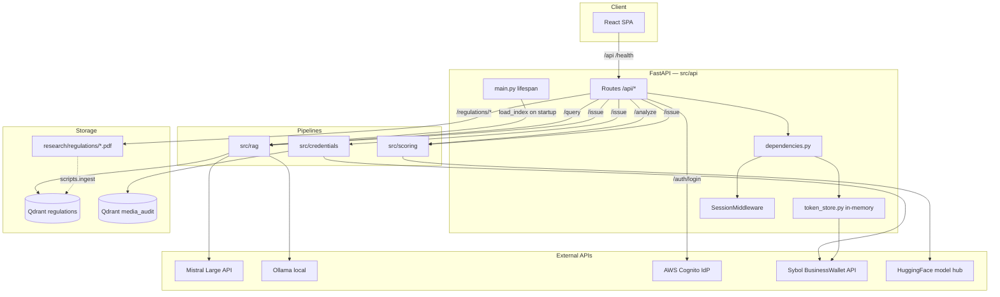
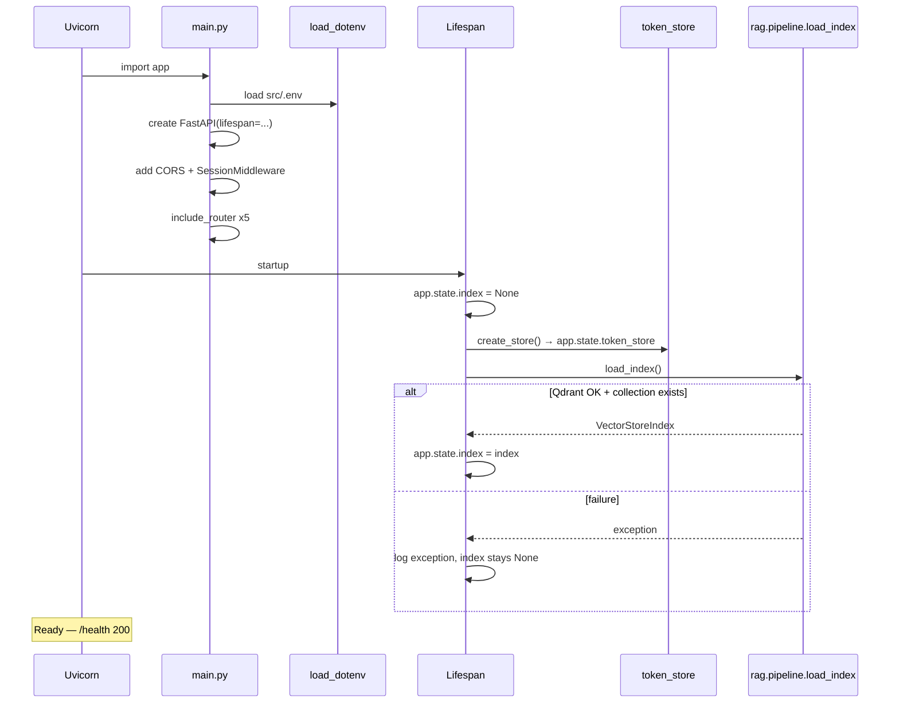
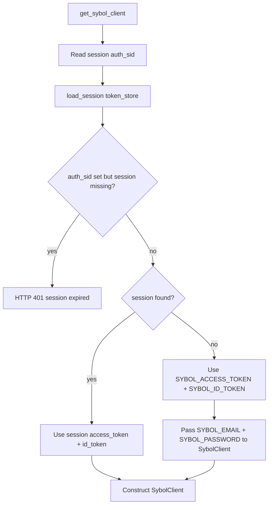
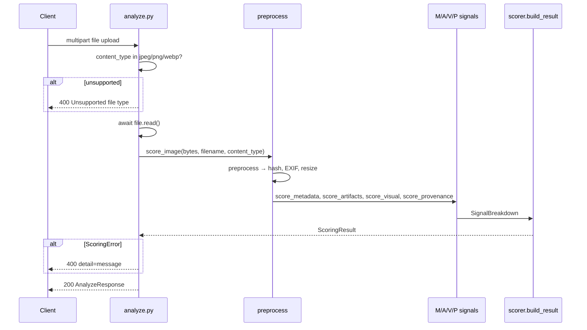
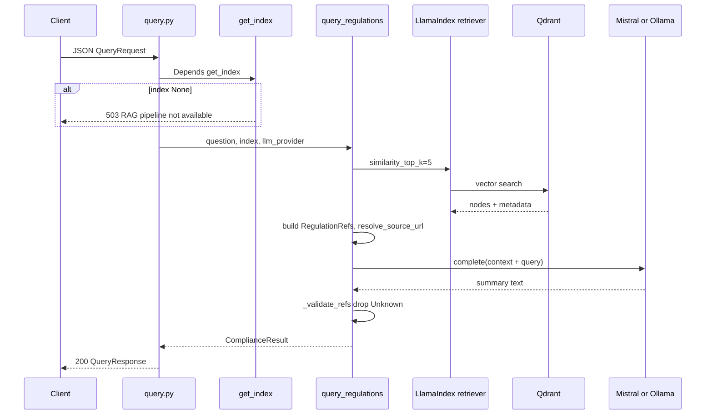
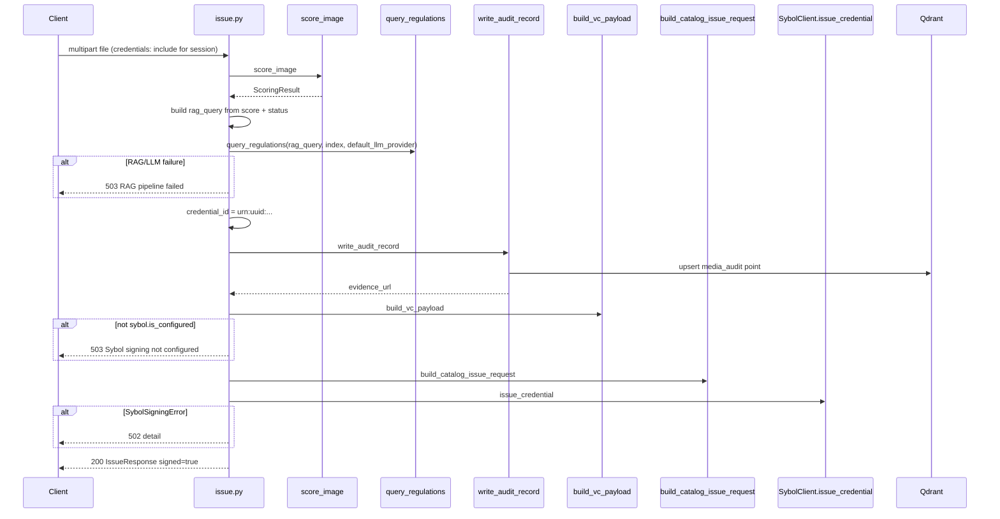
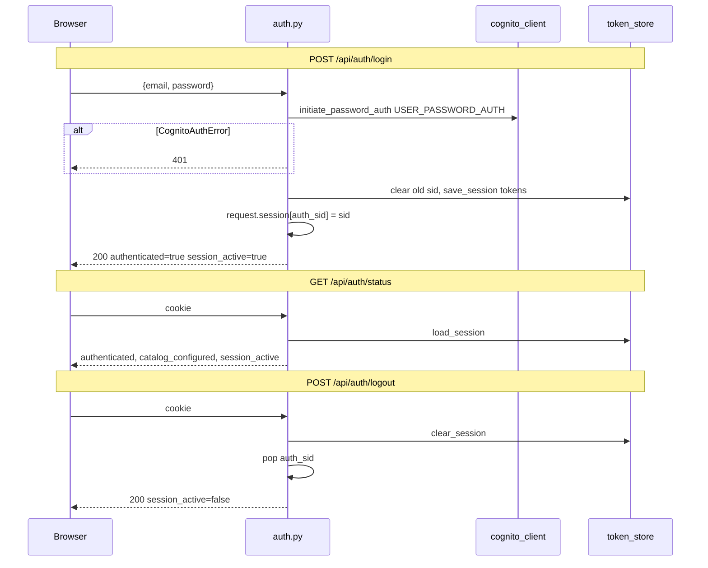
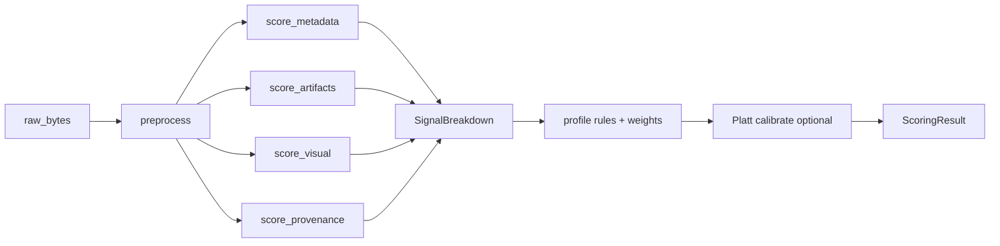
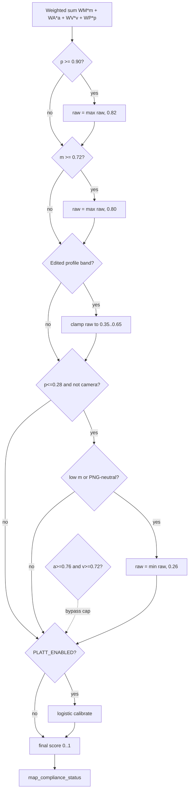
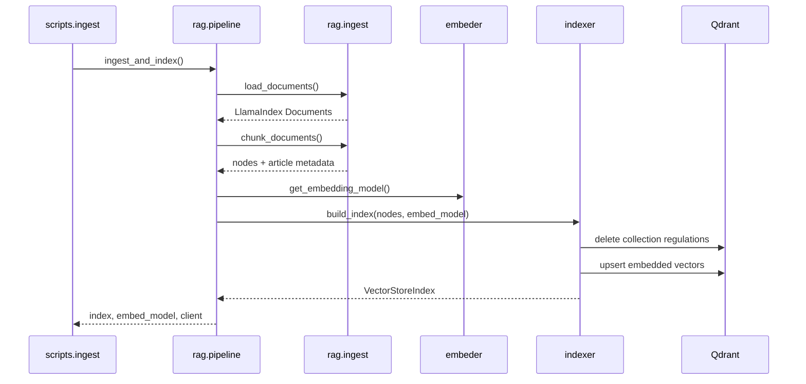

# Sybol Compliance Engine — Backend Technical Reference (Parts I–V)

> **Scope:** This document covers system overview, configuration, API layer, scoring pipeline, and RAG engine. It is grounded in source code under `src/` as of the current branch. For credentials/Sybol integration, frontend, tests, and infrastructure, see companion parts in `docs/_parts/`.
>
> **Last verified:** Against `src/api/main.py`, `src/scoring/`, `src/rag/`, and `src/api/routes/` in this repository.

---

## Part I — System overview

### 1. Purpose and scope

The **Sybol Compliance Engine** (`sybol-compliance-engine`) is a compliance AI service built by **IEU Labs** in collaboration with **Sybol**. It evaluates uploaded media for authenticity against EU and Spanish regulatory context, and can issue a **W3C Verifiable Credential (VC)** signed through Sybol's BusinessWallet API.

The engine delivers four integrated capabilities:

| Capability | Module(s) | User-facing surface |
|---|---|---|
| **Authenticity scoring** | `src/scoring/` | `POST /api/analyze`, Issue tab (internal) |
| **Regulation RAG** | `src/rag/` | `POST /api/query`, Issue tab (internal RAG step) |
| **Audit trail** | `src/credentials/audit.py` | Issue flow only — metadata stored in Qdrant |
| **Signed VC issuance** | `src/credentials/` | `POST /api/issue`, Issue tab + Sybol auth |

Scoring is **self-contained**: `/api/analyze` does not require Qdrant, Mistral, or Sybol credentials. Query and Issue routes depend on a populated Qdrant `regulations` collection and (for synthesis) either `MISTRAL_API_KEY` or a local Ollama instance.

**README drift:** [`README.md`](../README.md) still states the Issue tab is a "placeholder until Sybol VC signing is wired up." The Issue tab and `POST /api/issue` are **live** in code (`src/api/routes/issue.py`, `frontend/src/components/IssueTab.tsx`). README also references `SYBOL_API_URL`; the actual setting is **`SYBOL_API_BASE_URL`** (`src/api/dependencies.py`).

---

### 2. Confirmed technology stack

Versions below are taken from [`pyproject.toml`](../../pyproject.toml) and [`frontend/package.json`](../../frontend/package.json).

#### Backend (Python)

| Component | Technology | Version constraint (Poetry) |
|---|---|---|
| Runtime | Python | `>=3.10,<3.14` |
| API framework | FastAPI | `>=0.110,<1.0` |
| ASGI server | Uvicorn (standard extras) | `>=0.27,<1.0` |
| Validation | Pydantic | `>=2.6,<3.0` |
| RAG orchestration | LlamaIndex | `>=0.10` |
| Vector store client | qdrant-client | `>=1.8,<2.0` |
| Embeddings | sentence-transformers / HuggingFace | `all-MiniLM-L6-v2` via `llama-index-embeddings-huggingface` |
| LLM (cloud) | Mistral Large | `mistral-large-latest` via `llama-index-llms-mistralai` |
| LLM (local) | Ollama | `qwen2.5:7b-instruct` default via `llama-index-llms-ollama` |
| Deepfake CNN | HuggingFace Transformers | `dima806/deepfake_vs_real_image_detection` |
| Vision | OpenCV (headless) | `>=4.9,<5.0` |
| EXIF | ExifRead | `>=3.0,<4.0` |
| Perceptual hash | imagehash | `>=4.3,<5.0` |
| PDF parsing | PyMuPDF (ingest path) | `>=1.24,<2.0` |
| HTTP client | httpx | `>=0.27,<1.0` |
| Sessions | Starlette SessionMiddleware + itsdangerous | via FastAPI / `itsdangerous` |
| Env loading | python-dotenv | `>=1.0,<2.0` |

#### Frontend (reference — detailed in Part VII companion doc)

| Component | Version |
|---|---|
| React | `^18.3.1` |
| TypeScript | `^5.6.3` |
| Vite | `^7.3.6` |

#### External services

| Service | Role |
|---|---|
| **Qdrant** | `regulations` vector collection (RAG); `media_audit` metadata collection (audit) |
| **Mistral API** | RAG answer synthesis when `llm_provider=mistral` |
| **Ollama** | Local RAG synthesis when `llm_provider=ollama` |
| **AWS Cognito** | Issue-tab password auth (`InitiateAuth`) |
| **Sybol BusinessWallet API** | Catalog credential signing (`POST /api/bl/credentials`) |

#### Deployment targets

| Target | Entry |
|---|---|
| Local dev | `PYTHONPATH=src uvicorn api.main:app` + Vite proxy |
| Docker | [`Dockerfile`](../../Dockerfile) — Python 3.12, no frontend bake-in |
| Railway | [`railway.toml`](../../railway.toml) — uvicorn on `$PORT` |

**CI note:** `pyproject.toml` sets `mypy` `python_version = "3.11"` while the Dockerfile uses **Python 3.12**.

---

### 3. High-level architecture

The system is layered: a React SPA (optional in dev) talks to FastAPI routes, which delegate to scoring, RAG, and credentials pipelines. External services sit behind those pipelines.



#### Request path summary

| Route | Scoring | RAG | Qdrant | LLM | Sybol | Cognito |
|---|---|---|---|---|---|---|
| `GET /health` | — | — | — | — | — | — |
| `POST /api/analyze` | ✓ | — | — | — | — | — |
| `POST /api/query` | — | ✓ | ✓ (read) | ✓ | — | — |
| `POST /api/issue` | ✓ | ✓ | ✓ (read + audit write) | ✓ | ✓ | optional (session) |
| `POST /api/auth/login` | — | — | — | — | — | ✓ |
| `GET /api/regulations/{file}` | — | — | — | — | — | — |

---

### 4. Repository layout

Top-level directories and their roles:

| Path | Purpose |
|---|---|
| [`src/`](../../src/) | All Python application code (API, scoring, RAG, credentials, CLI scripts) |
| [`src/api/`](../../src/api/) | FastAPI app, routes, schemas, dependencies, token store |
| [`src/scoring/`](../../src/scoring/) | Four-signal authenticity pipeline (M/A/V/P) |
| [`src/rag/`](../../src/rag/) | Regulation ingest, index, query, LLM providers |
| [`src/credentials/`](../../src/credentials/) | VC builder, Sybol client, Cognito, audit |
| [`src/scripts/`](../../src/scripts/) | One-off CLIs: ingest, OpenAPI export, Sybol probes |
| [`frontend/`](../../frontend/) | React SPA (Analyze, Query, Issue tabs) |
| [`tests/`](../../tests/) | Unit, integration, e2e pytest suites |
| [`qa/`](../../qa/) | Golden dataset, RAG eval queries, QA logs |
| [`research/regulations/`](../../research/regulations/) | Five regulation PDFs for RAG ingest |
| [`scripts/`](../../scripts/) | Repo-level utilities (e.g. Platt calibration fit) |
| [`docs/`](../../docs/) | Runbooks, status, this technical reference |
| [`sybol_docs/`](../../sybol_docs/) | Sybol platform architecture and API contracts |
| [`.github/workflows/`](../../.github/workflows/) | CI (ruff, black, mypy, pytest+cov) |

#### `src/` module index (backend focus)

| File | Responsibility |
|---|---|
| `api/main.py` | App factory, lifespan, CORS, sessions, router mount, SPA fallback |
| `api/dependencies.py` | `Settings` dataclass, `get_index`, `get_qdrant_client`, `get_sybol_client` |
| `api/schemas.py` | Pydantic request/response models for HTTP API |
| `api/token_store.py` | In-memory Cognito JWT storage keyed by session id |
| `api/routes/analyze.py` | Multipart image upload → scoring |
| `api/routes/query.py` | JSON question → RAG |
| `api/routes/issue.py` | Full issue pipeline |
| `api/routes/auth.py` | Cognito login, status, logout |
| `api/routes/regulations.py` | PDF whitelist static serve |
| `scoring/pipeline.py` | `score_image()` orchestration |
| `scoring/preprocess.py` | Hash, EXIF, resize, validation |
| `scoring/metadata.py` | Signal M |
| `scoring/artifacts.py` | Signal A |
| `scoring/detector.py` | HuggingFace CNN loader |
| `scoring/visual.py` | Signal V |
| `scoring/provenance.py` | Signal P (pHash) |
| `scoring/scorer.py` | Weighted sum + profile rules |
| `scoring/constants.py` | Weights, thresholds, model IDs |
| `scoring/models.py` | `ScoringResult`, `SignalBreakdown`, `ComplianceStatus` |
| `rag/pipeline.py` | `build_index`, `load_index`, `ingest_and_index` facade |
| `rag/ingest.py` | PDF load + chunking |
| `rag/indexer.py` | Qdrant vector store wiring |
| `rag/embeder.py` | HuggingFace embedding singleton |
| `rag/query.py` | Retrieval + LLM synthesis |
| `rag/llm.py` | Mistral vs Ollama provider selection |
| `rag/source_urls.py` | Filesystem path → `/api/regulations/...` URL |
| `rag/models.py` | `ComplianceResult`, `RegulationRef` |

---

### 5. Runtime modes

#### 5.1 Local development (split processes)

1. Copy `src/.env.example` → `src/.env` and configure secrets.
2. Start Qdrant (optional for analyze; required for query/issue RAG):

   ```bash
   docker run -p 6333:6333 qdrant/qdrant
   ```

3. Ingest regulations (one-time per Qdrant volume):

   ```bash
   PYTHONPATH=src poetry run python -m scripts.ingest
   ```

4. Start API from repo root:

   ```bash
   PYTHONPATH=src poetry run uvicorn api.main:app --reload --host 127.0.0.1 --port 8000
   ```

   `main.py` loads env via `load_dotenv(Path(__file__).resolve().parents[1] / ".env")` — i.e. **`src/.env`**, not repo-root `.env`.

5. Start frontend:

   ```bash
   cd frontend && npm ci && npm run dev
   ```

   Vite ([`frontend/vite.config.ts`](../../frontend/vite.config.ts)) proxies `/api` and `/health` to `http://localhost:8000`. Browser origin is `http://localhost:5173`, which matches CORS allowlist in `main.py`.

#### 5.2 Production (single process + built SPA)

```bash
cd frontend && npm ci && npm run build
PYTHONPATH=src poetry run uvicorn api.main:app --host 0.0.0.0 --port 8000
```

When `frontend/dist/` exists, `main.py` mounts `/assets` and registers a catch-all SPA fallback that serves `index.html` for non-API paths. API paths under `api/` that miss a route return 404 from the fallback guard.

#### 5.3 Docker

[`Dockerfile`](../../Dockerfile) multi-stage build:

- **Builder:** Poetry install `--only main`
- **Runtime:** copies `src/`, runs `uvicorn src.api.main:app` on `$PORT` (default 8000)

The image does **not** build or copy `frontend/dist`. Production SPA serving requires a separate build step or alternate deployment layout.

#### 5.4 Railway

[`railway.toml`](../../railway.toml):

```toml
startCommand = "sh -c 'uvicorn src.api.main:app --host 0.0.0.0 --port ${PORT}'"
healthcheckPath = "/health"
```

Typical topology (see [`docs/RAILWAY_SETUP.md`](../RAILWAY_SETUP.md)): FastAPI service + Qdrant service; env vars set in Railway dashboard.

#### 5.5 Graceful degradation at startup

`lifespan` in `main.py`:

```python
app.state.index = None
try:
    index, _ = load_index()
    app.state.index = index
except Exception:
    logger.exception("Failed to build index during startup")
```

If Qdrant is down or the collection is empty, startup **continues**. `/api/analyze` works; `/api/query` and `/api/issue` return **503** via `get_index()` when `app.state.index` is `None`.

Scoring model warmup is **lazy**: the deepfake CNN loads on first `score_image()` call inside `predict_authenticity_score()` (`src/scoring/detector.py`), not at API startup.

---

## Part II — Configuration and boot

### 6. Environment variables

Configuration is split between the `Settings` dataclass (`src/api/dependencies.py`), direct `os.environ` reads in RAG LLM code (`src/rag/llm.py`), and `main.py` session secret.

#### 6.1 `Settings` dataclass (dependencies.py)

| Variable | Default | Required for | Description |
|---|---|---|---|
| `APP_ENV` | `dev` | — | Ambient environment label (not heavily branched in code) |
| `QDRANT_URL` | `http://localhost:6333` | `/query`, `/issue`, startup index | Qdrant HTTP URL |
| `QDRANT_API_KEY` | `None` | Cloud Qdrant | Optional API key |
| `QDRANT_COLLECTION` | `regulations` | Ingest (implicit) | Regulations collection name — **note:** indexer hardcodes `"regulations"` in `COLLECTION_NAME`; this setting is defined but not wired to indexer |
| `QDRANT_AUDIT_COLLECTION` | `media_audit` | `/issue` audit write | Audit metadata collection |
| `SYBOL_API_BASE_URL` | `https://api.develop.wallet.sybol.id` | `/issue` | Sybol BusinessWallet base URL. Production host: `https://api.sybol.io` |
| `SYBOL_ACCESS_TOKEN` | `None` | `/issue` (fallback auth) | Cognito access token (Bearer) |
| `SYBOL_ID_TOKEN` | `None` | `/issue` (fallback auth) | Cognito ID token (`x-id-token` header) |
| `SYBOL_EMAIL` | `None` | `/issue` (on-demand login) | Email for Sybol `POST /auth/login` fallback |
| `SYBOL_PASSWORD` | `None` | `/issue` (on-demand login) | Password for Sybol login fallback |
| `SYBOL_DOCUMENT_ID` | `None` | `/issue` signing | Catalog document id |
| `SYBOL_ISSUER_KEY` | `None` | `/issue` signing | Catalog issuer key |
| `SYBOL_SUBJECT_DID` | `None` | `/issue` signing | Alternate recipient DID |
| `SYBOL_RECIPIENT_DID` | `None` | `/issue` signing | Primary recipient DID |
| `SYBOL_CREDENTIAL_FORMAT` | `jwt_vc_json` | `/issue` | Credential format field in issue request |
| `SYBOL_LEVEL_OF_ASSURANCE` | `None` | `/issue` (optional) | Integer LoA if set |
| `SYBOL_REQUEST_TIMEOUT` | `30.0` | Sybol + Cognito HTTP | Request timeout seconds |
| `SYBOL_COGNITO_CLIENT_ID` | `None` | `/auth/login` | Cognito app client id. Alias: `COGNITO_CLIENT_ID` |
| `SYBOL_COGNITO_REGION` | `eu-west-1` | `/auth/login` | Cognito region. Alias: `COGNITO_REGION` |
| `DEFAULT_LLM_PROVIDER` | `mistral` | `/issue` RAG step | `mistral` or `ollama` — **not** the Query tab UI toggle |
| `OLLAMA_BASE_URL` | `http://localhost:11434` | Ollama paths | Ollama API base |
| `OLLAMA_MODEL` | `qwen2.5:7b-instruct` | Ollama paths | Model tag |

#### 6.2 Variables in `src/.env.example` but outside `Settings`

| Variable | Read in | Required for | Description |
|---|---|---|---|
| `MISTRAL_API_KEY` | `src/rag/llm.py` | Mistral synthesis | API key for `mistral-large-latest` |
| `OLLAMA_REQUEST_TIMEOUT` | `src/rag/llm.py` | Ollama synthesis | Default `120` seconds |
| `SESSION_SECRET_KEY` | `src/api/main.py` | Session cookies | Starlette `SessionMiddleware` secret. Default in code: `dev-only-change-in-production` |

#### 6.3 Test-only overrides

| Variable | Used in | Purpose |
|---|---|---|
| `SYBOL_GOLDEN_DATASET` | `tests/integration/test_scoring_regression.py` | Override path to golden manifest root |

#### 6.4 Feature dependency matrix

| Feature | Minimum env / infra |
|---|---|
| Health check | — |
| Analyze | — (optional: HF cache for CNN) |
| Query | Qdrant up + ingested `regulations` + (`MISTRAL_API_KEY` or Ollama) |
| Issue — scoring + RAG + audit | Same as Query |
| Issue — Sybol sign | Above + (`session login` or `SYBOL_ACCESS_TOKEN`+`SYBOL_ID_TOKEN` or email/password) + `SYBOL_DOCUMENT_ID` + `SYBOL_ISSUER_KEY` + `SYBOL_RECIPIENT_DID` (or `SYBOL_SUBJECT_DID`) |
| Auth login | `SYBOL_COGNITO_CLIENT_ID` |
| Regulation PDF links | PDFs present under `research/regulations/` |

#### 6.5 Security notes

- Never commit `src/.env`. Example file uses empty placeholders.
- `SESSION_SECRET_KEY` must be strong in production; default is explicitly dev-only.
- JWTs are stored **server-side** in `token_store` because Cognito tokens exceed practical cookie size limits (`src/api/token_store.py` module docstring).
- Restarting the API process **invalidates** in-memory sessions; clients must re-login.

---

### 7. Application startup

Source: [`src/api/main.py`](../../src/api/main.py).

#### 7.1 Boot sequence



#### 7.2 `load_index()` behavior

`rag.pipeline.load_index()`:

1. `get_embedding_model()` — loads `sentence-transformers/all-MiniLM-L6-v2` on CPU.
2. `indexer.load_index(embed_model)` — attaches to existing Qdrant collection `regulations` via `QdrantVectorStore`.
3. Does **not** re-ingest PDFs. Ingest is explicit via `python -m scripts.ingest`.

#### 7.3 Router registration

All API routers mount under `/api` prefix:

| Router module | Prefix in router | Full path examples |
|---|---|---|
| `analyze.py` | — | `/api/analyze` |
| `auth.py` | `/auth` | `/api/auth/login`, `/api/auth/status`, `/api/auth/logout` |
| `query.py` | — | `/api/query` |
| `issue.py` | — | `/api/issue` |
| `regulations.py` | — | `/api/regulations/{filename}` |

Plus un-prefixed `GET /health`.

#### 7.4 Static / SPA serving

Conditional on `frontend/dist` directory existing (repo root relative):

- `StaticFiles` mount at `/assets`
- Catch-all `GET /{full_path:path}`:
  - Rejects paths starting with `api/` → 404
  - Serves file if exists under `dist/`
  - Else serves `dist/index.html`

---

### 8. Poetry packaging

From [`pyproject.toml`](../../pyproject.toml):

#### 8.1 Installable packages

Poetry packages (from `src/`):

```toml
packages = [
  { include = "rag", from = "src" },
  { include = "credentials", from = "src" },
  { include = "scoring", from = "src" },
]
```

The **`api`** package is not listed as a Poetry package but is imported as `src.api` when `PYTHONPATH=src` or when running `uvicorn src.api.main:app` (Docker/Railway).

#### 8.2 PYTHONPATH convention

Local README and scripts use:

```bash
PYTHONPATH=src poetry run uvicorn api.main:app ...
```

This exposes top-level imports `scoring`, `rag`, `credentials`, and `api` without the `src.` prefix. Route modules use absolute imports `from src.api...` and `from src.scoring...` consistently.

#### 8.3 Dev vs production dependencies

| Group | Packages | Purpose |
|---|---|---|
| Main | FastAPI, LlamaIndex, torch (cpu), transformers, etc. | Runtime |
| Dev | pytest, pytest-cov, hypothesis, ruff, black, mypy | CI and local quality gates |

Install dev deps: `poetry install --with dev`.

#### 8.4 Coverage policy

```toml
[tool.coverage.report]
fail_under = 80
```

#### 8.5 First-run model downloads

- **Deepfake CNN:** `AutoImageProcessor.from_pretrained("dima806/deepfake_vs_real_image_detection")` on first scoring request (~100 MB).
- **Embeddings:** `all-MiniLM-L6-v2` on first RAG operation.

---

### 9. Middleware stack

Middleware is applied in **reverse order** of registration (last added runs first on ingress).

Registration order in `main.py`:

1. `CORSMiddleware`
2. `SessionMiddleware`

#### 9.1 CORS

```python
app.add_middleware(
    CORSMiddleware,
    allow_origins=["http://localhost:5173", "http://127.0.0.1:5173"],
    allow_methods=["*"],
    allow_headers=["*"],
    allow_credentials=True,
)
```

`allow_credentials=True` is required for session cookies on `/api/auth/*` and `/api/issue`. Production deployments behind a single origin (SPA served from same host) may not need CORS; current code only whitelists Vite dev origins.

#### 9.2 Session middleware

```python
_session_secret = os.getenv("SESSION_SECRET_KEY", "dev-only-change-in-production")
app.add_middleware(SessionMiddleware, secret_key=_session_secret)
```

Session data stores **`auth_sid`** — a random key into `app.state.token_store` (`src/api/routes/auth.py`). Note: `token_store.SESSION_COOKIE = "sybol_auth_sid"` is defined but **unused**; the actual session key is `auth_sid` inside the signed session cookie managed by Starlette.

#### 9.3 No global rate limiting in main

Files `src/api/rate_limit.py`, `src/api/security.py`, and `src/api/uploads.py` appear in git status on some branches but are **not present** in the current tree wired by `main.py`. Upload validation lives inline in route handlers.

---

## Part III — API layer

### 10. Route inventory

Complete HTTP surface from route modules and `main.py`.

| Method | Path | Auth | Depends | Success | Error codes |
|---|---|---|---|---|---|
| `GET` | `/health` | None | — | `200 {"status":"ok"}` | — |
| `POST` | `/api/analyze` | None | — | `200 AnalyzeResponse` | `400` bad file |
| `POST` | `/api/query` | None | `get_index` | `200 QueryResponse` | `503` no index; `500` LLM errors bubble |
| `POST` | `/api/issue` | Sybol tokens (session or env) | `get_index`, `get_qdrant_client`, `get_settings`, `get_sybol_client` | `200 IssueResponse` | `400`, `401`, `502`, `503` |
| `POST` | `/api/auth/login` | None | `get_settings` | `200 AuthLoginResponse` | `401` Cognito failure; `503` no token store |
| `GET` | `/api/auth/status` | None | `get_settings` | `200 AuthStatusResponse` | — |
| `POST` | `/api/auth/logout` | None | `get_settings` | `200 AuthLoginResponse` | — |
| `GET` | `/api/regulations/{filename}` | None | — | PDF `FileResponse` | `404` |
| `GET` | `/{path}` | None | SPA fallback | HTML/assets | `404` for `api/*` misses |

#### 10.1 `AnalyzeResponse` (`schemas.py`)

| Field | Type | Notes |
|---|---|---|
| `authenticity_score` | `float` [0,1] | Weighted + rule-adjusted score |
| `score_breakdown` | `ScoreBreakdown` | Aliases: `m`, `a`, `v`, `p` |
| `compliance_status` | `compliant` \| `non-compliant` \| `review` | Threshold mapping |
| `media_hash` | `str` | SHA-256 of raw bytes pre-resize |
| `model_version` | `str` | CNN revision string |
| `analysis_timestamp` | `str` | ISO UTC from route (not scoring pipeline) |
| `evidence_url` | `str \| null` | Optional; not set by analyze route today |

#### 10.2 `QueryRequest` / `QueryResponse`

**Request:**

| Field | Type | Default |
|---|---|---|
| `question` | `str` min 1 | — |
| `llm_provider` | `mistral` \| `ollama` | `mistral` |

**Response:**

| Field | Type |
|---|---|
| `answer` | `str` |
| `regulation_refs` | `list[dict]` with `regulation`, `article`, `url` |
| `llm_provider` | `str` |
| `llm_model` | `str` |

#### 10.3 `IssueResponse`

| Field | Type | When set |
|---|---|---|
| `status` | `str` | `"signed_vc_issued"` on success |
| `vc_id` | `str \| null` | From unsigned VC payload `id` |
| `detail` | `str \| null` | Human message |
| `signed` | `bool` | `True` on success |
| `vc_payload` | `dict \| null` | Unsigned W3C VC 1.1 reference |
| `signed_vc` | `dict \| null` | Sybol API `data` envelope |

#### 10.4 Auth models

**`AuthLoginRequest`:** `email`, `password`

**`AuthStatusResponse` / `AuthLoginResponse`:**

| Field | Meaning |
|---|---|
| `authenticated` | Session, env tokens, or env login credentials present |
| `email` | From session or `SYBOL_EMAIL` |
| `catalog_configured` | `SYBOL_DOCUMENT_ID` and `SYBOL_ISSUER_KEY` both set |
| `session_active` | Valid in-memory session for current `auth_sid` |

---

### 11. `dependencies.py` — dependency injection

#### 11.1 `get_settings()`

Returns a fresh `Settings()` dataclass on each call (reads `os.getenv` via `field(default_factory=...)`). No caching.

#### 11.2 `get_index(request)`

```python
index = getattr(request.app.state, "index", None)
if index is None:
    raise HTTPException(503, detail="RAG pipeline not available...")
return index
```

Used by `/api/query` and `/api/issue`.

#### 11.3 `get_qdrant_client(settings)`

Constructs `QdrantClient(url=settings.qdrant_url, api_key=settings.qdrant_api_key)`.

#### 11.4 `get_sybol_client(request, settings)` — token resolution chain



Priority:

1. **Browser session** (Issue tab login): `request.session["auth_sid"]` → `token_store.load_session`.
2. If `auth_sid` present but session missing → **401** (typical after API restart).
3. Else **environment tokens** `SYBOL_ACCESS_TOKEN` + `SYBOL_ID_TOKEN` (normalized via `normalize_token`).
4. Else pass **email/password** to `SybolClient` for on-demand `POST /auth/login` inside `ensure_authenticated()`.

`SybolClient.is_configured` additionally requires non-placeholder `SYBOL_DOCUMENT_ID` and `SYBOL_ISSUER_KEY`.

---

### 12. Per-route deep dives

#### 12.1 `POST /api/analyze`

**Source:** [`src/api/routes/analyze.py`](../../src/api/routes/analyze.py)



**MIME whitelist:** `image/jpeg`, `image/png`, `image/webp` — checked on `UploadFile.content_type` only (not magic-byte re-check at route layer; preprocess validates bytes).

**Example curl:**

```bash
curl -X POST http://localhost:8000/api/analyze \
  -F "file=@qa/test_cases/authentic/ar_1.JPG"
```

**Example response:**

```json
{
  "authenticity_score": 0.82,
  "score_breakdown": { "m": 0.91, "a": 0.88, "v": 0.74, "p": 0.95 },
  "compliance_status": "compliant",
  "media_hash": "abc123...",
  "model_version": "dima806/deepfake_vs_real_image_detection@...",
  "analysis_timestamp": "2026-06-25T12:00:00.000000",
  "evidence_url": null
}
```

---

#### 12.2 `POST /api/query`

**Source:** [`src/api/routes/query.py`](../../src/api/routes/query.py)



**`llm_provider` passthrough:** Query tab sends per-request provider; issue route uses `settings.default_llm_provider` only.

**Example curl:**

```bash
curl -X POST http://localhost:8000/api/query \
  -H "Content-Type: application/json" \
  -d '{"question": "What does the EU AI Act require for deepfakes?", "llm_provider": "mistral"}'
```

---

#### 12.3 `POST /api/issue`

**Source:** [`src/api/routes/issue.py`](../../src/api/routes/issue.py)

Full pipeline: **score → RAG → audit → VC payload → catalog issue → Sybol sign**.



**Auto-generated RAG question** (fixed template):

```python
rag_query = (
    f"What EU regulations apply to media with authenticity score "
    f"{result.authenticity_score:.2f} and compliance status "
    f"{result.compliance_status.value}?"
)
```

**Credential ID:** `urn:uuid:{uuid4()}` — used consistently in audit point id, VC `id`, and Qdrant point key (uuid part).

---

#### 12.4 Auth routes (`/api/auth/*`)

**Source:** [`src/api/routes/auth.py`](../../src/api/routes/auth.py)



**MFA / challenges:** Cognito challenges raise `CognitoAuthError` with message to complete MFA in Sybol wallet — not supported server-side.

**`authenticated` on status** is true if any of: active session, env token pair, or env email/password — even before a successful Sybol API call.

---

#### 12.5 `GET /api/regulations/{filename}`

**Source:** [`src/api/routes/regulations.py`](../../src/api/routes/regulations.py)

- Builds whitelist `_ALLOWED_PDFS` from `REGULATIONS_DIR.glob("*.pdf")` at import time.
- Serves files from [`research/regulations/`](../../research/regulations/) with `Content-Type: application/pdf`.
- Used by RAG `source_urls.resolve_source_url()` for browser-openable citation links.

---

### 13. Error model

| HTTP | Source | Typical `detail` |
|---|---|---|
| **400** | `analyze`, `issue` | Unsupported file type; `ScoringError` message (empty, corrupt, unsupported format) |
| **401** | `auth/login` | Cognito failure; `get_sybol_client` session expired |
| **404** | `regulations`, SPA fallback | Unknown PDF; unknown non-API path |
| **502** | `issue` | `SybolSigningError` — Sybol API error, invalid JWT, schema mismatch |
| **503** | `get_index` | RAG index not loaded at startup |
| **503** | `issue` | RAG step exception; audit write failure; `not sybol.is_configured` |
| **503** | `auth` | Token store not initialized (should not happen post-startup) |

**ScoringError codes** (`preprocess.py`): `empty_file`, `unsupported_format`, `corrupted_file`.

**RAG LLM errors** inside `query_regulations`: `RuntimeError` with Ollama or Mistral hint — may surface as 500 unless caught (issue route catches and maps to 503).

**Sybol client** validates id token structure (`is_valid_jwt` — three dot-separated parts) before API calls.

---

### 14. OpenAPI

- **Interactive docs:** `GET /docs` (Swagger UI) and `GET /redoc` — auto-generated by FastAPI from route decorators and `response_model`.
- **Export script:** [`src/scripts/export_openapi.py`](../../src/scripts/export_openapi.py)

  ```bash
  PYTHONPATH=src poetry run python src/scripts/export_openapi.py
  ```

  Writes `openapi.json` at cwd with `app.openapi()` from `src.api.main:app`.

- **Tags:** `rag` (query), `credentials` (issue), `auth` (auth), `regulations` (PDF serve). Analyze router untagged.

---

## Part IV — Scoring pipeline

### 15. Pipeline orchestration

**Source:** [`src/scoring/pipeline.py`](../../src/scoring/pipeline.py)

```python
def score_image(raw_bytes, filename=None, content_type=None) -> ScoringResult:
    preprocessed = preprocess(...)
    breakdown = SignalBreakdown(
        m=score_metadata(preprocessed),
        a=score_artifacts(preprocessed),
        v=score_visual(preprocessed),
        p=score_provenance(preprocessed),
    )
    return build_result(preprocessed.media_hash, breakdown)
```

**`load_scoring_pipeline()`** (optional explicit warmup): `rebuild_provenance_index()` + `load_detector()` — not called from API startup; provenance index rebuilds lazily on first `score_provenance()` if empty.

#### Pipeline diagram



---

### 16. Preprocessing

**Source:** [`src/scoring/preprocess.py`](../../src/scoring/preprocess.py)

| Step | Behavior |
|---|---|
| Empty check | `ScoringError("Empty file", "empty_file")` |
| Magic-byte detect | JPEG `FF D8 FF`, PNG `89 50 4E 47...`, WebP `RIFF....WEBP` |
| Content-Type cross-check | If provided, must be in `SUPPORTED_MIME_TYPES` |
| **SHA-256** | Computed on **raw bytes before resize** → `media_hash` |
| EXIF | `exifread.process_file(details=False)`; failures → empty tags (no 500) |
| PIL load | `Image.open` + `load()`; corruption → `ScoringError("Corrupted or unreadable image")` |
| RGB convert | `original_image.convert("RGB")` |
| Model resize | `224×224` LANCZOS → `model_image` |

**Output:** `PreprocessedImage` dataclass with `raw_bytes`, `media_hash`, `exif_tags`, `original_image`, `model_image`, `content_type`.

---

### 17. Signal M — Metadata

**Source:** [`src/scoring/metadata.py`](../../src/scoring/metadata.py), constants in [`src/scoring/constants.py`](../../src/scoring/constants.py)

#### Sub-scores

| Sub-score | Weight constant | Logic summary |
|---|---|---|
| Presence | `METADATA_PRESENCE_WEIGHT = 0.35` | Tags present → 1.0; PNG/WebP no EXIF → `PNG_WEBP_NO_EXIF_SCORE = 0.55`; JPEG no EXIF → `NO_EXIF_CAP = 0.35` |
| Required fields | `METADATA_FIELDS_WEIGHT = 0.35` | Fraction of `REQUIRED_EXIF_FIELDS` (`DateTimeOriginal`, `Make`, `Model`); +0.15 bonus if Make+Model and ≥2 fields |
| Software | `METADATA_SOFTWARE_WEIGHT = 0.20` | No Software tag → 1.0; editing/AI tags → 0.0–0.2 via `EDITING_SOFTWARE_TAGS` |
| Timestamp | `METADATA_TIMESTAMP_WEIGHT = 0.10` | Future dates → 0.1; inconsistent dates >24h → 0.4; missing → 0.7; consistent → 1.0 |

#### `EDITING_SOFTWARE_TAGS`

`photoshop`, `gimp`, `stable diffusion`, `midjourney`, `dall-e`, `dalle`, `adobe`, `lightroom`, `canva`, `affinity`

AI generators (`stable diffusion`, `midjourney`, `dall-e`, `dalle`) force software sub-score **0.0**.

#### Post-combination caps

- If `software <= 0.2` → total metadata ≤ **0.35**
- If `timestamp <= 0.2` → total metadata ≤ **0.45**

---

### 18. Signal A — Artifacts

**Sources:** [`src/scoring/artifacts.py`](../../src/scoring/artifacts.py), [`src/scoring/detector.py`](../../src/scoring/detector.py)

#### CNN detector

- Model: **`dima806/deepfake_vs_real_image_detection`** (`DEEPFAKE_MODEL_ID`)
- `predict_authenticity_score()` → softmax probability of "real" class (1 = likely real)
- `predict_fake_probability()` → `1 - authenticity`

#### FFT sub-score (`_fft_score`)

2D FFT magnitude on grayscale model image; compares high vs low frequency band energy ratio. Ratio > 1.8 penalizes (GAN grid artifacts).

#### Noise residual (`_noise_residual_score`)

Gaussian blur residual variance; very low variance → synthetic smoothness penalty.

#### Weight profiles

**Camera / JPEG path** (default):

| Component | Weight |
|---|---|
| CNN | `ARTIFACT_CNN_WEIGHT = 0.50` |
| FFT | `ARTIFACT_FFT_WEIGHT = 0.25` |
| Noise | `ARTIFACT_NOISE_WEIGHT = 0.25` |

**Synthetic format path** — PNG/WebP **without EXIF** (`_is_synthetic_format`):

| Component | Weight |
|---|---|
| Fake probability | `ARTIFACT_SYNTHETIC_FAKE_WEIGHT = 0.62` |
| FFT | `ARTIFACT_SYNTHETIC_FFT_WEIGHT = 0.25` |
| Noise | `ARTIFACT_SYNTHETIC_NOISE_WEIGHT = 0.20` |

Rationale in code comment: CNN "real" scores mislead on EXIF-less PNG/WebP.

---

### 19. Signal V — Visual

**Source:** [`src/scoring/visual.py`](../../src/scoring/visual.py)

OpenCV on full-resolution RGB (`original_image`), not 224px model tensor.

| Sub-score | Method |
|---|---|
| Lighting uniformity | 3×3 grid mean luminance variance — high variance → compositing suspicion |
| Shadow direction | Sobel orientation histogram entropy on strong edges |
| Edge blending | Canny edges + local variance along edges |

Final visual score: arithmetic mean of three sub-scores, clamped [0,1].

---

### 20. Signal P — Provenance

**Source:** [`src/scoring/provenance.py`](../../src/scoring/provenance.py)

| Constant | Value |
|---|---|
| `AUTHENTIC_REFERENCE_DIR` | `qa/test_cases/authentic/` |
| `PHASH_MATCH_THRESHOLD` | `10` (Hamming distance) |
| `EMPTY_PROVENANCE_DEFAULT` | `0.5` when index empty |

**Index build:** `imagehash.phash` per reference image in `authentic/` (jpg/jpeg/png/webp).

**Scoring:**

- `min_distance <= PHASH_MATCH_THRESHOLD` → score `1.0 - min_distance / (threshold + 1)` (near-match → high provenance)
- Else decay: `0.42 - min_distance / 48.0`

Strong provenance match feeds **profile rules** in scorer (floor on final score).

---

### 21. Scoring engine

**Source:** [`src/scoring/scorer.py`](../../src/scoring/scorer.py), [`src/scoring/constants.py`](../../src/scoring/constants.py)

#### 21.1 Primary weights

| Signal | Symbol | Weight |
|---|---|---|
| Metadata | WM | **0.18** |
| Artifacts | WA | **0.22** |
| Visual | WV | **0.15** |
| Provenance | WP | **0.45** |

**Sum = 1.0**

```python
raw = WM * m + WA * a + WV * v + WP * p
raw = _apply_profile_rules(raw, breakdown)
return clamp(calibrate(raw))
```

#### 21.2 Profile rules (`_apply_profile_rules`)

| Rule | Condition | Effect |
|---|---|---|
| Provenance match floor | `p >= PROVENANCE_MATCH_MIN (0.90)` | `raw = max(raw, PROVENANCE_MATCH_SCORE_FLOOR 0.82)` |
| EXIF-rich floor | `m >= EXIF_RICH_METADATA_MIN (0.72)` | `raw = max(raw, EXIF_RICH_SCORE_FLOOR 0.80)` |
| Edited band | `m` in [0.45, 0.72], `a` in [0.38, 0.78], `p <= 0.55` | Clamp raw to [0.35, 0.65] |
| Synthetic cap | `p <= 0.28` and not camera-likely and (low metadata or PNG-neutral band) | `raw = min(raw, SYNTHETIC_PROFILE_SCORE_CAP 0.26)` |
| Camera-likely escape | `a >= 0.76` and `v >= 0.72` | Bypasses synthetic cap |

**PNG-neutral metadata band:** `m` in [0.44, 0.52] — treats missing EXIF on PNG/WebP as neutral, not stripped-JPEG suspicion.

#### 21.3 Platt calibration

| Constant | Value |
|---|---|
| `PLATT_ENABLED` | **False** |
| `PLATT_PARAMS_PATH` | `src/scoring/data/platt_params.json` |

When enabled, applies logistic calibration `1 / (1 + exp(a * raw + b))` from JSON params. Fitting script: [`scripts/fit_platt_calibration.py`](../../scripts/fit_platt_calibration.py).

#### 21.4 Compliance thresholds

| Score range | `ComplianceStatus` |
|---|---|
| `< 0.3` (`THRESHOLD_NON_COMPLIANT`) | `non-compliant` |
| `0.3` – `< 0.7` | `review` |
| `>= 0.7` (`THRESHOLD_COMPLIANT`) | `compliant` |

#### 21.5 `build_result`

Sets `model_version` from `get_deepfake_model().version` or fallback `"@unloaded"` if CNN not yet loaded.

---

### 22. Data models

**Source:** [`src/scoring/models.py`](../../src/scoring/models.py)

```python
class ComplianceStatus(str, Enum):
    COMPLIANT = "compliant"
    NON_COMPLIANT = "non-compliant"
    REVIEW = "review"

class SignalBreakdown(BaseModel):
    m: float  # ge=0, le=1
    a: float
    v: float
    p: float

class ScoringResult(BaseModel):
    authenticity_score: float
    score_breakdown: SignalBreakdown
    compliance_status: ComplianceStatus
    media_hash: str
    model_version: str
```

API layer maps `SignalBreakdown` to `ScoreBreakdown` with JSON aliases `m/a/v/p` (`schemas.py`).

---

### 23. Golden dataset

#### 23.1 Location and manifest

| Path | Role |
|---|---|
| `qa/test_cases/golden/manifest.json` | List of `{file, label}` records |
| `qa/test_cases/golden/` | Image files referenced by manifest |
| `qa/test_cases/authentic/` | Provenance reference index (separate from golden) |

Manifest labels used in regression: **`authentic`**, **`ai_generated`**. The harness also defines expectations for **`edited`** but the current manifest contains **no `edited` entries** (67 labelled cases: authentic + ai_generated only).

Override root: `SYBOL_GOLDEN_DATASET` env var.

#### 23.2 Acceptance targets

From [`tests/integration/test_scoring_regression.py`](../../tests/integration/test_scoring_regression.py):

| Test case | Label | Score band | Expected status |
|---|---|---|---|
| TC-001 | `authentic` | [0.8, 1.0] | `compliant` |
| TC-002 | `ai_generated` | [0.0, 0.3] | `non-compliant` |
| TC-003 | `edited` | [0.3, 0.7] | `review` |

**Suite-level gates:**

- Accuracy ≥ **85%**
- False positive rate ≤ **10%** (non-authentic marked compliant)
- False negative rate ≤ **10%** (authentic marked non-compliant)

#### 23.3 Running regression

```bash
poetry run pytest tests/integration/test_scoring_regression.py -v
```

Autouse fixture rebuilds provenance index from `qa/test_cases/authentic/` before each test.

#### 23.4 Property tests

[`tests/unit/test_scorer_properties.py`](../../tests/unit/test_scorer_properties.py) — Hypothesis-generated breakdowns for monotonicity and bound invariants.

---

## Part V — RAG compliance engine

### 24. Ingestion

**Source:** [`src/rag/ingest.py`](../../src/rag/ingest.py)

#### 24.1 PDF corpus

Directory: **`research/regulations/`** (`REGULATIONS_DIR`)

| Filename stem | `regulation_name` metadata |
|---|---|
| `eu_ai_act.pdf` | EU AI Act |
| `gdpr.pdf` | GDPR |
| `codigo_penal.pdf` | Código Penal (LO 10/1995) |
| `lopdgdd.pdf` | LOPDGDD |
| `ley_13_2022.pdf` | Ley 13/2022 (Comunicación Audiovisual) |

All five PDFs are present in the repository. See [`research/regulations/README_Maxim.md`](../../research/regulations/README_Maxim.md).

#### 24.2 `load_documents()`

Uses LlamaIndex `SimpleDirectoryReader`:

- `required_exts=[".pdf"]`
- Per-file metadata: `regulation_name`, `regulation_type` (stem), `source_path`

#### 24.3 `chunk_documents()`

| Parameter | Value |
|---|---|
| Splitter | `SentenceSplitter` |
| `chunk_size` | **512** tokens |
| `chunk_overlap` | **64** tokens |

**Post-chunk metadata enrichment:**

- `article_number` — regex `Article\s+(\d+)` case-insensitive, else `"unknown"`
- `section` — regex `(?:Section|Chapter)\s+(\d+[\w.]*)`, else `"unknown"`

#### 24.4 CLI entrypoint

[`src/scripts/ingest.py`](../../src/scripts/ingest.py):

```bash
PYTHONPATH=src poetry run python -m scripts.ingest
```

Calls `rag.pipeline.ingest_and_index()` which loads PDFs, chunks, embeds, and writes to Qdrant (recreates collection by default).

---

### 25. Indexing

**Sources:** [`src/rag/indexer.py`](../../src/rag/indexer.py), [`src/rag/embeder.py`](../../src/rag/embeder.py)

#### 25.1 Embedding model

```python
HuggingFaceEmbedding(
    model_name="sentence-transformers/all-MiniLM-L6-v2",
    device="cpu",
)
```

384-dimensional embeddings (MiniLM-L6-v2 standard).

#### 25.2 Qdrant collection

| Constant | Value |
|---|---|
| `COLLECTION_NAME` | `"regulations"` |

**`build_index(nodes, embed_model, recreate_collection=True)`:**

1. `get_qdrant_client()` from settings
2. If `recreate_collection`: delete existing `regulations` collection
3. `QdrantVectorStore` + `VectorStoreIndex(nodes, ...)`

**`load_index(embed_model)`:**

- Attaches to **existing** collection — no ingest
- Used at API startup

#### 25.3 Indexer stub vs real ingest path

`rag/indexer.py` contains a **stub** `load_documents()` returning a placeholder `Document`. The production path uses **`rag.ingest.load_documents`** via `rag.pipeline`:

```python
# pipeline.py
from src.rag.ingest import chunk_documents, load_documents
```

Do not call `indexer.load_documents()` directly for production ingest.

#### 25.4 `Settings.QDRANT_COLLECTION` wiring gap

`dependencies.Settings.qdrant_collection` defaults to `"regulations"` but `indexer.COLLECTION_NAME` is hardcoded — changing the env var alone does not retarget the indexer today.

---

### 26. Retrieval and synthesis

**Source:** [`src/rag/query.py`](../../src/rag/query.py)

#### 26.1 `query_regulations(query, index, regulation_type=None, llm_provider="mistral")`

| Step | Detail |
|---|---|
| LLM | `get_synthesis_llm(llm_provider)` |
| Optional filter | `MetadataFilter(regulation_type=...)` |
| Retrieval | `index.as_retriever(similarity_top_k=5)` |
| Ref construction | Map node metadata → `RegulationRef` + 300-char excerpt |
| URL | `resolve_source_url(source_path, regulation_type)` |
| Prompt | `Context:\n{chunks}\n\nQuery: {query}` |
| Synthesis | `llm.complete(prompt)` → `summary` |
| Hallucination guard | `_validate_refs` drops refs where regulation or article is `"Unknown"` |

#### 26.2 `ComplianceResult` / `RegulationRef`

[`src/rag/models.py`](../../src/rag/models.py) — internal camelCase aliases `regulationRefs`, `sourceUrl` for VC mapping; API flattens to snake_case dicts.

---

### 27. LLM providers

**Source:** [`src/rag/llm.py`](../../src/rag/llm.py)

| Provider | Model | Config |
|---|---|---|
| `mistral` | `mistral-large-latest` | `MISTRAL_API_KEY` required |
| `ollama` | `OLLAMA_MODEL` default `qwen2.5:7b-instruct` | `OLLAMA_BASE_URL`, `OLLAMA_REQUEST_TIMEOUT` default 120s |

**`normalize_provider(value)`** — only `"ollama"` selects Ollama; any other string → Mistral.

**System prompt (`SYNTHESIS_PROMPT`):**

> You are a EU regulatory compliance expert. Using ONLY the provided regulation excerpts, answer the query...

**Error messages:**

- Ollama failure → `RuntimeError` with `ollama serve` / `ollama pull` hints
- Mistral failure → `RuntimeError("Mistral API synthesis failed.")`

---

### 28. Pipeline facade

**Source:** [`src/rag/pipeline.py`](../../src/rag/pipeline.py)

| Function | Behavior |
|---|---|
| `build_index(documents=None)` | `load_documents()` from **ingest** if omitted → `indexer.build_index` |
| `load_index()` | Attach embed model to existing Qdrant collection |
| `load_pipeline()` | Returns `(index, embed_model, client)` |
| `ingest_and_index()` | Full reload: load PDFs → chunk → build (raises if no PDFs) |
| `build_pipeline()` | Alias for `ingest_and_index()` |

**Startup vs CLI:**

| Trigger | Calls | Re-ingest? |
|---|---|---|
| API `lifespan` | `load_index()` | No |
| `scripts.ingest` | `ingest_and_index()` | Yes (recreates collection) |

---

### 29. Regulation URLs

**Source:** [`src/rag/source_urls.py`](../../src/rag/source_urls.py)

`REGULATIONS_API_PREFIX = "/api/regulations"`

| `source_path` input | Output URL |
|---|---|
| Already `http(s)://...` | Unchanged |
| Filesystem path ending in `.pdf` | `/api/regulations/{basename}` |
| Empty path but `regulation_type` set | `/api/regulations/{regulation_type}.pdf` |
| Otherwise | `""` |

Frontend helper [`frontend/src/utils/regulationUrl.ts`](../../frontend/src/utils/regulationUrl.ts) resolves relative URLs against API base (companion frontend doc).

**Security:** `regulations.py` whitelist prevents path traversal — only known PDF basenames under `research/regulations/`.

---

### 30. RAG evaluation

#### 30.1 Eval dataset

**Path:** [`qa/test_cases/rag_eval/queries.json`](../../qa/test_cases/rag_eval/queries.json)

| Field | Purpose |
|---|---|
| `corpus_regulations` | Closed set for hallucination detection |
| `queries[]` | 8 labelled questions (`RAG-01` … `RAG-08`) |
| `expected_regulations` | Per-query acceptable regulation names (case-insensitive) |

**Corpus regulations:** GDPR, EU AI Act, Codigo Penal, Ley 13/2022, LOPDGDD

#### 30.2 TC-005 metrics harness

**Source:** [`tests/integration/test_rag_metrics.py`](../../tests/integration/test_rag_metrics.py)

| Metric | Threshold |
|---|---|
| Precision (macro) | ≥ **80%** |
| Recall (macro) | ≥ **75%** |
| Hallucination rate | ≤ **5%** |

**Skip conditions** (`requires_live_rag`):

- Qdrant health check on `QDRANT_URL/healthz`
- `MISTRAL_API_KEY` set

When skipped, message: *"TC-005 metrics skipped until Engineering brings RAG online."*

#### 30.3 Metric definitions

Per query, at regulation granularity:

- **Precision** = |returned ∩ expected| / |returned|
- **Recall** = |returned ∩ expected| / |expected|
- **Hallucination** = returned regulation not in `corpus_regulations`

Macro-average across all queries in the eval set.

#### 30.4 Tests

| Test | Assertion |
|---|---|
| `test_corpus_has_no_hallucinated_regulations` | Hallucination rate ≤ 5% |
| `test_rag_precision_and_recall_meet_targets` | Macro P/R thresholds |
| `test_every_query_returns_at_least_one_ref` | Non-empty `regulation_refs` |

#### 30.5 Running TC-005

```bash
# Prerequisites: Qdrant up, ingest complete, MISTRAL_API_KEY in src/.env
poetry run pytest tests/integration/test_rag_metrics.py -v
```

For step-by-step QA procedures, see [`docs/INTEGRATION_AND_QA_RUNBOOK.md`](../INTEGRATION_AND_QA_RUNBOOK.md) Task 4.

---

## Appendix — Quick reference tables

### Signal weight summary (final score)

| Signal | Weight |
|---|---|
| M (metadata) | 0.18 |
| A (artifacts) | 0.22 |
| V (visual) | 0.15 |
| P (provenance) | 0.45 |

### Artifact sub-weights (camera path)

| Component | Weight |
|---|---|
| CNN | 0.50 |
| FFT | 0.25 |
| Noise | 0.25 |

### Metadata sub-weights

| Component | Weight |
|---|---|
| Presence | 0.35 |
| Required fields | 0.35 |
| Software | 0.20 |
| Timestamp | 0.10 |

### README drift checklist

| README claim | Actual behavior |
|---|---|
| Issue tab placeholder | **Live** — `IssueTab.tsx`, `POST /api/issue` |
| `SYBOL_API_URL` | Use **`SYBOL_API_BASE_URL`** |
| `/issue` needs `SYBOL_API_URL` + tokens | Needs base URL, tokens/session, **and** catalog ids |
| Env file at repo root | Load from **`src/.env`** via `main.py` |
| Query LLM for issue | Issue uses **`DEFAULT_LLM_PROVIDER`**, not Query UI toggle |

### Related documentation

| Document | Role |
|---|---|
| [`README.md`](../../README.md) | Quick start (verify env var names against this doc) |
| [`docs/TESTING_GUIDE.md`](../TESTING_GUIDE.md) | Local validation steps |
| [`docs/RAILWAY_SETUP.md`](../RAILWAY_SETUP.md) | Deployment |
| [`docs/INTEGRATION_AND_QA_RUNBOOK.md`](../INTEGRATION_AND_QA_RUNBOOK.md) | TC-005 manual eval |
| [`src/scoring/README_Javier.md`](../../src/scoring/README_Javier.md) | Scoring team notes |
| [`src/rag/README_Alex.md`](../../src/rag/README_Alex.md) | RAG team notes |

---

### Appendix B — Scorer decision flow (profile rules)



---

### Appendix C — Additional API examples

#### Query with Ollama

```bash
curl -X POST http://localhost:8000/api/query \
  -H "Content-Type: application/json" \
  -d '{"question": "What are GDPR data subject rights?", "llm_provider": "ollama"}'
```

#### Auth login (session cookie)

```bash
curl -X POST http://localhost:8000/api/auth/login \
  -H "Content-Type: application/json" \
  -c cookies.txt \
  -d '{"email": "user@example.com", "password": "..."}'
```

#### Issue with session

```bash
curl -X POST http://localhost:8000/api/issue \
  -b cookies.txt \
  -F "file=@qa/test_cases/authentic/ar_1.JPG"
```

#### Regulation PDF

```bash
curl -O http://localhost:8000/api/regulations/gdpr.pdf
```

---

### Appendix D — `ScoringError` catalog

| Code | Message | Trigger |
|---|---|---|
| `empty_file` | Empty file | Zero-byte upload |
| `unsupported_format` | Unsupported or unrecognized image format | Magic bytes fail |
| `unsupported_format` | Unsupported file type: {content_type} | MIME not in whitelist |
| `corrupted_file` | Corrupted or unreadable image | PIL `UnidentifiedImageError` / `OSError` |

---

### Appendix E — RAG ingest sequence



---

*End of Parts I–V (sections 1–30).*
