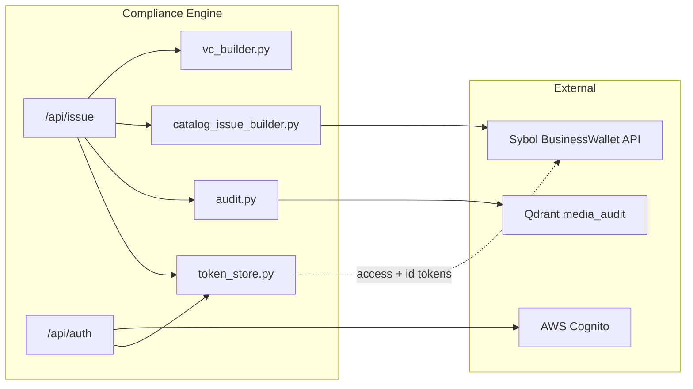
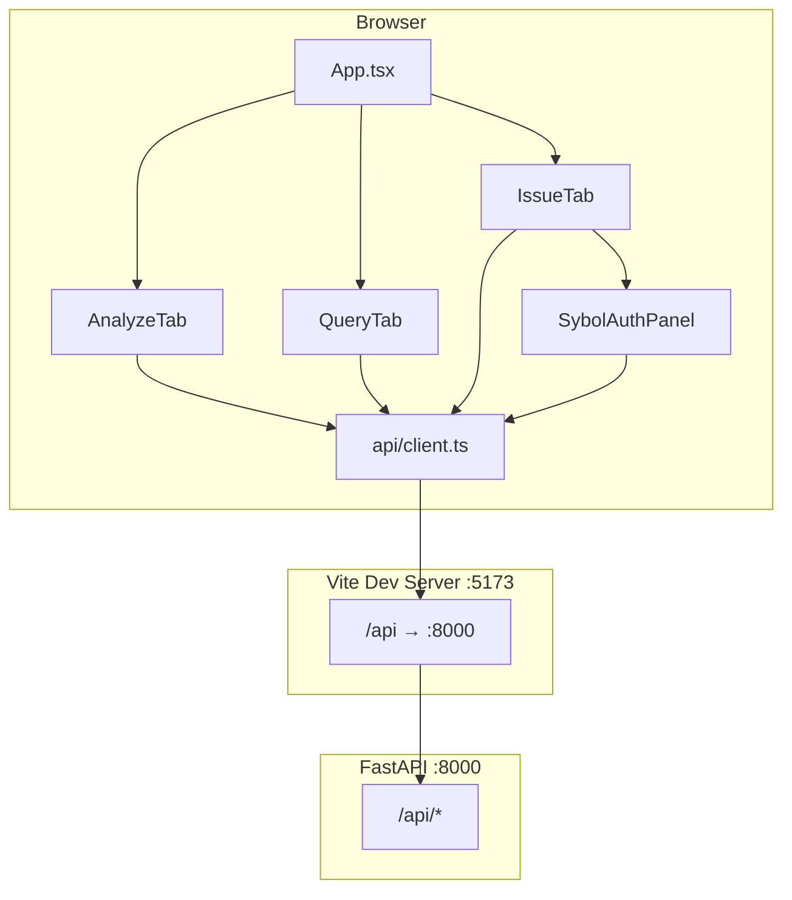
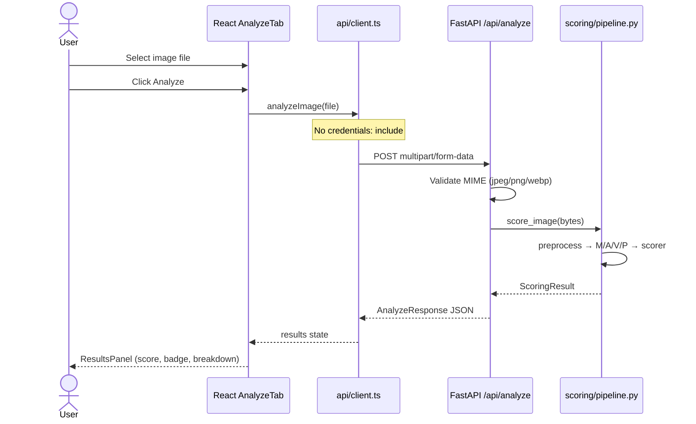
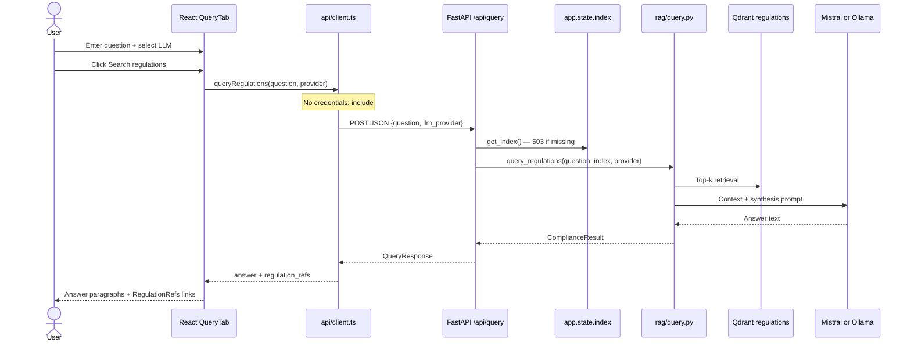

# Technical Reference — Parts VI, VII, VIII

> **Scope:** Credentials & Sybol integration (§31–38), Frontend (§39–45), Data flows (§46–49).  
> **Sources verified against:** `src/credentials/`, `src/api/`, `frontend/src/`, `src/scripts/`, `sybol_docs/`.

---

## Part VI — Credentials and Sybol integration

The credentials package (`src/credentials/`) implements the fourth deliverable of the Sybol Compliance Engine: **signed W3C Verifiable Credentials (VCs)** backed by scoring, RAG, and audit metadata. It bridges local analysis pipelines to the Sybol BusinessWallet API (OpenAPI v4) and AWS Cognito authentication.

### Architecture overview



| Module | File | Responsibility |
|--------|------|----------------|
| VC payload builder | `src/credentials/vc_builder.py` | Unsigned W3C VC Data Model 1.1 reference payload |
| Catalog issue builder | `src/credentials/catalog_issue_builder.py` | `CredentialIssueRequest` body for `POST /api/bl/credentials` |
| HTTP client | `src/credentials/sybol_client.py` | Login, catalog discovery, credential issuance |
| Token helpers | `src/credentials/auth_tokens.py` | JWT normalization and structural validation |
| Cognito client | `src/credentials/cognito_client.py` | Direct `InitiateAuth` (USER_PASSWORD_AUTH) |
| Audit writer | `src/credentials/audit.py` | Metadata-only Qdrant audit records |
| Session store | `src/api/token_store.py` | In-memory JWT storage keyed by session ID |
| Auth routes | `src/api/routes/auth.py` | Browser sign-in, status, logout |
| Issue route | `src/api/routes/issue.py` | Full issuance pipeline orchestration |
| Token resolution | `src/api/dependencies.py` → `get_sybol_client()` | Session → env tokens → env login fallback |

---

### §31 — W3C VC payload (`vc_builder.py`)

**Source:** `src/credentials/vc_builder.py`

The VC builder produces an **unsigned** W3C Verifiable Credentials Data Model 1.1 JSON object. This payload is returned in `IssueResponse.vc_payload` as a human-readable reference alongside the Sybol-signed credential. It is **not** sent directly to Sybol for signing — catalog issuance uses `catalog_issue_builder.py` instead.

#### Constants and helpers

| Symbol | Value / behavior | Location |
|--------|------------------|----------|
| `VC_CONTEXT` | `"https://www.w3.org/2018/credentials/v1"` | `vc_builder.py:7` |
| `_iso_timestamp()` | UTC ISO-8601 with `Z` suffix | `vc_builder.py:10–11` |

#### `build_vc_payload()`

**Signature:**

```python
def build_vc_payload(
    result: ScoringResult,
    rag: ComplianceResult,
    *,
    credential_id: str | None = None,
    evidence_url: str | None = None,
    expiration_date: str | None = None,
) -> dict
```

**Inputs:**

| Parameter | Type | Default | Description |
|-----------|------|---------|-------------|
| `result` | `ScoringResult` | required | Scoring pipeline output (`src/scoring/models.py`) |
| `rag` | `ComplianceResult` | required | RAG synthesis output (`src/rag/models.py`) |
| `credential_id` | `str \| None` | `urn:uuid:{uuid4}` | VC `id` field |
| `evidence_url` | `str \| None` | `None` | Qdrant audit point URL written to `credentialSubject.evidenceUrl` |
| `expiration_date` | `str \| None` | omitted | Optional top-level `expirationDate` |

**Design note (from docstring):** Issuer DID is resolved **server-side** by Sybol from the authenticated tenant context; it is intentionally **not** included in the request body.

#### Output shape

```json
{
  "@context": ["https://www.w3.org/2018/credentials/v1"],
  "id": "urn:uuid:550e8400-e29b-41d4-a716-446655440000",
  "type": ["VerifiableCredential", "MediaComplianceCredential"],
  "issuanceDate": "2026-06-25T14:30:00.000000Z",
  "credentialSubject": {
    "id": "urn:media:{sha256_hex}",
    "mediaHash": "{sha256_hex}",
    "authenticityScore": 0.86,
    "scoreBreakdown": { "m": 0.9, "a": 0.8, "v": 0.85, "p": 0.9 },
    "complianceStatus": "compliant",
    "modelVersion": "1.0.0",
    "analysisTimestamp": "2026-06-25T14:30:00.000000Z",
    "regulationRefs": [
      {
        "regulation": "EU AI Act",
        "article": "Article 50",
        "url": "https://eur-lex.europa.eu/eli/reg/2024/1689"
      }
    ],
    "evidenceUrl": "http://localhost:6333/collections/media_audit/points/{uuid}"
  }
}
```

#### Field mapping table

| VC field | Source |
|----------|--------|
| `credentialSubject.id` | `urn:media:{result.media_hash}` |
| `credentialSubject.mediaHash` | `result.media_hash` |
| `credentialSubject.authenticityScore` | `result.authenticity_score` |
| `credentialSubject.scoreBreakdown.m/a/v/p` | `result.score_breakdown.*` |
| `credentialSubject.complianceStatus` | `result.compliance_status.value` |
| `credentialSubject.modelVersion` | `result.model_version` |
| `credentialSubject.regulationRefs[]` | `rag.regulation_refs` → `{regulation, article, url: source_url}` |
| `credentialSubject.evidenceUrl` | `evidence_url` argument (from audit write) |

#### Credential type

The custom type `MediaComplianceCredential` extends the base `VerifiableCredential` type. This aligns with Sybol catalog document definitions (when a `MediaCompliance` catalog document exists) and ADR-0004 W3C VC alignment in `sybol_docs/`.

#### Package export

`src/credentials/__init__.py` re-exports only `build_vc_payload`:

```python
from .vc_builder import build_vc_payload
__all__ = ["build_vc_payload"]
```

---

### §32 — Catalog issue builder (`catalog_issue_builder.py`)

**Source:** `src/credentials/catalog_issue_builder.py`

Maps scoring + RAG output to the Sybol BusinessWallet **`CredentialIssueRequest`** body consumed by `POST /api/bl/credentials`. The implementation follows OpenAPI v4 (`sybol_docs/openapi-wallet.yaml`) with one important runtime adaptation documented in the module docstring.

#### OpenAPI vs live API divergence

| Aspect | OpenAPI v4 (`openapi-wallet.yaml`) | Live API (this engine) |
|--------|--------------------------------------|------------------------|
| Required fields | `documentId`, `issuerKey`, `subject`, `claims` | `documentId`, `issuerKey`, `recipientDid`, `claims` |
| `claims` shape | `ClaimValue[]` array | **Flat object** `key → value` |
| `subject` | Required string | Replaced by `recipientDid` in practice |

The catalog builder uses the **flat claims object** because the live develop wallet API validates claims as `dict[str, object]`, not as an array of `{key, value}` pairs.

#### `build_catalog_issue_request()`

**Signature:**

```python
def build_catalog_issue_request(
    result: ScoringResult,
    rag: ComplianceResult,
    *,
    settings: Settings,
    evidence_url: str | None = None,
) -> dict
```

#### Required environment variables

| Env var | `Settings` field | Validation |
|---------|------------------|------------|
| `SYBOL_DOCUMENT_ID` | `sybol_document_id` | Raises `ValueError` if missing |
| `SYBOL_ISSUER_KEY` | `sybol_issuer_key` | Raises `ValueError` if missing |
| `SYBOL_RECIPIENT_DID` | `sybol_recipient_did` | Required; falls back to `SYBOL_SUBJECT_DID` |

Error messages (from `catalog_issue_builder.py:30–37`):

- `"SYBOL_DOCUMENT_ID and SYBOL_ISSUER_KEY are required for catalog issuance."`
- `"SYBOL_RECIPIENT_DID (or SYBOL_SUBJECT_DID) is required for catalog issuance."`

#### `_claim_value()` coercion

```python
def _claim_value(value: object) -> object:
    if isinstance(value, (dict, list)):
        return value
    return str(value)
```

Scalars are stringified; nested dicts/lists (e.g. `regulationRefs`, `scoreBreakdown` components) pass through unchanged.

#### Claims mapping

| Claim key | Source | Coercion |
|-----------|--------|----------|
| `mediaHash` | `result.media_hash` | `str` |
| `authenticityScore` | `result.authenticity_score` | `str` |
| `complianceStatus` | `result.compliance_status.value` | `str` |
| `modelVersion` | `result.model_version` | `str` |
| `scoreBreakdown.m` | `result.score_breakdown.m` | `str` |
| `scoreBreakdown.a` | `result.score_breakdown.a` | `str` |
| `scoreBreakdown.v` | `result.score_breakdown.v` | `str` |
| `scoreBreakdown.p` | `result.score_breakdown.p` | `str` |
| `regulationRefs` | RAG refs as `{regulation, article, url}` list | `list` (unchanged) |
| `ragSummary` | `rag.summary` | `str` |
| `evidenceUrl` | optional `evidence_url` arg | `str` (only if provided) |

Dot-notation keys (`scoreBreakdown.m`, etc.) mirror catalog claim key conventions used in Sybol batch issuance (`sybol_docs/services/businessLogic/specs/batch-spec.md`).

#### Request body structure

```json
{
  "documentId": "<SYBOL_DOCUMENT_ID>",
  "issuerKey": "<SYBOL_ISSUER_KEY>",
  "recipientDid": "<SYBOL_RECIPIENT_DID>",
  "claims": {
    "mediaHash": "abc123...",
    "authenticityScore": "0.86",
    "complianceStatus": "compliant",
    "modelVersion": "1.0.0",
    "scoreBreakdown.m": "0.9",
    "scoreBreakdown.a": "0.8",
    "scoreBreakdown.v": "0.85",
    "scoreBreakdown.p": "0.9",
    "regulationRefs": [
      { "regulation": "EU AI Act", "article": "Article 50", "url": "https://..." }
    ],
    "ragSummary": "EU AI Act transparency obligations may apply...",
    "evidenceUrl": "http://localhost:6333/collections/media_audit/points/{uuid}"
  },
  "format": "jwt_vc_json",
  "levelOfAssurance": 2
}
```

| Field | Source | Notes |
|-------|--------|-------|
| `format` | `settings.sybol_credential_format` | Default `jwt_vc_json` (`SYBOL_CREDENTIAL_FORMAT`) |
| `levelOfAssurance` | `settings.sybol_level_of_assurance` | Optional; included only when env var is set |

---

### §33 — Sybol HTTP client (`sybol_client.py`)

**Source:** `src/credentials/sybol_client.py`

HTTP client for the Sybol BusinessWallet API. Handles authentication headers, login, catalog document listing, and credential issuance.

#### Module constants

| Constant | Value | Purpose |
|----------|-------|---------|
| `_TBD_PREFIX` | `"TBD_"` | Placeholder detection for unset config |
| `DEFAULT_API_BASE_URL` | `https://api.develop.wallet.sybol.id` | Develop wallet host |

#### Exception types

| Exception | When raised |
|-----------|-------------|
| `SybolSigningError` | HTTP errors, timeouts, invalid responses, MFA challenges, missing signed proof |
| `SybolNotConfiguredError` | Missing tokens/credentials when headers or login required |

#### `SybolClient` constructor

```python
def __init__(
    self,
    api_base_url: str | None,
    access_token: str | None,
    id_token: str | None,
    email: str | None = None,
    password: str | None = None,
    document_id: str | None = None,
    issuer_key: str | None = None,
    timeout: float = 10.0,
) -> None
```

Tokens are normalized via `normalize_token()` on construction.

#### `is_configured` property

Returns `True` when **all** of the following hold (`sybol_client.py:51–59`):

1. `api_base_url` is set and not a `TBD_` placeholder
2. `document_id` is set and not a `TBD_` placeholder
3. `issuer_key` is set and not a `TBD_` placeholder
4. **Either** valid access + id tokens **or** email + password for on-demand login

Note: `is_configured` does **not** check `recipientDid` — that is validated in `build_catalog_issue_request()`.

#### Authentication headers

`_headers()` (`sybol_client.py:80–96`) requires valid tokens and produces:

```http
Authorization: Bearer <access_token>
x-id-token: <id_token>
Content-Type: application/json
```

Before returning headers, `is_valid_jwt(self._id_token)` is checked. Invalid ID tokens raise `SybolSigningError` with guidance to sign in again on the Issue tab.

This matches the Sybol Business Logic API contract documented in `sybol_docs/services/businessLogic/api/businesslogic-api.md`:

> All Business Logic API endpoints require authentication via `x-id-token` header (tenant-specific database access).

#### `login()` — `POST /auth/login`

Exchanges `SYBOL_EMAIL` + `SYBOL_PASSWORD` for Cognito tokens via the Sybol wallet REST envelope:

1. `POST {base}/auth/login` with `{"email", "password"}`
2. Expects `{success, data: {accessToken, idToken, refreshToken?}}`
3. On MFA challenge: `challengeName` in envelope → `SybolSigningError`
4. Updates `self._access_token` and `self._id_token` in place

#### `ensure_authenticated()`

Calls `login()` if `_has_valid_tokens()` is false.

#### `list_catalog_documents(search=None)` — `GET /api/catalog/documents`

Authenticated catalog discovery. Returns `envelope["data"]` when it is a list, else `[]`.

Used by `sybol_discover_catalog.py` to find `SYBOL_DOCUMENT_ID`.

#### `issue_credential(issue_request)` — `POST /api/bl/credentials`

1. `ensure_authenticated()`
2. `POST /api/bl/credentials` with catalog issue body
3. Validates response `data` contains signed credential via `_credential_is_signed()`:
   - `signed_token` present, **or**
   - `proof` is a dict, **or**
   - `signedToken` is a string
4. Returns the `data` object (signed credential)

`sign_credential()` is an alias for `issue_credential()`.

#### `_request()` error handling

| Condition | Exception |
|-----------|-----------|
| `httpx.TimeoutException` | `SybolSigningError` with timeout message |
| `httpx.TransportError` | `SybolSigningError` with transport detail |
| Non-success HTTP status | `SybolSigningError` with status + extracted message |
| `success: false` in envelope | `SybolSigningError` |
| Non-dict envelope | `SybolSigningError` |

Error messages are extracted from `message` or `error` keys (max 400 chars).

#### Environment hosts

| Environment | Base URL | Used by |
|-------------|----------|---------|
| Develop wallet | `https://api.develop.wallet.sybol.id` | Default (`SYBOL_API_BASE_URL`, `DEFAULT_API_BASE_URL`) |
| Production | `https://api.sybol.io` | Probed by `sybol_probe.py`; documented in BL API examples |

The compliance engine defaults to **develop** for safe integration testing. Production issuance requires updating `SYBOL_API_BASE_URL` and valid production catalog IDs.

---

### §34 — Authentication tokens and Cognito client

#### `auth_tokens.py`

**Source:** `src/credentials/auth_tokens.py`

Minimal JWT helpers — **structural validation only**, no signature verification (Sybol API validates tokens server-side).

| Function | Behavior |
|----------|----------|
| `normalize_token(value)` | Strip whitespace; `None` or empty → `None` |
| `is_valid_jwt(token)` | `True` if exactly 3 non-empty dot-separated segments |

Used by:
- `SybolClient._headers()` — rejects malformed ID tokens before Sybol calls
- `get_sybol_client()` — normalizes env tokens

#### `cognito_client.py`

**Source:** `src/credentials/cognito_client.py`

Direct AWS Cognito **`InitiateAuth`** with `USER_PASSWORD_AUTH` flow. The Issue tab auth route uses this path instead of Sybol's `/auth/login` REST endpoint.

| Constant | Value |
|----------|-------|
| `COGNITO_TARGET` | `AWSCognitoIdentityProviderService.InitiateAuth` |
| `AUTH_FLOW` | `USER_PASSWORD_AUTH` |
| Default region | `eu-west-1` |

##### `initiate_password_auth()`

```python
def initiate_password_auth(
    username: str,
    password: str,
    *,
    client_id: str,
    region: str = "eu-west-1",
    timeout: float = 30.0,
) -> dict[str, str]
```

**Request:** `POST https://cognito-idp.{region}.amazonaws.com/` with:

```http
Content-Type: application/x-amz-json-1.1
X-Amz-Target: AWSCognitoIdentityProviderService.InitiateAuth
```

**Body:**

```json
{
  "AuthFlow": "USER_PASSWORD_AUTH",
  "ClientId": "<SYBOL_COGNITO_CLIENT_ID>",
  "AuthParameters": {
    "USERNAME": "<email>",
    "PASSWORD": "<password>"
  }
}
```

**Returns (camelCase):**

```python
{
    "accessToken": str,
    "idToken": str,
    "refreshToken": str  # optional
}
```

##### MFA rejection

If Cognito returns `ChallengeName` (e.g. `SOFTWARE_TOKEN_MFA`), raises `CognitoAuthError`:

> `Cognito requires challenge {challenge!r} — complete it in the Sybol wallet, then try again.`

The compliance engine does **not** implement MFA challenge response flows. Users with MFA enabled must complete authentication in the Sybol wallet UI and paste tokens into `src/.env`, or use env-based `SYBOL_EMAIL`/`SYBOL_PASSWORD` only when Cognito allows password auth without challenge.

##### Required configuration

| Env var | `Settings` field | Aliases |
|---------|------------------|---------|
| `SYBOL_COGNITO_CLIENT_ID` | `sybol_cognito_client_id` | `COGNITO_CLIENT_ID` |
| `SYBOL_COGNITO_REGION` | `sybol_cognito_region` | `COGNITO_REGION` (default `eu-west-1`) |

#### Cognito ADR context

From [`sybol_docs/global/decisions/0001-aws-cognito-authentication.md`](../../sybol_docs/global/decisions/0001-aws-cognito-authentication.md):

- **Decision:** AWS Cognito User Pools for all Sybol platform services
- **Token model:** JWT access + ID tokens; `x-id-token` for tenant DB routing in Business Logic
- **MFA:** Supported platform-wide; compliance engine rejects challenged logins
- **Multi-tenant:** `tenantId` custom attribute in Cognito; BL service resolves issuer DID from auth context
- **Integration pattern:** Services validate JWTs via middleware; frontend apps use Cognito SDK or direct API

The compliance engine's browser sign-in path (`/api/auth/login`) bypasses Sybol's `/auth/login` wrapper and calls Cognito directly — equivalent tokens, fewer network hops, same token format expected by `SybolClient._headers()`.

---

### §35 — Session store (`token_store.py`)

**Source:** `src/api/token_store.py`

#### Problem solved

Cognito JWTs (especially ID tokens with custom claims) exceed practical signed-cookie size limits. The engine stores JWTs **server-side** in an in-memory dict and keeps only a short session ID in the Starlette session cookie.

#### Types and functions

```python
@dataclass
class AuthSession:
    access_token: str
    id_token: str
    email: str
    refresh_token: str | None = None

SESSION_COOKIE = "sybol_auth_sid"  # documented constant; see session key note below

def create_store() -> dict[str, AuthSession]
def save_session(store, session) -> str      # returns secrets.token_urlsafe(32) session ID
def load_session(store, session_id) -> AuthSession | None
def clear_session(store, session_id) -> None
```

#### Session cookie mechanics

| Layer | Key / name | Content |
|-------|------------|---------|
| Starlette `SessionMiddleware` | Encrypted HTTP cookie (name assigned by Starlette) | Serialized session dict |
| Session dict key | `"auth_sid"` | Opaque 32-byte URL-safe session ID |
| `app.state.token_store` | `{session_id: AuthSession}` | Full Cognito JWT pair |

**Important:** `SESSION_COOKIE = "sybol_auth_sid"` in `token_store.py` is a **named constant** for documentation; the live session dict key used throughout `auth.py` and `dependencies.py` is **`"auth_sid"`**.

#### Lifecycle

1. **Startup** (`main.py` lifespan): `app.state.token_store = create_store()` — empty dict
2. **Login** (`POST /api/auth/login`): `save_session()` → `request.session["auth_sid"] = sid`
3. **Issue** (`POST /api/issue`): `get_sybol_client()` reads `auth_sid` from session → `load_session()`
4. **Logout** (`POST /api/auth/logout`): `clear_session()` + `request.session.pop("auth_sid")`

#### Restart invalidation

The token store is **in-memory only**. API process restart clears all sessions. If the browser still holds a session cookie with `auth_sid` but the store entry is gone, `get_sybol_client()` raises **401**:

> Sign-in session expired (for example after an API restart). Sign in again on the Issue tab.

#### `SESSION_SECRET_KEY`

Required for `SessionMiddleware` (`main.py:46–55`). Default `dev-only-change-in-production` — must be changed for production deployments.

---

### §36 — Audit trail (`audit.py`)

**Source:** `src/credentials/audit.py`

Writes **metadata-only** audit records to Qdrant. No raw image bytes are stored (GDPR data minimisation per module docstring).

#### `write_audit_record()`

```python
def write_audit_record(
    result: ScoringResult,
    rag: ComplianceResult,
    credential_id: str,
    client: QdrantClient,
    settings: Settings,
) -> str
```

**Returns:** URL string used as `evidenceUrl` in VC payload and catalog claims:

```
{qdrant_url}/collections/{qdrant_audit_collection}/points/{point_id}
```

Default collection: `media_audit` (`QDRANT_AUDIT_COLLECTION`).

#### Collection setup

`_ensure_collection()` creates the collection if missing with:
- Vector size: **1** (dummy dimension)
- Distance: `COSINE`

Audit records are payload-centric; the `[0.0]` vector satisfies Qdrant's vector requirement without enabling semantic search on audit data.

#### Point ID

`credential_id.removeprefix("urn:uuid:")` — the VC UUID without URN prefix.

#### Stored payload fields

| Field | Source |
|-------|--------|
| `mediaHash` | `result.media_hash` |
| `authenticityScore` | `result.authenticity_score` |
| `scoreBreakdown` | `{m, a, v, p}` |
| `complianceStatus` | `result.compliance_status.value` |
| `modelVersion` | `result.model_version` |
| `analysisTimestamp` | UTC ISO-8601 `Z` |
| `regulationRefs` | `{regulation, article, url}` per RAG ref |

#### Privacy properties

- SHA-256 `mediaHash` only — irreversible fingerprint, not reversible to image
- No filename, EXIF, or pixel data
- Audit URL is a Qdrant admin-style point URL (useful for demo; production may front with an API gateway)

---

### §37 — Sybol platform context

This section summarizes how the compliance engine integrates with Sybol platform services documented in `sybol_docs/`.

#### Cognito authentication model

**Reference:** [`sybol_docs/global/decisions/0001-aws-cognito-authentication.md`](../../sybol_docs/global/decisions/0001-aws-cognito-authentication.md)

| Platform concept | Compliance engine mapping |
|------------------|---------------------------|
| User Pool auth | `cognito_client.initiate_password_auth()` |
| Access token | `Authorization: Bearer` header in `SybolClient` |
| ID token | `x-id-token` header — tenant DB routing |
| MFA challenges | Rejected with `CognitoAuthError` / `SybolSigningError` |
| Session in browser | Starlette session + in-memory `token_store` |
| Env fallback tokens | `SYBOL_ACCESS_TOKEN` + `SYBOL_ID_TOKEN` in `src/.env` |

#### Business Logic API

**Reference:** [`sybol_docs/services/businessLogic/api/businesslogic-api.md`](../../sybol_docs/services/businessLogic/api/businesslogic-api.md)

| BL endpoint | Engine usage |
|-------------|--------------|
| `POST /api/bl/credentials` | `SybolClient.issue_credential()` — catalog issuance |
| `GET /api/bl/credentials` | Not used (listing) |
| `GET /api/bl/settings` | Probed by `sybol_probe.py` for tenant DID defaults |

**Required headers (both documented and implemented):**

```http
Authorization: Bearer <access_token>
x-id-token: <id_token>
Content-Type: application/json
```

**Success response envelope:**

```json
{
  "success": true,
  "data": {
    "id": "credential-uuid",
    "issuer": "did:sybol:...",
    "signed_token": "eyJ...",
    "proof": { "type": "...", "created": "...", "jws": "..." }
  }
}
```

The engine accepts any of `signed_token`, `proof` (dict), or `signedToken` as evidence of successful signing (`_credential_is_signed()`).

**HTTP status codes (from sybol_docs):**

| Code | Meaning |
|------|---------|
| 201 | Credential created |
| 400 | Invalid format |
| 401 | Authentication required |
| 422 | Validation failed (catalog claim mismatch, bad documentId, etc.) |

Engine mapping: `SybolSigningError` → HTTP **502** on `/api/issue`; configuration gaps → HTTP **503**.

#### Catalog service role

**Reference:** [`sybol_docs/services/catalog/README.md`](../../sybol_docs/services/catalog/README.md)

The Catalog service defines the **structural vocabulary** for credential issuance:

| Catalog entity | Role in issuance |
|----------------|------------------|
| **Documents** | Template for credential type; provides `documentId` |
| **Claims** | Expected claim keys and validation (regex, data types) |
| **Forms** | UI presentation over claims |
| **Compliance Regions** | Regulatory jurisdiction hierarchy |

**Engine touchpoints:**

| Catalog API | Client method | Purpose |
|-------------|---------------|---------|
| `GET /api/catalog/documents` | `list_catalog_documents()` | Discover `SYBOL_DOCUMENT_ID` |
| Document claim keys | Printed by `sybol_discover_catalog.py` | Align `catalog_issue_builder` claim keys |

Catalog GET endpoints may be public on develop (no auth) per `sybol_probe.py` probe; authenticated listing returns tenant-scoped documents.

**ADR-0006 alignment:** [`sybol_docs/global/decisions/0006-catalog-w3c-data-model-alignment.md`](../../sybol_docs/global/decisions/0006-catalog-w3c-data-model-alignment.md) — catalog Documents gain `vc_type`, `@context`, and claim `semantic_id` fields for W3C VC interoperability. The engine's `MediaComplianceCredential` type and claim keys should match the catalog document definition once provisioned.

#### Host mapping

| Host | Environment | Default in engine |
|------|-------------|-------------------|
| `api.develop.wallet.sybol.id` | Develop wallet | **Yes** (`SYBOL_API_BASE_URL`) |
| `api.sybol.io` | Production | Documented in BL API examples |
| `api.sybol.id` | Alternate | Probed by `sybol_probe.py` |

#### Issuer DID resolution

Per `vc_builder.py` docstring and Sybol ADR-0009 (`company-did-resolution-from-auth-context`), the issuer DID is derived from the authenticated tenant — not passed in the catalog issue body. The `issuerKey` field identifies the KMS signing key, not the DID string directly.

#### Token resolution chain (for `/api/issue`)

`get_sybol_client()` in `src/api/dependencies.py`:

```
1. request.session["auth_sid"]
   → load_session(app.state.token_store, auth_sid)
   → if auth_sid present but session missing: HTTP 401

2. If session found:
   → use session.access_token, session.id_token
   → email/password = None (no on-demand login)

3. Else (no browser session):
   → SYBOL_ACCESS_TOKEN + SYBOL_ID_TOKEN (normalized)
   → fallback SYBOL_EMAIL + SYBOL_PASSWORD for SybolClient.login()
```

---

### §38 — CLI discovery scripts

All scripts live in `src/scripts/` and are run with `PYTHONPATH=src` or `poetry run python -m scripts.<name>` from the repo root.

#### `sybol_login.py`

**Purpose:** Exchange `SYBOL_EMAIL` + `SYBOL_PASSWORD` via Sybol `POST /auth/login`.

```bash
export SYBOL_EMAIL=...
export SYBOL_PASSWORD=...
poetry run python -m scripts.sybol_login
```

**Output:** `export`-ready lines for `src/.env`:

```
SYBOL_ACCESS_TOKEN=...
SYBOL_ID_TOKEN=...
SYBOL_REFRESH_TOKEN=...  # if present
```

**Note:** Tokens expire in ~1 hour. Browser sign-in via Issue tab is preferred for interactive use.

#### `sybol_discover_catalog.py`

**Purpose:** List catalog documents to find `SYBOL_DOCUMENT_ID` and inspect claim keys.

```bash
poetry run python -m scripts.sybol_discover_catalog
poetry run python -m scripts.sybol_discover_catalog --search Media
```

**Auth:** Uses env tokens or email/password via `SybolClient.ensure_authenticated()`.

**Output:** Document `id`, `name`, `supported_format`, and claim keys per document.

#### `sybol_probe.py`

**Purpose:** Comprehensive discovery — login paths, catalog, BL settings, issuance format probe.

```bash
export SYBOL_EMAIL=...
export SYBOL_PASSWORD=...
PYTHONPATH=src python3 -m scripts.sybol_probe
```

**Probes:**

| Phase | Action |
|-------|--------|
| 1 | Public `GET /api/catalog/documents` on develop (no auth) |
| 2 | Login across 3 hosts × 4 login paths |
| 3 | Authenticated GET: `/api/catalog/documents`, `/api/bl/settings`, `/auth/me` |
| 4 | POST `/api/bl/credentials` with `catalog_v4` and `raw_w3c_vc` probe bodies |

**Interpretation guide (printed by script):**

| Result | Meaning |
|--------|---------|
| 201 on `catalog_v4` | Use `catalog_issue_builder` + real documentId/issuerKey |
| 201 on `raw_w3c_vc` | Use `vc_builder` payload directly (BL doc style) |
| 401 | Wrong tokens or host |
| 404 on issue | Wrong path or host |
| 422 | Format recognized; validation failed (check catalog claims/IDs) |

#### `sybol_probe_issue.py`

**Purpose:** End-to-end issuance test with synthetic scoring/RAG data.

```bash
PYTHONPATH=src python3 -m scripts.sybol_probe_issue
```

**Behavior:**

1. Loads `src/.env` if present (simple line parser)
2. `Settings()` + `SybolClient.ensure_authenticated()`
3. Lists catalog documents (search `"media"` first)
4. If `SYBOL_DOCUMENT_ID` + `SYBOL_ISSUER_KEY` set: builds catalog request and calls `issue_credential()`

**Exit codes:** `0` success, `1` auth/issue failure, `2` missing catalog config.

---

## Part VII — Frontend

The React SPA in `frontend/` provides three workflow tabs: **Analyze** (scoring only), **Query** (RAG Q&A), and **Issue** (full VC pipeline with Sybol sign-in).

### Architecture overview



---

### §39 — Stack and build

#### `frontend/package.json`

| Category | Package | Version |
|----------|---------|---------|
| Runtime | `react` | ^18.3.1 |
| Runtime | `react-dom` | ^18.3.1 |
| Build | `vite` | ^7.3.6 |
| Build | `typescript` | ^5.6.3 |
| Build | `@vitejs/plugin-react` | ^4.7.0 |
| Types | `@types/react` | ^18.3.12 |
| Types | `@types/react-dom` | ^18.3.1 |

**Scripts:**

| Script | Command | Output |
|--------|---------|--------|
| `dev` | `vite` | Dev server on port 5173 |
| `build` | `tsc && vite build` | `frontend/dist/` |
| `preview` | `vite preview` | Preview production build |

**Project metadata:** `sybol-compliance-engine-ui` v0.1.0, `"type": "module"` (ESM).

#### TypeScript configuration

Strict mode enabled (inferred from `tsc` in build script and explicit interfaces throughout `types/api.ts`). Path alias: none — relative imports only.

#### `frontend/vite.config.ts`

```typescript
export default defineConfig({
  plugins: [react()],
  server: {
    proxy: {
      '/api': 'http://localhost:8000',
      '/health': 'http://localhost:8000',
    },
  },
});
```

| Setting | Behavior |
|---------|----------|
| React plugin | Fast Refresh for `.tsx` |
| `/api` proxy | Forwards to FastAPI during local dev |
| `/health` proxy | Header health check bypasses CORS issues |

#### `VITE_API_BASE_URL`

Defined in `frontend/src/api/client.ts`:

```typescript
const base = import.meta.env.VITE_API_BASE_URL ?? '';
```

| Mode | `base` value | Effect |
|------|--------------|--------|
| Local dev (default) | `''` | Relative URLs → Vite proxy → FastAPI |
| Production / custom | `https://api.example.com` | Absolute API origin |

When FastAPI serves `frontend/dist/` (production), relative URLs work without setting `VITE_API_BASE_URL`.

#### CORS and credentials

FastAPI CORS (`main.py:48–54`):

```python
allow_origins=["http://localhost:5173", "http://127.0.0.1:5173"]
allow_credentials=True
```

Session cookies require `credentials: 'include'` on cross-origin fetches from Vite dev server to proxied API — handled selectively in `client.ts` (see §41).

#### Production SPA serving

When `frontend/dist/` exists, `main.py` mounts `/assets` and provides SPA fallback for non-API routes. Same-origin deployment eliminates CORS for session cookies.

---

### §40 — App shell

#### `frontend/src/main.tsx`

Entry point: `createRoot` → `<StrictMode><App /></StrictMode>`. Imports global `index.css`.

#### `frontend/src/App.tsx`

**State:** `activeTab: TabId` — `'analyze' | 'query' | 'issue'`, default `'analyze'`.

**Layout:**

```
.app
├── Header          (health check)
└── .app-main
    ├── TabNav      (tab switcher)
    └── {activeTab} (AnalyzeTab | QueryTab | IssueTab)
```

No React Router — tab state is local `useState`. No global context providers.

#### `frontend/src/components/Header.tsx`

| Concern | Implementation |
|---------|----------------|
| Health check | `healthCheck()` on mount |
| Status states | `loading` → `connected` → `unreachable` |
| UI | Brand title "Sybol Compliance Engine" + IEU Labs sublabel |
| Accessibility | `aria-live="polite"` on status indicator |

Does **not** use `credentials: 'include'` (health is unauthenticated).

#### `frontend/src/components/TabNav.tsx`

| Tab ID | Label | Stub? |
|--------|-------|-------|
| `analyze` | Analyze | No |
| `query` | Query | No |
| `issue` | Issue | No |

The `stub` property exists on tab config but is **false** for all tabs (Issue tab is live — not a stub).

**Props:** `activeTab: TabId`, `onTabChange: (tab: TabId) => void`.

Uses `aria-current="page"` on active tab button.

---

### §41 — API client (`api/client.ts`)

**Source:** `frontend/src/api/client.ts`

#### Base URL and shared options

```typescript
const base = import.meta.env.VITE_API_BASE_URL ?? '';
const fetchOptions: RequestInit = { credentials: 'include' };
```

#### `ApiError` class

```typescript
export class ApiError extends Error {
  status?: number;
  constructor(message: string, status?: number);
}
```

`parseErrorMessage()` extracts FastAPI `detail` (string or validation array `[0].msg`).

#### Function reference

| Function | Method | Path | `credentials: 'include'` | Body |
|----------|--------|------|--------------------------|------|
| `healthCheck()` | GET | `/health` | **No** | — |
| `analyzeImage(file)` | POST | `/api/analyze` | **No** | `FormData` |
| `queryRegulations(question, provider)` | POST | `/api/query` | **No** | JSON |
| `issueCredential(file)` | POST | `/api/issue` | **Yes** | `FormData` |
| `authStatus()` | GET | `/api/auth/status` | **Yes** (`fetchOptions`) | — |
| `authLogin(email, password)` | POST | `/api/auth/login` | **Yes** | JSON |
| `authLogout()` | POST | `/api/auth/logout` | **Yes** | — |

#### Why `credentials: 'include'` is selective

| Endpoint | Cookie needed? | Reason |
|----------|----------------|--------|
| `/api/auth/*` | Yes | Starlette session stores `auth_sid` |
| `/api/issue` | Yes | `get_sybol_client()` reads session tokens |
| `/api/analyze` | No | Stateless; no auth |
| `/api/query` | No | Stateless; no auth |
| `/health` | No | Public |

Omitting `credentials: 'include'` on analyze/query avoids sending session cookies unnecessarily and matches same-origin policy for unauthenticated endpoints.

#### Error handling pattern (tabs)

All tabs follow the same pattern:

```typescript
try {
  const response = await apiFunction(...);
  setResults(response);
} catch (err) {
  if (err instanceof ApiError) {
    setError(err.message);  // status-specific hints in IssueTab/QueryTab
  } else if (err instanceof TypeError) {
    setError('Network error — could not reach the API...');
  } else {
    setError('An unexpected error occurred.');
  }
}
```

---

### §42 — Types (`types/api.ts`)

**Source:** `frontend/src/types/api.ts`

#### Naming convention split

| Layer | Convention | Example |
|-------|------------|---------|
| REST API responses | `snake_case` | `authenticity_score`, `regulation_refs` |
| W3C VC payload (`vc_payload`) | `camelCase` | `credentialSubject`, `mediaHash` |
| Score breakdown | Single-letter keys | `m`, `a`, `v`, `p` (both layers) |

#### Core types

```typescript
export type ComplianceStatus = 'compliant' | 'non-compliant' | 'review';
export type LlmProvider = 'mistral' | 'ollama';

export interface ScoreBreakdown { m: number; a: number; v: number; p: number; }
```

#### API response interfaces

| Interface | Key fields |
|-----------|------------|
| `AnalyzeResponse` | `authenticity_score`, `score_breakdown`, `compliance_status`, `media_hash`, `model_version`, `analysis_timestamp`, `evidence_url?` |
| `QueryResponse` | `answer`, `regulation_refs`, `llm_provider`, `llm_model` |
| `IssueResponse` | `status`, `vc_id`, `detail`, `signed`, `vc_payload`, `signed_vc` |
| `AuthStatusResponse` | `authenticated`, `email?`, `catalog_configured`, `session_active` |
| `AuthLoginResponse` | Same shape as `AuthStatusResponse` |
| `HealthResponse` | `status` |

#### VC-specific types (camelCase)

| Interface | Purpose |
|-----------|---------|
| `VcRegulationRef` | `{ regulation, article, url }` |
| `VcCredentialSubject` | Full subject with scores, refs, `evidenceUrl` |
| `VcPayload` | W3C envelope with `@context`, `type`, `issuanceDate` |
| `SignedVcProof` | `type`, `created`, `verificationMethod`, `proofPurpose`, `proofValue` |
| `SignedVc` | Sybol response; index signature for extra fields |

`CredentialResultsPanel` maps `VcRegulationRef[]` → `RegulationRef[]` for reuse of `RegulationRefs` component.

#### Error body

```typescript
export interface ApiErrorBody {
  detail?: string | { msg?: string }[];
}
```

---

### §43 — Tab flows

#### AnalyzeTab (`components/AnalyzeTab.tsx`)

**Flow:**

1. User selects image via `ImageUploader` (drag-drop or file picker)
2. Client-side MIME check via `isAcceptedImageType()`
3. `ImagePreview` shows object URL (revoked on unmount)
4. "Analyze" → `analyzeImage(file)` → `POST /api/analyze`
5. `ResultsPanel` displays score, badge, gauge, breakdown, metadata

**State:**

| State variable | Type | Purpose |
|----------------|------|---------|
| `file` | `File \| null` | Selected upload |
| `previewUrl` | `string \| null` | Blob URL for preview |
| `loading` | `boolean` | Request in flight |
| `error` | `string \| null` | User-facing error |
| `results` | `AnalyzeResponse \| null` | API response |

**No authentication required.**

#### QueryTab (`components/QueryTab.tsx`)

**Flow:**

1. User enters question (min 10 characters)
2. Selects LLM provider: Mistral (cloud) or Ollama (local Qwen)
3. Provider persisted to `localStorage` key `sybol-query-llm-provider`
4. Submit via button or ⌘/Ctrl+Enter
5. `queryRegulations(question, llmProvider)` → `POST /api/query`
6. Answer rendered as paragraphs; citations via `RegulationRefs`

**Example questions (chips):**

- GDPR personal data in images
- EU AI Act transparency obligations
- Spanish deepfake law

**503 handling:** Custom message mentioning Qdrant ingest + Ollama setup when provider is `ollama`.

#### IssueTab (`components/IssueTab.tsx`)

**Flow:**

1. `SybolAuthPanel` mounted at top — checks auth status on load
2. User signs in (optional if env tokens configured)
3. User uploads image (same uploader pattern as Analyze)
4. "Issue credential" → `issueCredential(file)` → `POST /api/issue` with `credentials: 'include'`
5. `CredentialResultsPanel` shows signed VC details

**Loading hint:** "Scoring, regulation lookup, audit write, and Sybol signing may take 30–60s on first run."

**503 error branches:**

| Condition | User message |
|-----------|--------------|
| Sybol not configured | Prompts sign-in or `src/.env` tokens |
| Other 503 | Qdrant / RAG availability |

#### SybolAuthPanel (`components/SybolAuthPanel.tsx`)

**Purpose:** Browser-based Cognito sign-in without pasting JWTs into `.env`.

**Mount behavior:** `useEffect` → `authStatus()` with `credentials: 'include'`.

**UI states:**

| Condition | Display |
|-----------|---------|
| `loading` | "Checking sign-in status…" |
| `session_active` | Signed-in email + Sign out button |
| `authenticated && !session_active` | "Tokens configured on server via src/.env" |
| `!session_active` | Email/password form |

**Login flow:**

1. `authLogin(email, password)` → `POST /api/auth/login`
2. Clears password field
3. `refreshStatus()` → updates `catalog_configured` flag

**Logout flow:**

1. `authLogout()` → `POST /api/auth/logout`
2. Clears server session + in-memory token store entry

**Catalog hint:** When `!catalog_configured`, shows reminder for `SYBOL_DOCUMENT_ID`, `SYBOL_ISSUER_KEY`, `SYBOL_RECIPIENT_DID` in `src/.env`.

**Session cookie:** Login sets `request.session["auth_sid"]` server-side; browser stores encrypted session cookie automatically when `credentials: 'include'` is set.

---

### §44 — Component catalog (17 components)

The frontend has **17 React components** (`.tsx` files in `frontend/src/components/`). `App.tsx` in `frontend/src/` is the shell but lives outside the components directory.

#### Shell and navigation

##### 1. `Header.tsx`

| Prop | Type | Description |
|------|------|-------------|
| *(none)* | — | Self-contained; calls `healthCheck()` internally |

**Responsibilities:** API connectivity indicator, product branding.

##### 2. `TabNav.tsx`

| Prop | Type | Description |
|------|------|-------------|
| `activeTab` | `TabId` | Current tab |
| `onTabChange` | `(tab: TabId) => void` | Tab switch handler |

**Exports:** `TabId` type.

#### Tab containers

##### 3. `AnalyzeTab.tsx`

| Prop | Type | Description |
|------|------|-------------|
| *(none)* | — | Full analyze workflow |

**Children used:** `ImageUploader`, `ImagePreview`, `LoadingPanel`, `ErrorAlert`, `ResultsPanel`.

##### 4. `QueryTab.tsx`

| Prop | Type | Description |
|------|------|-------------|
| *(none)* | — | RAG query workflow with LLM toggle |

**Children used:** `LoadingPanel`, `ErrorAlert`, `RegulationRefs`.

**Constants:** `EXAMPLE_QUESTIONS`, `MIN_QUESTION_LENGTH=10`, `LLM_STORAGE_KEY`.

##### 5. `IssueTab.tsx`

| Prop | Type | Description |
|------|------|-------------|
| *(none)* | — | VC issuance workflow |

**Children used:** `SybolAuthPanel`, `ImageUploader`, `ImagePreview`, `LoadingPanel`, `ErrorAlert`, `CredentialResultsPanel`.

##### 6. `SybolAuthPanel.tsx`

| Prop | Type | Description |
|------|------|-------------|
| *(none)* | — | Cognito sign-in/out UI |

**State:** `status`, `email`, `password`, `loading`, `submitting`, `error`.

**API calls:** `authStatus`, `authLogin`, `authLogout` (all with session cookies).

#### Upload and preview

##### 7. `ImageUploader.tsx`

| Prop | Type | Description |
|------|------|-------------|
| `onFileSelect` | `(file: File) => void` | Called with validated file |
| `disabled?` | `boolean` | Disables drop zone and input |

**Exports:** `isAcceptedImageType(type: string): boolean`.

**Accepted MIME types:** `image/jpeg`, `image/png`, `image/webp`.

##### 8. `ImagePreview.tsx`

| Prop | Type | Description |
|------|------|-------------|
| `file` | `File \| null` | Original file (for name display) |
| `previewUrl` | `string \| null` | Object URL to render |

Revokes object URL on unmount.

#### Feedback

##### 9. `LoadingPanel.tsx`

| Prop | Type | Default | Description |
|------|------|---------|-------------|
| `title?` | `string` | `'Analyzing image…'` | Status heading |
| `hint?` | `string` | ML warmup hint | Subtext |

`role="status"`, `aria-live="polite"`.

##### 10. `ErrorAlert.tsx`

| Prop | Type | Default | Description |
|------|------|---------|-------------|
| `message` | `string` | required | Error detail |
| `title?` | `string` | `'Analysis failed'` | Alert heading |

`role="alert"`.

#### Results display

##### 11. `ResultsPanel.tsx`

| Prop | Type | Description |
|------|------|-------------|
| `results` | `AnalyzeResponse` | Analyze API response |

**Composes:** `ComplianceBadge`, `AuthenticityGauge`, `ScoreBreakdownPanel`, `MetadataRow`.

##### 12. `CredentialResultsPanel.tsx`

| Prop | Type | Description |
|------|------|-------------|
| `results` | `IssueResponse` | Issue API response |

**Features:**

- Signed/unsigned badge
- Credential ID truncation + copy
- Issuer DID display (from `signed_vc`)
- Score visualization (reuses analyze components)
- Regulation citations
- Cryptographic proof summary
- Signed JWT token copy
- Copy JSON / Download JSON actions

**Helpers:** `toRegulationRefs()`, `truncateId()`.

#### Score visualization

##### 13. `ComplianceBadge.tsx`

| Prop | Type | Description |
|------|------|-------------|
| `status` | `ComplianceStatus` | Maps to CSS modifier class |

Labels: Compliant, Review, Non-compliant.

##### 14. `AuthenticityGauge.tsx`

| Prop | Type | Description |
|------|------|-------------|
| `score` | `number` | 0.0–1.0 authenticity score |

SVG circular progress ring with numeric score and percent label.

##### 15. `ScoreBreakdown.tsx` (`ScoreBreakdownPanel`)

| Prop | Type | Description |
|------|------|-------------|
| `breakdown` | `ScoreBreakdown` | `{m, a, v, p}` values |

Renders labeled progress bars using `SIGNAL_LABELS` from `constants/signals.ts`.

##### 16. `MetadataRow.tsx`

| Prop | Type | Description |
|------|------|-------------|
| `mediaHash` | `string` | SHA-256 hex |
| `modelVersion` | `string` | Scoring model version |
| `analysisTimestamp` | `string` | ISO timestamp |

Truncated hash display with copy button.

#### Regulation citations

##### 17. `RegulationRefs.tsx`

| Prop | Type | Description |
|------|------|-------------|
| `refs` | `RegulationRef[]` | Citation list |

Uses `resolveRegulationUrl()` for link hrefs. Empty state message when no refs.

#### Complete file index

| # | File | Export |
|---|------|--------|
| 1 | `AnalyzeTab.tsx` | `AnalyzeTab` |
| 2 | `AuthenticityGauge.tsx` | `AuthenticityGauge` |
| 3 | `ComplianceBadge.tsx` | `ComplianceBadge` |
| 4 | `CredentialResultsPanel.tsx` | `CredentialResultsPanel` |
| 5 | `ErrorAlert.tsx` | `ErrorAlert` |
| 6 | `Header.tsx` | `Header` |
| 7 | `ImagePreview.tsx` | `ImagePreview` |
| 8 | `ImageUploader.tsx` | `ImageUploader`, `isAcceptedImageType` |
| 9 | `IssueTab.tsx` | `IssueTab` |
| 10 | `LoadingPanel.tsx` | `LoadingPanel` |
| 11 | `MetadataRow.tsx` | `MetadataRow` |
| 12 | `QueryTab.tsx` | `QueryTab` |
| 13 | `RegulationRefs.tsx` | `RegulationRefs` |
| 14 | `ResultsPanel.tsx` | `ResultsPanel` |
| 15 | `ScoreBreakdown.tsx` | `ScoreBreakdownPanel` |
| 16 | `SybolAuthPanel.tsx` | `SybolAuthPanel` |
| 17 | `TabNav.tsx` | `TabNav`, `TabId` |

Note: `ScoreBreakdown.tsx` exports `ScoreBreakdownPanel` (export name differs from filename).

#### Signal constants (`constants/signals.ts`)

| Key | Label | Description |
|-----|-------|-------------|
| `m` | Metadata | EXIF / file metadata signals |
| `a` | Artifacts | Compression & editing artifacts |
| `v` | Visual | Deepfake / visual authenticity model |
| `p` | Provenance | Perceptual hash & provenance |

`SIGNAL_KEYS: ['m', 'a', 'v', 'p']` — display order in breakdown UI.

---

### §45 — Regulation link resolution (`utils/regulationUrl.ts`)

**Source:** `frontend/src/utils/regulationUrl.ts`

RAG ingestion may store regulation `source_url` values as:

- Absolute HTTP(S) URLs (EUR-Lex, BOE, etc.)
- Local filesystem paths to PDFs in `research/regulations/`

The frontend must route local PDF paths through the FastAPI regulations whitelist endpoint.

#### `resolveRegulationUrl(url: string): string | null`

| Input pattern | Output |
|---------------|--------|
| Empty / whitespace | `null` |
| `http://` or `https://` | Unchanged absolute URL |
| Path ending in `.pdf` | `/api/regulations/{filename}` (URL-encoded) |
| Anything else | `null` → UI shows "Source link unavailable" |

**Example:**

```
Input:  research/regulations/EU_AI_Act.pdf
Output: /api/regulations/EU_AI_Act.pdf

Input:  https://eur-lex.europa.eu/eli/reg/2024/1689
Output: https://eur-lex.europa.eu/eli/reg/2024/1689
```

**Consumer:** `RegulationRefs.tsx` — renders "View source" link when `href` is non-null.

**Backend counterpart:** `src/api/routes/regulations.py` serves whitelisted PDFs from `research/regulations/`.

---

## Part VIII — Data flows (end-to-end)

### §46 — Analyze flow

Stateless scoring pipeline. No Qdrant, LLM, Cognito, or Sybol dependencies.



#### Step-by-step

| Step | Component | Action |
|------|-----------|--------|
| 1 | `ImageUploader` | Client-side MIME validation |
| 2 | `analyzeImage()` | `FormData` POST to `/api/analyze` |
| 3 | `analyze.py` | Reject unsupported `content_type` → 400 |
| 4 | `score_image()` | Full scoring pipeline |
| 5 | `ScoringError` | Mapped to HTTP 400 with detail message |
| 6 | Response | `AnalyzeResponse` with `analysis_timestamp` (UTC ISO from route) |

#### Response fields used by UI

| Field | Component |
|-------|-----------|
| `authenticity_score` | `AuthenticityGauge` |
| `compliance_status` | `ComplianceBadge` |
| `score_breakdown` | `ScoreBreakdownPanel` |
| `media_hash`, `model_version`, `analysis_timestamp` | `MetadataRow` |

---

### §47 — Query flow

RAG retrieval + LLM synthesis. Requires Qdrant index loaded at startup.



#### Step-by-step

| Step | Component | Action |
|------|-----------|--------|
| 1 | `QueryTab` | Min 10 chars; provider from state/localStorage |
| 2 | `queryRegulations()` | JSON body with snake_case `llm_provider` |
| 3 | `get_index()` | Raises 503 if `app.state.index is None` |
| 4 | `query_regulations()` | Retrieve top-5 chunks, synthesize answer |
| 5 | `get_model_name()` | Populates `llm_model` in response |
| 6 | `RegulationRefs` | `resolveRegulationUrl()` on each ref URL |

#### Failure modes

| HTTP | Cause | UI behavior |
|------|-------|-------------|
| 503 | Qdrant down / index not built | Extended error with ingest instructions |
| 503/5xx | Ollama unreachable | Ollama-specific setup hint |
| Network | API not running | TypeError → network error message |

---

### §48 — Issue flow

Full pipeline: score → RAG → audit → VC build → catalog issue → Sybol sign. Requires auth (session or env) and catalog configuration.

```mermaid
sequenceDiagram
  actor User
  participant Browser as React IssueTab
  participant Auth as SybolAuthPanel
  participant Client as api/client.ts
  participant API as FastAPI /api/issue
  participant Session as token_store + auth_sid cookie
  participant Score as scoring/pipeline.py
  participant RAG as rag/query.py
  participant Audit as credentials/audit.py
  participant VC as vc_builder.py
  participant Catalog as catalog_issue_builder.py
  participant Sybol as SybolClient
  participant Qdrant as Qdrant
  participant SybolAPI as Sybol BL API

  Note over User,Auth: Optional prior sign-in
  User->>Auth: Sign in (email/password)
  Auth->>Client: authLogin() credentials:include
  Client->>API: POST /api/auth/login
  API->>API: cognito_client.initiate_password_auth()
  API->>Session: save_session(tokens); session auth_sid
  API-->>Auth: AuthLoginResponse

  User->>Browser: Upload image + Issue credential
  Browser->>Client: issueCredential(file) credentials:include
  Client->>API: POST /api/issue multipart
  API->>Session: get_sybol_client() via auth_sid
  Session-->>API: access_token + id_token

  API->>Score: score_image()
  Score-->>API: ScoringResult

  API->>RAG: query_regulations(auto-generated question)
  RAG->>Qdrant: retrieval
  RAG-->>API: ComplianceResult

  API->>API: credential_id = urn:uuid:...
  API->>Audit: write_audit_record()
  Audit->>Qdrant: upsert media_audit point
  Audit-->>API: evidence_url

  API->>VC: build_vc_payload()
  VC-->>API: unsigned vc_payload

  API->>API: sybol.is_configured? — else 503
  API->>Catalog: build_catalog_issue_request()
  Catalog-->>API: CredentialIssueRequest body

  API->>Sybol: issue_credential(body)
  Sybol->>SybolAPI: POST /api/bl/credentials
  Note over Sybol,SybolAPI: Authorization + x-id-token headers
  SybolAPI-->>Sybol: signed credential data
  Sybol-->>API: signed_vc dict

  API-->>Client: IssueResponse
  Client-->>Browser: results
  Browser-->>User: CredentialResultsPanel
```

#### Pipeline stages in `issue.py`

| Order | Function | Failure HTTP |
|-------|----------|--------------|
| 1 | MIME check | 400 |
| 2 | `score_image()` | 400 (`ScoringError`) |
| 3 | `query_regulations()` | 503 |
| 4 | `write_audit_record()` | 503 |
| 5 | `build_vc_payload()` | — |
| 6 | `sybol.is_configured` check | 503 |
| 7 | `build_catalog_issue_request()` | 502 (ValueError unlikely at route level) |
| 8 | `sybol.issue_credential()` | 502 (`SybolSigningError`) |

#### Auto-generated RAG question

```python
rag_query = (
    f"What EU regulations apply to media with authenticity score "
    f"{result.authenticity_score:.2f} and compliance status "
    f"{result.compliance_status.value}?"
)
```

Uses `settings.default_llm_provider` (not the Query tab's localStorage override).

#### IssueResponse fields

| Field | Content |
|-------|---------|
| `status` | `"signed_vc_issued"` |
| `vc_id` | From `vc_payload["id"]` |
| `detail` | `"Signed VC issued by Sybol"` |
| `signed` | `true` |
| `vc_payload` | Unsigned W3C reference (local builder) |
| `signed_vc` | Sybol API `data` envelope (JWT + proof) |

---

### §49 — Auth flow

Browser sign-in via Cognito direct auth, server-side JWT storage, session cookie bridge.

```mermaid
sequenceDiagram
  actor User
  participant UI as SybolAuthPanel
  participant Client as api/client.ts
  participant API as FastAPI /api/auth/*
  participant Cognito as AWS Cognito
  participant Store as app.state.token_store
  participant Cookie as SessionMiddleware cookie

  Note over UI: Page load
  UI->>Client: authStatus() credentials:include
  Client->>API: GET /api/auth/status
  API->>Store: load_session(auth_sid)
  API-->>UI: authenticated, session_active, catalog_configured

  Note over User,UI: Sign in
  User->>UI: Submit email + password
  UI->>Client: authLogin() credentials:include
  Client->>API: POST /api/auth/login JSON
  API->>Cognito: InitiateAuth USER_PASSWORD_AUTH
  alt MFA challenge
    Cognito-->>API: ChallengeName
    API-->>UI: 401 CognitoAuthError
  else Success
    Cognito-->>API: AccessToken, IdToken, RefreshToken?
    API->>Store: clear old session; save_session()
    API->>Cookie: session auth_sid = new session_id
    API-->>UI: authenticated, session_active=true
  end

  Note over Client,API: Subsequent /api/issue
  Client->>API: POST /api/issue credentials:include
  API->>Cookie: read auth_sid
  API->>Store: load_session(auth_sid)
  Store-->>API: AuthSession tokens
  API->>API: SybolClient(access, id from session)

  Note over User,UI: Sign out
  User->>UI: Sign out
  UI->>Client: authLogout() credentials:include
  Client->>API: POST /api/auth/logout
  API->>Store: clear_session(auth_sid)
  API->>Cookie: pop auth_sid
  API-->>UI: session_active=false
```

#### Auth status semantics

`GET /api/auth/status` (`auth.py:83–100`):

| Field | True when |
|-------|-----------|
| `session_active` | `load_session()` returns `AuthSession` |
| `authenticated` | Session **or** env tokens **or** env email/password |
| `catalog_configured` | `SYBOL_DOCUMENT_ID` and `SYBOL_ISSUER_KEY` both set |
| `email` | Session email, else `settings.sybol_email` |

#### Three authentication modes

| Mode | Configuration | `session_active` | `authenticated` | Issue works? |
|------|---------------|------------------|-----------------|--------------|
| Browser session | Sign in on Issue tab | `true` | `true` | Yes (if catalog configured) |
| Env tokens | `SYBOL_ACCESS_TOKEN` + `SYBOL_ID_TOKEN` | `false` | `true` | Yes |
| Env login | `SYBOL_EMAIL` + `SYBOL_PASSWORD` | `false` | `true` | Yes (on-demand `SybolClient.login()`) |
| None | — | `false` | `false` | No (503 on issue) |

#### Session cookie and `credentials: 'include'`

| Mechanism | Detail |
|-----------|--------|
| Middleware | `SessionMiddleware(secret_key=SESSION_SECRET_KEY)` in `main.py` |
| Session key | `auth_sid` — opaque ID, not the JWT itself |
| Cookie flags | Managed by Starlette; `allow_credentials=True` in CORS for dev |
| Client functions using cookies | `authStatus`, `authLogin`, `authLogout`, `issueCredential` |
| Stale cookie after restart | `get_sybol_client()` → HTTP 401 on issue |

#### Logout vs env tokens

`POST /api/auth/logout` clears the browser session only. If env tokens remain configured, `authenticated` may still be `true` in the logout response (`auth.py:107–108`) — issuance continues to work via env fallback.

#### Security notes

- Passwords are sent to `/api/auth/login` over HTTPS in production; never stored server-side
- JWTs live in server memory only during process lifetime
- ID token validated for structure (3-part JWT) before Sybol calls; signature verification delegated to Sybol platform
- MFA-enabled accounts must use wallet UI token paste or complete MFA outside this engine

---

## Cross-reference index

| Topic | Primary source files |
|-------|---------------------|
| VC unsigned payload | `src/credentials/vc_builder.py` |
| Catalog issue body | `src/credentials/catalog_issue_builder.py` |
| Sybol HTTP client | `src/credentials/sybol_client.py` |
| JWT helpers | `src/credentials/auth_tokens.py` |
| Cognito auth | `src/credentials/cognito_client.py` |
| Audit writes | `src/credentials/audit.py` |
| Session store | `src/api/token_store.py` |
| Auth routes | `src/api/routes/auth.py` |
| Issue route | `src/api/routes/issue.py` |
| Token resolution | `src/api/dependencies.py` → `get_sybol_client()` |
| App startup | `src/api/main.py` |
| API client | `frontend/src/api/client.ts` |
| Types | `frontend/src/types/api.ts` |
| Sybol sign-in UI | `frontend/src/components/SybolAuthPanel.tsx` |
| Regulation URLs | `frontend/src/utils/regulationUrl.ts` |
| Cognito ADR | `sybol_docs/global/decisions/0001-aws-cognito-authentication.md` |
| BL API | `sybol_docs/services/businessLogic/api/businesslogic-api.md` |
| Catalog service | `sybol_docs/services/catalog/README.md` |
| Env template | `src/.env.example` |

---

## Related operational docs

| Doc | Use when |
|-----|----------|
| [`docs/TESTING_GUIDE.md`](../TESTING_GUIDE.md) | Step-by-step local validation |
| [`docs/INTEGRATION_AND_QA_RUNBOOK.md`](../INTEGRATION_AND_QA_RUNBOOK.md) | Demo and QA tasks |
| [`docs/RAILWAY_SETUP.md`](../RAILWAY_SETUP.md) | Deployment procedures |
| [`README.md`](../../README.md) | Quick start (verify env var names against this reference) |
