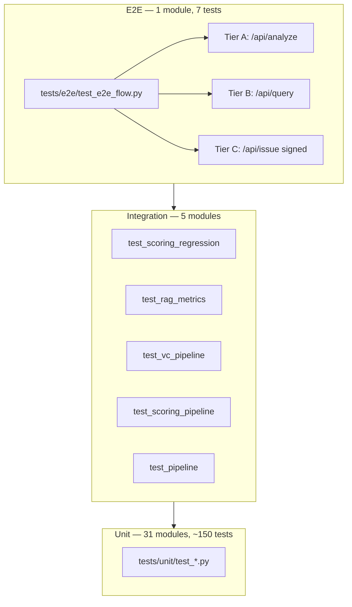
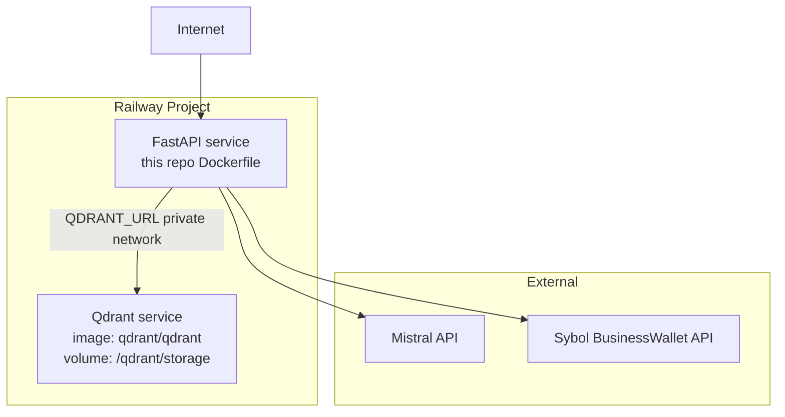

# Technical Reference — Parts IX, X, XI

> **Scope:** Testing, QA, infrastructure, operations, and appendices for the Sybol Compliance Engine.
> **Last verified:** June 2026 against the `devel` branch worktree.
> **Companion runbooks (step-by-step procedures, not duplicated here):**
> [TESTING_GUIDE.md](../TESTING_GUIDE.md),
> [INTEGRATION_AND_QA_RUNBOOK.md](../INTEGRATION_AND_QA_RUNBOOK.md),
> [RAILWAY_SETUP.md](../RAILWAY_SETUP.md),
> [DEMO_RUNBOOK.md](../DEMO_RUNBOOK.md),
> [PROJECT_STATUS.md](../PROJECT_STATUS.md).

---

## Part IX — Testing, QA, and quality

### 50. Test pyramid

The repository follows a classic test pyramid: a broad base of fast, isolated unit tests; a narrow band of integration tests that exercise multi-module pipelines with mocks or live services; and a thin apex of end-to-end tests that drive the real FastAPI application through HTTP.



#### 50.1 Inventory summary

| Layer | Directory | Test modules | Approx. tests | External deps |
|-------|-----------|-------------:|--------------:|---------------|
| Unit | `tests/unit/` | **31** | ~150 | None (mocked via `conftest.py`) |
| Integration | `tests/integration/` | **5** | ~20 | Optional live Qdrant + Mistral for TC-005 |
| E2E | `tests/e2e/` | **1** | **7** | Tier B/C need Qdrant; Tier C needs Sybol env |
| **Total** | `tests/` | **37** | **180** | Collected via `poetry run pytest --collect-only` |

> **Note on module counts:** The project plan references "35 unit modules"; the repository currently ships **31** `test_*.py` files under `tests/unit/`, plus shared support (`tests/conftest.py`, `tests/mocks/sybol.py`, `tests/schemas/vc_1_1_schema.json`). The gap is not a coverage hole — scoring, RAG, credentials, and API routes are each covered by multiple focused modules.

#### 50.2 Unit test modules (31)

Every unit module maps to one or more `src/` packages. Tests use `pytest-mock` fixtures from `tests/conftest.py` to stub Qdrant, HuggingFace embeddings, Mistral/Ollama synthesis, and the deepfake CNN.

| Module | Primary source under test | What it validates |
|--------|---------------------------|-------------------|
| `test_api_dependencies.py` | `src/api/dependencies.py` | `Settings` dataclass, `get_qdrant_client`, `get_sybol_client` token resolution |
| `test_api_main.py` | `src/api/main.py` | App factory, lifespan, SPA fallback, `/health` |
| `test_artifacts.py` | `src/scoring/artifacts.py` | Format-aware artifact signal (PNG vs JPEG weight profiles) |
| `test_audit.py` | `src/credentials/audit.py` | Metadata-only Qdrant audit writes, no raw image bytes |
| `test_auth_route.py` | `src/api/routes/auth.py` | Cognito login, session cookie, status/logout semantics |
| `test_auth_tokens.py` | `src/credentials/auth_tokens.py` | Token normalization, `TBD_*` placeholder rejection |
| `test_catalog_issue_builder.py` | `src/credentials/catalog_issue_builder.py` | Flat `claims` mapping for Sybol catalog API |
| `test_cognito_client.py` | `src/credentials/cognito_client.py` | `InitiateAuth` USER_PASSWORD_AUTH, MFA rejection |
| `test_corrupted_input.py` | `src/scoring/preprocess.py`, routes | TC-004 corrupt uploads → `ScoringError` / HTTP 400 |
| `test_embeder.py` | `src/rag/embeder.py` | HuggingFace embedding model wiring |
| `test_indexer.py` | `src/rag/indexer.py` | Qdrant collection creation, vector store index |
| `test_ingest.py` | `src/rag/ingest.py` | PDF discovery, chunking, regulation name mapping |
| `test_issue_route.py` | `src/api/routes/issue.py` | Full issue route with mocked Sybol/Qdrant/RAG |
| `test_llm.py` | `src/rag/llm.py` | Mistral vs Ollama provider selection, `normalize_provider` |
| `test_metadata.py` | `src/scoring/metadata.py` | EXIF presence, software tags, timestamp sub-scores |
| `test_models.py` | `src/scoring/models.py` | Pydantic/dataclass models, enum values |
| `test_preprocess.py` | `src/scoring/preprocess.py` | SHA-256, resize, MIME handling, `ScoringError` cases |
| `test_provenance.py` | `src/scoring/provenance.py` | pHash index, `PHASH_MATCH_THRESHOLD` |
| `test_query.py` | `src/rag/query.py` | Retrieval, synthesis prompt, hallucination guard on refs |
| `test_query_route.py` | `src/api/routes/query.py` | HTTP contract, 503 when index missing |
| `test_regulations_route.py` | `src/api/routes/regulations.py` | PDF whitelist serving from `research/regulations/` |
| `test_scorer.py` | `src/scoring/scorer.py` | Weighted sum, profile rules, threshold mapping |
| `test_scorer_determinism.py` | `src/scoring/pipeline.py` | Same bytes → identical score + hash |
| `test_scorer_properties.py` | `src/scoring/scorer.py` | **Hypothesis** property invariants (see §54) |
| `test_source_urls.py` | `src/rag/source_urls.py` | Regulation filename → `/api/regulations/{filename}` |
| `test_sybol_client.py` | `src/credentials/sybol_client.py` | `is_configured`, headers, error types |
| `test_sybol_issuance.py` | `tests/mocks/sybol.py`, VC shape | Signed VC mock contract, proof fields |
| `test_token_store.py` | `src/api/token_store.py` | In-memory session save/load/clear |
| `test_vc_builder.py` | `src/credentials/vc_builder.py` | `MediaComplianceCredential` payload assembly |
| `test_vc_schema.py` | `tests/schemas/vc_1_1_schema.json` | **TC-006** JSON Schema validation (see §55) |
| `test_visual.py` | `src/scoring/visual.py` | Lighting, shadows, edge blending (OpenCV) |

#### 50.3 Integration test modules (5)

Integration tests span package boundaries. Most still mock external HTTP; two modules optionally hit live infrastructure when env preconditions are met.

| Module | Purpose | Live deps | Skip condition |
|--------|---------|-----------|----------------|
| `test_scoring_regression.py` | **TC-001–003** golden dataset score bands + suite accuracy gates | None (loads HF model) | Skips if `qa/test_cases/golden/manifest.json` missing |
| `test_rag_metrics.py` | **TC-005** precision / recall / hallucination on `rag_eval/queries.json` | Qdrant + `MISTRAL_API_KEY` | `@requires_live_rag` skipif |
| `test_vc_pipeline.py` | Score → RAG → VC payload through FastAPI `TestClient` | Mocked Sybol/Qdrant | — |
| `test_scoring_pipeline.py` | End-to-end `score_image` on sample bytes | None | — |
| `test_pipeline.py` | RAG `load_pipeline` / `ingest_and_index` facade | Mocked Qdrant | — |

#### 50.4 E2E tiers A / B / C

End-to-end tests live in `tests/e2e/test_e2e_flow.py` and use a **session-scoped** `TestClient` against the real `api.main:app` (import path `from api.main import app` with `PYTHONPATH=src`). Shared fixtures and skip gates are in `tests/e2e/conftest.py`.

| Tier | Tests | Endpoint | Preconditions | Demo role |
|------|-------|----------|---------------|-----------|
| **A** | `test_health_ok`, `test_analyze_authentic_image_end_to_end`, `test_analyze_ai_generated_image_end_to_end`, `test_analyze_is_deterministic_over_http`, `test_analyze_rejects_corrupted_upload` | `GET /health`, `POST /api/analyze` | None | Guaranteed demo path — scoring only |
| **B** | `test_query_returns_regulation_refs` | `POST /api/query` | Qdrant reachable (`QDRANT_URL` healthz), index ingested | RAG regulation citations |
| **B′** | `test_issue_builds_unsigned_vc` | `POST /api/issue` | Tier B + Sybol **not** required | Returns `vc_payload` when signing blocked |
| **C** | `test_issue_returns_signed_vc` | `POST /api/issue` | Tier B + `SYBOL_ACCESS_TOKEN`, `SYBOL_ID_TOKEN`, `SYBOL_DOCUMENT_ID` | Full signed VC with `proof` |

**Tier detection logic** (`tests/e2e/conftest.py`):

- `RAG_AVAILABLE` — `httpx.get(f"{QDRANT_URL}/healthz")` returns status &lt; 400.
- `SYBOL_CONFIGURED` — all of `SYBOL_ACCESS_TOKEN`, `SYBOL_ID_TOKEN`, `SYBOL_DOCUMENT_ID` are set in the environment.
- Marks: `@requires_rag`, `@requires_sybol` — tests skip with explicit reasons when gates fail.

**Mapping to TESTING_GUIDE tiers:** The guide uses Tier 0–5 numbering (0 = pytest, 1 = analyze HTTP, etc.). E2E file tiers A/B/C are a subset focused on HTTP smoke through the live app:

| E2E tier | TESTING_GUIDE equivalent |
|----------|--------------------------|
| A | Tiers 0–1 (health + analyze) |
| B | Tier 3 (`/api/query`) |
| B′ | Partial Tier 5 (issue without Sybol signing) |
| C | Full Tier 5 (`/api/issue` + Sybol) |

For step-by-step local validation commands, see [TESTING_GUIDE.md](../TESTING_GUIDE.md) — not reproduced here.

#### 50.5 Running the suite

```bash
# From repository root
export PYTHONPATH=src

# Fast unit layer (no model download if mocks cover the path)
poetry run pytest tests/unit/ -q

# Integration (golden regression may download deepfake model ~100 MB first time)
poetry run pytest tests/integration/ -q

# Full suite with coverage gate (≥ 80%, see §52)
poetry run pytest tests/unit tests/integration --cov=src --cov-fail-under=80

# E2E (Tier A always runs; B/C skip without infrastructure)
poetry run pytest tests/e2e/ -v

# CI-equivalent (what GitHub Actions runs)
poetry run pytest -q --cov=src
```

Lint and type-check (also in CI):

```bash
poetry run ruff check src tests
poetry run black src tests
cd src && poetry run mypy .
```

---

### 51. Fixtures (`tests/conftest.py`)

The root `tests/conftest.py` is imported automatically by pytest for all test packages except e2e-specific overrides.

#### 51.1 Auto-applied environment (`env_vars`)

```python
@pytest.fixture(autouse=True)
def env_vars(monkeypatch):
    monkeypatch.setenv("QDRANT_URL", "http://localhost:6333")
    monkeypatch.setenv("QDRANT_API_KEY", "test-key")
    monkeypatch.setenv("MISTRAL_API_KEY", "test-mistral-key")
```

Every unit and integration test receives stable fake credentials so `os.getenv` calls never hit real services. E2E tests **override** this by using the real process environment (no autouse in `tests/e2e/conftest.py`).

#### 51.2 Mock fixtures

| Fixture | Patches | Returns |
|---------|---------|---------|
| `mock_qdrant_client` | `rag.indexer.QdrantClient`, `QdrantVectorStore` | `MagicMock` client with empty collections |
| `mock_embed_model` | `rag.embeder.HuggingFaceEmbedding`, `rag.pipeline.get_embedding_model` | Mock embedding model |
| `mock_synthesis_llm` | `rag.llm.get_synthesis_llm`, `rag.query.get_synthesis_llm` | LLM with `complete()` → fixed string |
| `mock_mistral` | Alias of `mock_synthesis_llm` | Backward compatibility |
| `mock_vector_index` | — (constructed inline) | Retriever returning one GDPR Article 5 node |
| `mock_deepfake_model` | `scoring.detector.get_deepfake_model`, `predict_authenticity_score` | CNN bundle, score 0.85 |

#### 51.3 Sample media fixtures

| Fixture | Content |
|---------|---------|
| `sample_png_bytes` | 64×64 RGB PNG |
| `sample_jpeg_bytes` | 128×128 RGB JPEG |
| `corrupt_bytes` | `b"not-an-image-at-all"` |
| `authentic_reference_dir` | Temp dir with 3 colored PNGs for provenance index tests |
| `sample_document_nodes` | LlamaIndex `Document` + `TextNode` for ingest tests |

#### 51.4 E2E-specific fixtures (`tests/e2e/conftest.py`)

| Fixture | Scope | Behavior |
|---------|-------|----------|
| `client` | session | `TestClient(app)` — model loads once per session |
| `golden_cases` | function | Loads `qa/test_cases/golden/manifest.json` → `[(path, label), ...]` |
| `first_of_label(cases, label)` | helper | Returns first image path for `authentic` / `ai_generated` |
| `content_type_for(path)` | helper | Maps `.jpg`/`.png`/`.webp` suffix to MIME type |

#### 51.5 Integration autouse fixtures

`test_scoring_regression.py` defines:

```python
@pytest.fixture(autouse=True)
def _ensure_provenance_reference_index():
    from scoring.provenance import rebuild_provenance_index
    rebuild_provenance_index()
```

Golden authentic labels assume `qa/test_cases/authentic/` is indexed for pHash matching before each regression test.

---

### 52. Coverage policy

Coverage is configured in `pyproject.toml`:

```toml
[tool.coverage.run]
source = ["src"]
omit = ["tests/*"]

[tool.coverage.report]
fail_under = 80
```

| Setting | Value | Meaning |
|---------|-------|---------|
| `source` | `["src"]` | Measure only application code under `src/` |
| `omit` | `tests/*` | Exclude test helpers from coverage numerator |
| `fail_under` | **80** | `pytest --cov=src` fails the build if line coverage drops below 80% |

**CI invocation** (`.github/workflows/ci.yml`):

```yaml
- name: Test
  run: |
    poetry run pytest -q --cov=src
```

The workflow does **not** pass `--cov-fail-under=80` explicitly; the threshold is enforced via `[tool.coverage.report]` in `pyproject.toml` when `pytest-cov` reads that section.

**Local strict gate** (recommended before PR):

```bash
poetry run pytest tests/unit tests/integration --cov=src --cov-report=term-missing --cov-fail-under=80
```

**What coverage does not measure:**

- Frontend TypeScript (`frontend/src/`) — no Jest/Vitest suite in CI today.
- CLI scripts under `src/scripts/` and `scripts/` — exercised manually, not in default pytest paths.
- E2E HTTP tests — included in full `pytest` run but external services may cause skips rather than failures.

---

### 53. QA assets

#### 53.1 Golden scoring dataset

| Property | Value |
|----------|-------|
| Location | `qa/test_cases/golden/` |
| Override env | `SYBOL_GOLDEN_DATASET=/path/to/golden` |
| Manifest | `qa/test_cases/golden/manifest.json` (67 entries) |
| Labels | `authentic` (30), `ai_generated` (37), `edited` (0) |
| Score report | `qa/test_cases/golden/scoring_report.csv` (exported via `scripts/export_golden_scores.py`) |

**Provenance reference index** (separate from golden regression labels):

| Location | Purpose |
|----------|---------|
| `qa/test_cases/authentic/` | 30 camera photos indexed by `scoring.provenance` pHash |
| `qa/test_cases/authentic_raw/` | Raw uploads including HEIC variants for manual smoke |
| `qa/test_cases/corrupted/` | `not_a_real_image.txt` for TC-004 |

**Labelled AI source trees** (not in golden manifest, used for dataset curation):

- `qa/test_cases/ai_generated/DALLE/`
- `qa/test_cases/ai_generated/GEMINI /` *(note trailing space in directory name)*
- `qa/test_cases/ai_generated/StableDiffusion /`

#### 53.2 RAG evaluation set (TC-005)

| Property | Value |
|----------|-------|
| Location | `qa/test_cases/rag_eval/queries.json` |
| Queries | 8 labelled questions (`RAG-01` … `RAG-08`) |
| Corpus | GDPR, EU AI Act, Codigo Penal, Ley 13/2022, LOPDGDD |
| Harness | `tests/integration/test_rag_metrics.py` |
| Thresholds | Precision ≥ 80%, Recall ≥ 75%, Hallucination ≤ 5% |

#### 53.3 Regulation PDFs (ingest corpus)

Five PDFs under `research/regulations/` (verified present in repo):

```
research/regulations/
├── eu_ai_act.pdf
├── gdpr.pdf
├── codigo_penal.pdf
├── lopdgdd.pdf
└── ley_13_2022.pdf
```

> **README drift:** [INTEGRATION_AND_QA_RUNBOOK.md](../INTEGRATION_AND_QA_RUNBOOK.md) lists `espr_dpp.pdf`; the repository uses `codigo_penal.pdf` instead. Ingest mapping is defined in `src/rag/ingest.py`.

#### 53.4 VC JSON Schema (TC-006)

| Property | Value |
|----------|-------|
| Schema file | `tests/schemas/vc_1_1_schema.json` |
| Target | W3C VC Data Model **1.1** unsigned payload from `credentials.vc_builder.build_vc_payload` |
| Validator | `jsonschema.Draft202012Validator` in `tests/unit/test_vc_schema.py` |

#### 53.5 Sybol mock

`tests/mocks/sybol.py` provides `MockSybolClient` for issuance contract tests without calling the real BusinessWallet API. Documents expected signed VC shape (`proof`, issuer DID, `credentialStatus`).

#### 53.6 Demo readiness script

`scripts/check_demo_readiness.sh` reports:

- Golden dataset presence
- Regulation PDF count (5/5)
- Local Qdrant on `:6333`
- `MISTRAL_API_KEY` and Sybol vars in `src/.env`

Does not run pytest — use for pre-demo checklist only.

#### 53.7 QA documentation map

| Document | Owner focus | Role |
|----------|-------------|------|
| [qa/test_cases/README_Saba.md](../../qa/test_cases/README_Saba.md) | Saba | TC definitions, golden dataset, calibration notes |
| [qa/test_cases/README_Youssef.md](../../qa/test_cases/README_Youssef.md) | Youssef | Dataset labelling, edited-image gap |
| [docs/TESTING_GUIDE.md](../TESTING_GUIDE.md) | All | Local tier 0–5 validation |
| [docs/INTEGRATION_AND_QA_RUNBOOK.md](../INTEGRATION_AND_QA_RUNBOOK.md) | Alex/Darius | RAG ingest, Railway, TC-005 procedure |
| [docs/DEMO_RUNBOOK.md](../DEMO_RUNBOOK.md) | Jana | June demo paths |

---

### 54. Test case mapping (TC-001 – TC-006)

| ID | Requirement | Expected outcome | Automated test(s) | Status |
|----|-------------|------------------|-------------------|--------|
| **TC-001** | Authentic camera image | Score 0.8–1.0, status `compliant` | `test_scoring_regression.py::test_per_image_score_bands`; `test_e2e_flow.py::test_analyze_authentic_image_end_to_end` | **Passing** (30/30 authentic) |
| **TC-002** | AI-generated image | Score 0.0–0.3, status `non-compliant` | Same regression + `test_analyze_ai_generated_image_end_to_end` | **Passing** (37/37 AI) |
| **TC-003** | Edited image | Score 0.3–0.7, status `review` | `test_scoring_regression.py` (label `edited` in manifest) | **Blocked** — 0 edited images in manifest |
| **TC-004** | Corrupted / invalid upload | HTTP 400, no server crash | `test_corrupted_input.py`, `test_preprocess.py`, `test_analyze_rejects_corrupted_upload` | **Passing** |
| **TC-005** | RAG query quality | Precision ≥ 80%, Recall ≥ 75%, Hallucination ≤ 5% | `test_rag_metrics.py` (3 tests, live RAG) | **Ready** — skips until Qdrant ingested + Mistral key |
| **TC-006** | VC schema validation | 100% schema pass on unsigned payload | `test_vc_schema.py` (10 tests), `test_vc_pipeline.py` | **Passing** |

#### 54.1 Suite-level scoring gates (beyond per-image TCs)

From `test_scoring_regression.py`:

| Metric | Threshold | Test |
|--------|-----------|------|
| Scoring accuracy | ≥ 85% | `test_suite_level_accuracy_and_error_rates` |
| False positive rate | ≤ 10% | Same (AI/edited wrongly marked compliant) |
| False negative rate | ≤ 10% | Same (authentic wrongly marked non-compliant) |

#### 54.2 TC-001 / TC-002 score bands (code reference)

```python
LABEL_EXPECTATIONS = {
    "authentic": ((0.8, 1.0), ComplianceStatus.COMPLIANT),
    "ai_generated": ((0.0, 0.3), ComplianceStatus.NON_COMPLIANT),
    "edited": ((0.3, 0.7), ComplianceStatus.REVIEW),
}
```

Calibration layers documented in [qa/test_cases/README_Saba.md](../../qa/test_cases/README_Saba.md): provenance match floor, EXIF-rich floor, synthetic cap, edited clamp in `scorer.py`.

---

### 55. Property-based tests (Hypothesis)

**Module:** `tests/unit/test_scorer_properties.py`
**Dependency:** `hypothesis>=6.100` in `[tool.poetry.group.dev.dependencies]`

Hypothesis generates thousands of random `SignalBreakdown` tuples `(m, a, v, p)` ∈ [0, 1]⁴ and asserts scorer **invariants** that must hold regardless of input:

| Test | Invariant |
|------|-----------|
| `test_weights_sum_to_one` | `WM + WA + WV + WP == 1.0` |
| `test_score_always_in_unit_interval` | `0.0 <= score <= 1.0` always |
| `test_weighted_average_when_no_post_rules` | Pure convex combination when profile rules do not fire |
| `test_provenance_match_applies_floor` | `p >= PROVENANCE_MATCH_MIN` → score ≥ 0.82 |
| `test_synthetic_profile_applies_cap` | Low metadata + low provenance → score ≤ 0.26 |
| `test_status_mapping_is_total_and_consistent` | Thresholds 0.3 / 0.7 partition status enum |
| `test_status_is_monotonic_in_score` | Higher score → never lower compliance rank |

**Design note:** After golden-set calibration, the score is **not** always a pure weighted sum — post-weight floor/cap rules in `scorer.py` apply. The `_rules_apply()` helper mirrors rule conditions so Hypothesis can partition the input space into "rules active" vs "pure weighted average" regions.

Constants imported from `scoring.constants`:

```python
WM, WA, WV, WP = 0.18, 0.22, 0.15, 0.45
THRESHOLD_NON_COMPLIANT = 0.3
THRESHOLD_COMPLIANT = 0.7
PROVENANCE_MATCH_MIN = ...  # see constants.py
```

---

### 56. VC schema validation (TC-006)

#### 56.1 Schema location and scope

| File | Role |
|------|------|
| `tests/schemas/vc_1_1_schema.json` | JSON Schema Draft 2020-12 for **unsigned** `MediaComplianceCredential` |
| `tests/unit/test_vc_schema.py` | Validates `build_vc_payload()` output |
| `src/credentials/vc_builder.py` | Payload builder |

**In scope for TC-006:**

- `@context` containing `https://www.w3.org/2018/credentials/v1`
- `type` includes `VerifiableCredential` and `MediaComplianceCredential`
- `issuanceDate` (ISO 8601 UTC)
- `credentialSubject` with `mediaHash`, `authenticityScore`, `scoreBreakdown` (`m/a/v/p`), `complianceStatus`, `regulationRefs`, `evidenceUrl`

**Out of scope (validated elsewhere):**

- `issuer` — resolved server-side from tenant auth (explicitly absent in unsigned body)
- `proof`, `credentialStatus` — attached by Sybol signing (`test_sybol_issuance.py`)

#### 56.2 VC Data Model version gap

| Source | Claims |
|--------|--------|
| Root `README.md` | "W3C VC Data Model **2.0**" |
| `vc_builder.py` + schema | Emits VC Data Model **1.1** (`issuanceDate`, `/2018/credentials/v1` context) |
| `test_vc_data_model_version` | Documents this gap; fails if builder migrates to 2.0 without updating the test |

#### 56.3 Schema required fields (credentialSubject)

```json
{
  "required": [
    "id", "mediaHash", "authenticityScore", "scoreBreakdown",
    "complianceStatus", "modelVersion", "analysisTimestamp", "regulationRefs"
  ]
}
```

Each `regulationRefs[]` entry requires `{ "regulation", "article", "url" }`.

---

## Part X — Infrastructure and operations

### 57. Continuous integration (`.github/workflows/ci.yml`)

```mermaid
flowchart LR
  subgraph trigger [Triggers]
    PR[PR to main]
    PUSH[Push to main]
  end
  subgraph job [Job: test]
    CHECKOUT[checkout@v4]
    PY[Python 3.11]
    POETRY[poetry install --with dev]
    LINT[ruff + black]
    MYPY[mypy src/]
    PYTEST[pytest --cov=src]
  end
  trigger --> CHECKOUT --> PY --> POETRY --> LINT --> MYPY --> PYTEST
```

#### 57.1 Workflow specification

| Property | Value |
|----------|-------|
| File | `.github/workflows/ci.yml` |
| Name | `CI` |
| Triggers | `pull_request` → `main`; `push` → `main` |
| Runner | `ubuntu-latest` |
| Python version | **3.11** |
| Install | `poetry install --with dev` |

#### 57.2 CI steps

| Step | Command | Notes |
|------|---------|-------|
| Lint & Format | `poetry run ruff check --fix src tests \|\| true` then `poetry run black src tests` | Ruff fix failures are non-blocking (`\|\| true`) |
| Type check | `cd src && poetry run mypy .` | `ignore_missing_imports = true` in `pyproject.toml` |
| Test | `poetry run pytest -q --cov=src` | 80% fail-under from coverage config |

#### 57.3 CI gaps and branch policy mismatch

| Gap | Detail |
|-----|--------|
| **Branch coverage** | CI runs on `main` only; active development is on `devel` — PRs target `main` but day-to-day pushes to `devel` do not trigger CI unless configured separately |
| **Frontend** | No `npm ci`, `tsc`, or Vite build in CI |
| **E2E live tiers** | E2E tests run in pytest but Tier B/C skip without Qdrant/Sybol in CI |
| **Python version split** | CI uses **3.11**; Dockerfile uses **3.12** (see §58) |

Team policy (from README): develop on `devel`, merge to `main` for production deploy. See §60.

---

### 58. Dockerfile

Multi-stage build shipping Python application only — **frontend is not baked into the image**.

```dockerfile
# Stage 1 — builder
FROM python:3.12-slim AS builder
WORKDIR /app
RUN pip install --no-cache-dir poetry
COPY pyproject.toml poetry.lock ./
RUN poetry config virtualenvs.create false \
 && poetry install --only main --no-interaction --no-ansi --no-root

# Stage 2 — runtime
FROM python:3.12-slim
ENV PYTHONDONTWRITEBYTECODE=1 \
    PYTHONUNBUFFERED=1 \
    PIP_NO_CACHE_DIR=1 \
    PORT=8000
WORKDIR /app
COPY --from=builder /usr/local/lib/python3.12/site-packages /usr/local/lib/python3.12/site-packages
COPY --from=builder /usr/local/bin /usr/local/bin
COPY src ./src
EXPOSE 8000
CMD ["sh", "-c", "uvicorn src.api.main:app --host 0.0.0.0 --port \${PORT:-8000}"]
```

| Aspect | Behavior |
|--------|----------|
| Python | **3.12-slim** (vs CI 3.11) |
| Dependencies | `--only main` — no pytest, ruff, mypy in image |
| Source copied | `src/` only — not `research/regulations/`, `qa/`, or `frontend/dist` |
| Entrypoint | `uvicorn src.api.main:app` on `$PORT` |
| SPA | `main.py` serves `frontend/dist` **if present on filesystem** — image does not build it |
| Env loading | `load_dotenv(src/.env)` in `main.py` — `.env` is **not** in image; use platform env vars |

**Operational implication:** For production SPA hosting from the same container, either mount `frontend/dist` as a volume, add a frontend build stage to the Dockerfile, or serve the SPA from a separate CDN/static host.

---

### 59. Railway deployment

#### 59.1 `railway.toml`

```toml
[deploy]
startCommand = "sh -c 'uvicorn src.api.main:app --host 0.0.0.0 --port ${PORT}'"
healthcheckPath = "/health"
restartPolicyType = "on_failure"
```

Railway injects `PORT`; health checks poll `GET /health` → `{"status":"ok"}`.

#### 59.2 Two-service topology



| Service | Image / source | Persistent storage | Ports |
|---------|----------------|-------------------|-------|
| FastAPI | Repo `Dockerfile` | None (stateless) | `$PORT` (public domain) |
| Qdrant | `qdrant/qdrant` | Volume at `/qdrant/storage` | 6333 (internal) |

**Internal URL pattern:** `http://qdrant.railway.internal:6333` → set as `QDRANT_URL` on FastAPI service.

**Ingest is manual:** The API calls `load_index()` at startup but does **not** ingest PDFs. After deploy or volume wipe, run `python -m scripts.ingest` against production Qdrant (see [RAILWAY_SETUP.md](../RAILWAY_SETUP.md) Step 6).

#### 59.3 Resource recommendations

| Setting | Suggested | Reason |
|---------|-----------|--------|
| Memory | ≥ 2 GB | `torch` + `sentence-transformers` + first-request model download |
| CPU | 2 vCPU | Scoring latency on CPU inference |

#### 59.4 Deploy workflow

```
Push to main → GitHub Actions CI → Railway auto-deploy (if connected) → /health
```

Configure auto-deploy branch `main` in Railway dashboard. Do not deploy directly from `devel` without review.

Full setup procedure: [RAILWAY_SETUP.md](../RAILWAY_SETUP.md).

---

### 60. Branch policy

| Branch | Purpose | CI | Railway auto-deploy |
|--------|---------|----|--------------------|
| `devel` | Active feature development | Not triggered by current `ci.yml` | No |
| `main` | Production-ready | PR + push triggers CI | Yes (team default) |

**Rules:**

1. All development happens on `devel`.
2. Do **not** push directly to `main` without review.
3. Merge `devel` → `main` only after tests pass and demo/QA sign-off.
4. Railway production env vars are set in the dashboard — never commit `src/.env`.

---

### 61. Security and privacy

#### 61.1 Data minimisation (audit trail)

`credentials/audit.py` writes **metadata only** to Qdrant `media_audit`:

- Scores, hashes, regulation refs, timestamps
- **No raw image bytes** (GDPR data minimisation)
- Dummy 1-dimensional vector (collection requires a vector; payload carries the evidence)

`evidenceUrl` in the VC points to the audit record identifier, not a public image URL.

#### 61.2 Session and JWT handling

| Mechanism | Implementation | Security note |
|-----------|----------------|---------------|
| Cognito login | `POST /api/auth/login` → `initiate_password_auth` | Passwords never stored server-side |
| JWT storage | `src/api/token_store.py` in-memory dict | JWTs too large for cookies; only `auth_sid` session key in cookie |
| Session secret | `SESSION_SECRET_KEY` env var | Default `dev-only-change-in-production` — **must change in production** |
| Session invalidation | API restart clears in-memory store | Users must re-login after deploy |
| Token resolution chain | Cookie session → env `SYBOL_ACCESS_TOKEN`/`SYBOL_ID_TOKEN` → env email/password | Documented in `get_sybol_client()` |

#### 61.3 Auth before Sybol calls

`get_sybol_client()` raises **401** when `auth_sid` cookie references an expired/missing session (e.g. after API restart). Sybol signing never proceeds with stale session tokens.

`SybolClient.is_configured` rejects `TBD_*` placeholder tokens and requires catalog fields (`SYBOL_DOCUMENT_ID`, `SYBOL_ISSUER_KEY`, `SYBOL_RECIPIENT_DID`) for issuance.

#### 61.4 CORS and credentials

From `src/api/main.py`:

```python
app.add_middleware(
    CORSMiddleware,
    allow_origins=["http://localhost:5173", "http://127.0.0.1:5173"],
    allow_methods=["*"],
    allow_headers=["*"],
    allow_credentials=True,
)
```

- Local Vite dev origins only in default config.
- `allow_credentials=True` enables cookie-based auth from the Issue tab (`credentials: 'include'` in `frontend/src/api/client.ts`).
- Production Railway domain must be added to `allow_origins` if SPA is served from a different origin than the API.

#### 61.5 Upload validation

| Route | Validation |
|-------|------------|
| `/api/analyze`, `/api/issue` | MIME whitelist: `image/jpeg`, `image/png`, `image/webp` only |
| Corrupt bytes | `ScoringError` → HTTP 400 (no stack trace to client) |

#### 61.6 Secrets hygiene

| Rule | Enforcement |
|------|-------------|
| Never commit `src/.env` | `.gitignore` |
| Example template only | `src/.env.example` with empty placeholders |
| CI has no production secrets | Tests use monkeypatched fake keys |
| Railway vars | Dashboard only |

#### 61.7 Error exposure

| Status | When | Client body |
|--------|------|-------------|
| 400 | Bad file / scoring error | `{"detail": "..."}` |
| 401 | Expired auth session | Actionable re-login message |
| 502 | Sybol signing failure | Sybol error summary (no tokens) |
| 503 | RAG/audit/Sybol not configured | Configuration guidance |

---

## Part XI — Appendices

### 62. Complete file index (significant source files)

#### 62.1 API layer (`src/api/`)

| File | Description |
|------|-------------|
| `main.py` | FastAPI app factory, lifespan (`load_index`, `token_store`), CORS, SessionMiddleware, SPA fallback |
| `dependencies.py` | `Settings` dataclass, `get_settings`, `get_qdrant_client`, `get_sybol_client`, `get_index` |
| `schemas.py` | Pydantic request/response models for all routes |
| `token_store.py` | In-memory Cognito session store (JWT server-side) |
| `routes/analyze.py` | `POST /api/analyze` — multipart upload → scoring pipeline |
| `routes/query.py` | `POST /api/query` — RAG question → answer + regulation refs |
| `routes/issue.py` | `POST /api/issue` — score → RAG → audit → VC → Sybol sign |
| `routes/auth.py` | `POST /api/auth/login`, `GET /api/auth/status`, `POST /api/auth/logout` |
| `routes/regulations.py` | `GET /api/regulations/{filename}` — PDF whitelist download |

#### 62.2 Scoring (`src/scoring/`)

| File | Description |
|------|-------------|
| `pipeline.py` | Orchestrates preprocess → four signals → `build_result` |
| `preprocess.py` | SHA-256, EXIF, 224×224 resize, `ScoringError` |
| `metadata.py` | Signal M — EXIF presence, software tags, timestamps |
| `artifacts.py` | Signal A — CNN + FFT + noise residual composition |
| `detector.py` | HuggingFace deepfake CNN loader and inference |
| `visual.py` | Signal V — OpenCV lighting/shadow/edge analysis |
| `provenance.py` | Signal P — perceptual hash vs reference index |
| `scorer.py` | Weighted sum, profile rules, compliance status mapping |
| `constants.py` | Weights WM/WA/WV/WP, thresholds, profile rule constants |
| `models.py` | `SignalBreakdown`, `ScoringResult`, `ComplianceStatus` |

#### 62.3 RAG (`src/rag/`)

| File | Description |
|------|-------------|
| `pipeline.py` | `build_index`, `load_index`, `ingest_and_index` facade |
| `ingest.py` | PDF discovery in `research/regulations/`, chunking 512/64 |
| `indexer.py` | Qdrant `regulations` collection management |
| `embeder.py` | `sentence-transformers/all-MiniLM-L6-v2` wrapper |
| `query.py` | Top-5 retrieval, LLM synthesis, citation validation |
| `llm.py` | Mistral Large vs Ollama providers |
| `source_urls.py` | Regulation ref URL → `/api/regulations/{filename}` |
| `models.py` | `ComplianceResult`, `RegulationRef` |

#### 62.4 Credentials (`src/credentials/`)

| File | Description |
|------|-------------|
| `vc_builder.py` | W3C VC 1.1 unsigned `MediaComplianceCredential` JSON |
| `catalog_issue_builder.py` | Sybol catalog flat `claims` request body |
| `sybol_client.py` | HTTP client for `POST /api/bl/credentials` |
| `cognito_client.py` | Direct AWS Cognito `InitiateAuth` |
| `auth_tokens.py` | Token normalization, placeholder detection |
| `audit.py` | Qdrant metadata-only audit trail writer |

#### 62.5 Scripts (`src/scripts/`)

| File | Description |
|------|-------------|
| `ingest.py` | CLI entry: PDF → Qdrant ingest |
| `sybol_login.py` | Print export lines for Cognito tokens |
| `sybol_discover_catalog.py` | Search Sybol catalog for document IDs |
| `sybol_probe.py` | Connectivity probe to Sybol API |
| `sybol_probe_issue.py` | Dry-run issuance with synthetic data |
| `export_openapi.py` | Export OpenAPI schema to file |

#### 62.6 Root scripts (`scripts/`)

| File | Description |
|------|-------------|
| `check_demo_readiness.sh` | Pre-demo environment checklist |
| `export_golden_scores.py` | CSV export of golden dataset scores |
| `fit_platt_calibration.py` | Optional Platt calibration fitting |

#### 62.7 Frontend (`frontend/src/`)

| File | Description |
|------|-------------|
| `main.tsx` | React entry point |
| `App.tsx` | Tab shell, global layout |
| `api/client.ts` | Typed fetch wrappers for all API endpoints |
| `types/api.ts` | TypeScript types mirroring API schemas |
| `utils/regulationUrl.ts` | Resolve regulation PDF links for display |
| `constants/signals.ts` | M/A/V/P signal labels for UI |
| `components/TabNav.tsx` | Analyze / Query / Issue tab navigation |
| `components/Header.tsx` | App header + health check indicator |
| `components/AnalyzeTab.tsx` | Image upload and scoring results |
| `components/QueryTab.tsx` | RAG question form + LLM provider toggle |
| `components/IssueTab.tsx` | VC issuance flow |
| `components/SybolAuthPanel.tsx` | Cognito login panel for Issue tab |
| `components/ImageUploader.tsx` | Drag-and-drop file input |
| `components/ImagePreview.tsx` | Uploaded image preview |
| `components/ResultsPanel.tsx` | Analyze results container |
| `components/AuthenticityGauge.tsx` | Circular score gauge |
| `components/ScoreBreakdown.tsx` | M/A/V/P bar chart |
| `components/ComplianceBadge.tsx` | compliant / review / non-compliant badge |
| `components/MetadataRow.tsx` | Hash, model version, timestamp row |
| `components/RegulationRefs.tsx` | RAG citation list with links |
| `components/CredentialResultsPanel.tsx` | Issued VC JSON display |
| `components/LoadingPanel.tsx` | Spinner during async operations |
| `components/ErrorAlert.tsx` | API error display |

#### 62.8 Tests (`tests/`)

| File | Description |
|------|-------------|
| `conftest.py` | Shared fixtures: env, mocks, sample bytes |
| `schemas/vc_1_1_schema.json` | TC-006 JSON Schema |
| `mocks/sybol.py` | Mock Sybol signing client |
| `unit/test_*.py` | 31 unit test modules (see §50.2) |
| `integration/test_*.py` | 5 integration modules (see §50.3) |
| `e2e/conftest.py` | E2E gates, golden loader, TestClient |
| `e2e/test_e2e_flow.py` | Tiers A/B/C HTTP smoke tests |

#### 62.9 QA data (`qa/`)

| Path | Description |
|------|-------------|
| `test_cases/golden/manifest.json` | 67 labelled images for regression |
| `test_cases/golden/scoring_report.csv` | Latest score export |
| `test_cases/rag_eval/queries.json` | TC-005 labelled RAG questions |
| `test_cases/authentic/` | Provenance pHash reference photos |
| `test_cases/corrupted/` | TC-004 corrupt input |
| `test_cases/README_Saba.md` | QA harness documentation |

#### 62.10 Research & platform docs

| Path | Description |
|------|-------------|
| `research/regulations/*.pdf` | Five EU/ES regulation PDFs for RAG ingest |
| `research/regulations/README_Maxim.md` | Legal source requirements for PDFs |
| `sybol_docs/` | Sybol platform architecture, Cognito ADR, BL API contract |
| `sybol_docs/services/businessLogic/api/businesslogic-api.md` | `POST /api/bl/credentials` specification |
| `sybol_docs/global/decisions/0001-aws-cognito-authentication.md` | Cognito auth model |

#### 62.11 Configuration & infra

| File | Description |
|------|-------------|
| `pyproject.toml` | Poetry deps, pytest, coverage, ruff, mypy config |
| `poetry.lock` | Locked dependency versions |
| `Dockerfile` | Production container build |
| `railway.toml` | Railway start command + health check |
| `.github/workflows/ci.yml` | GitHub Actions CI pipeline |
| `src/.env.example` | Environment variable template |

---

### 63. API request/response examples (curl)

Replace `http://127.0.0.1:8000` with your Railway URL in production. All examples assume `PYTHONPATH=src` API is running.

#### 63.1 `GET /health`

```bash
curl -s http://127.0.0.1:8000/health | python3 -m json.tool
```

**Response 200:**

```json
{
  "status": "ok"
}
```

#### 63.2 `POST /api/analyze`

```bash
curl -s -X POST http://127.0.0.1:8000/api/analyze \
  -F "file=@qa/test_cases/golden/authentic/ar_1.JPG" \
  | python3 -m json.tool
```

**Response 200 (authentic example):**

```json
{
  "authenticity_score": 0.87,
  "score_breakdown": {
    "m": 0.91,
    "a": 0.82,
    "v": 0.78,
    "p": 0.95
  },
  "compliance_status": "compliant",
  "media_hash": "a1b2c3d4e5f6789012345678901234567890abcdef1234567890abcdef123456",
  "model_version": "dima806/deepfake_vs_real_image_detection",
  "analysis_timestamp": "2026-06-25T14:30:00.123456",
  "evidence_url": null
}
```

**Response 400 (unsupported type or corrupt file):**

```json
{
  "detail": "Unsupported file type"
}
```

#### 63.3 `POST /api/query`

Requires Qdrant ingested + `MISTRAL_API_KEY` (or Ollama for `llm_provider: "ollama"`).

```bash
curl -s -X POST http://127.0.0.1:8000/api/query \
  -H "Content-Type: application/json" \
  -d '{
    "question": "What transparency obligations apply to AI-generated media under the EU AI Act?",
    "llm_provider": "mistral"
  }' | python3 -m json.tool
```

**Response 200:**

```json
{
  "answer": "Under the EU AI Act, providers of AI systems that generate synthetic audio, image, video or text content must ensure outputs are marked in a machine-readable format ...",
  "regulation_refs": [
    {
      "regulation": "EU AI Act",
      "article": "50",
      "url": "/api/regulations/eu_ai_act.pdf"
    }
  ],
  "llm_provider": "mistral",
  "llm_model": "mistral-large-latest"
}
```

**Response 503 (index not loaded):**

```json
{
  "detail": "RAG pipeline not available. Ensure Qdrant is running and the index has been initialized."
}
```

#### 63.4 `POST /api/issue`

Requires Qdrant, Mistral (or Ollama via `DEFAULT_LLM_PROVIDER`), and Sybol configuration.

```bash
curl -s -X POST http://127.0.0.1:8000/api/issue \
  -F "file=@qa/test_cases/golden/authentic/ar_1.JPG" \
  -b "session=..." \
  | python3 -m json.tool
```

**Response 200 (signed):**

```json
{
  "status": "signed_vc_issued",
  "vc_id": "urn:uuid:550e8400-e29b-41d4-a716-446655440000",
  "detail": "Signed VC issued by Sybol",
  "signed": true,
  "vc_payload": {
    "@context": ["https://www.w3.org/2018/credentials/v1"],
    "id": "urn:uuid:550e8400-e29b-41d4-a716-446655440000",
    "type": ["VerifiableCredential", "MediaComplianceCredential"],
    "issuanceDate": "2026-06-25T14:35:00.000Z",
    "credentialSubject": {
      "id": "did:example:subject",
      "mediaHash": "a1b2c3...",
      "authenticityScore": 0.87,
      "scoreBreakdown": { "m": 0.91, "a": 0.82, "v": 0.78, "p": 0.95 },
      "complianceStatus": "compliant",
      "modelVersion": "dima806/deepfake_vs_real_image_detection",
      "analysisTimestamp": "2026-06-25T14:35:00.000Z",
      "regulationRefs": [
        { "regulation": "EU AI Act", "article": "50", "url": "/api/regulations/eu_ai_act.pdf" }
      ],
      "evidenceUrl": "qdrant://media_audit/550e8400-e29b-41d4-a716-446655440000"
    }
  },
  "signed_vc": {
    "proof": { "type": "JsonWebSignature2020", "..." : "..." }
  }
}
```

**Response 503 (Sybol not configured):**

```json
{
  "detail": "Sybol signing is not configured — sign in on the Issue tab, or set SYBOL_ACCESS_TOKEN and SYBOL_ID_TOKEN in src/.env. Catalog issuance also requires SYBOL_DOCUMENT_ID, SYBOL_ISSUER_KEY, and SYBOL_RECIPIENT_DID."
}
```

**Response 502 (Sybol rejected request):**

```json
{
  "detail": "Sybol signing failed: 401 Unauthorized — token expired"
}
```

#### 63.5 `GET /api/regulations/{filename}`

```bash
curl -s -o /tmp/gdpr.pdf \
  http://127.0.0.1:8000/api/regulations/gdpr.pdf
file /tmp/gdpr.pdf
# → PDF document
```

**Response 404:**

```json
{
  "detail": "Regulation document not found"
}
```

Only filenames present in `research/regulations/*.pdf` are served.

#### 63.6 `POST /api/auth/login`

```bash
curl -s -X POST http://127.0.0.1:8000/api/auth/login \
  -H "Content-Type: application/json" \
  -c cookies.txt \
  -d '{
    "email": "user@example.com",
    "password": "your-password"
  }' | python3 -m json.tool
```

**Response 200:**

```json
{
  "authenticated": true,
  "email": "user@example.com",
  "catalog_configured": true,
  "session_active": true
}
```

**Response 401 (bad credentials or MFA required):**

```json
{
  "detail": "Authentication failed: Incorrect username or password."
}
```

Requires `SYBOL_COGNITO_CLIENT_ID` in environment.

#### 63.7 `GET /api/auth/status`

```bash
curl -s http://127.0.0.1:8000/api/auth/status \
  -b cookies.txt | python3 -m json.tool
```

**Response 200 (session active):**

```json
{
  "authenticated": true,
  "email": "user@example.com",
  "catalog_configured": true,
  "session_active": true
}
```

**Response 200 (env tokens only, no session):**

```json
{
  "authenticated": true,
  "email": null,
  "catalog_configured": false,
  "session_active": false
}
```

#### 63.8 `POST /api/auth/logout`

```bash
curl -s -X POST http://127.0.0.1:8000/api/auth/logout \
  -b cookies.txt \
  -c cookies.txt | python3 -m json.tool
```

**Response 200:**

```json
{
  "authenticated": false,
  "email": null,
  "catalog_configured": true,
  "session_active": false
}
```

`authenticated` may remain `true` if env fallback tokens are still set.

#### 63.9 OpenAPI interactive docs

| URL | Description |
|-----|-------------|
| `http://127.0.0.1:8000/docs` | Swagger UI |
| `http://127.0.0.1:8000/redoc` | ReDoc |
| `http://127.0.0.1:8000/openapi.json` | Raw OpenAPI 3 schema |

Export to file: `PYTHONPATH=src poetry run python -m scripts.export_openapi`

---

### 64. Dependency matrix (environment variables vs features)

Sourced from `src/api/dependencies.py` `Settings`, `src/.env.example`, and route dependency chains.

| Variable | Default | `/health` | `/api/analyze` | `/api/query` | `/api/issue` | `/api/auth/*` | Frontend |
|----------|---------|:---------:|:--------------:|:------------:|:------------:|:-------------:|:--------:|
| `APP_ENV` | `dev` | — | — | — | — | — | — |
| `MISTRAL_API_KEY` | — | — | — | **Required** (mistral provider) | **Required** (default LLM) | — | Query tab |
| `DEFAULT_LLM_PROVIDER` | `mistral` | — | — | — | Sets issue RAG LLM | — | — |
| `OLLAMA_BASE_URL` | `http://localhost:11434` | — | — | If `llm_provider=ollama` | If default=ollama | — | Query tab toggle |
| `OLLAMA_MODEL` | `qwen2.5:7b-instruct` | — | — | Ollama path | Ollama path | — | Query tab |
| `QDRANT_URL` | `http://localhost:6333` | — | — | **Required** | **Required** | — | — |
| `QDRANT_API_KEY` | — | — | — | Optional | Optional | — | — |
| `QDRANT_COLLECTION` | `regulations` | — | — | **Required** | **Required** | — | — |
| `QDRANT_AUDIT_COLLECTION` | `media_audit` | — | — | — | **Required** | — | — |
| `SESSION_SECRET_KEY` | dev placeholder | — | — | — | — | **Required** (prod) | Issue tab cookies |
| `SYBOL_COGNITO_CLIENT_ID` | — | — | — | — | — | **Required** for login | Issue tab |
| `SYBOL_COGNITO_REGION` | `eu-west-1` | — | — | — | — | Login | — |
| `SYBOL_API_BASE_URL` | develop wallet URL | — | — | — | **Required** | — | — |
| `SYBOL_ACCESS_TOKEN` | — | — | — | — | **Required**† | Fallback auth | — |
| `SYBOL_ID_TOKEN` | — | — | — | — | **Required**† | Fallback auth | — |
| `SYBOL_EMAIL` / `SYBOL_PASSWORD` | — | — | — | — | Optional login | Optional | — |
| `SYBOL_DOCUMENT_ID` | — | — | — | — | **Required** | Catalog check | — |
| `SYBOL_ISSUER_KEY` | — | — | — | — | **Required** | Catalog check | — |
| `SYBOL_RECIPIENT_DID` | — | — | — | — | **Required** | — | — |
| `SYBOL_SUBJECT_DID` | — | — | — | — | Optional | — | — |
| `SYBOL_CREDENTIAL_FORMAT` | `jwt_vc_json` | — | — | — | Optional | — | — |
| `SYBOL_LEVEL_OF_ASSURANCE` | `2` | — | — | — | Optional | — | — |
| `SYBOL_REQUEST_TIMEOUT` | `30.0` | — | — | — | Optional | Login timeout | — |
| `SYBOL_GOLDEN_DATASET` | — | — | — | — | — | — | Test override only |
| `PORT` | `8000` | Railway | Railway | Railway | Railway | Railway | — |
| `VITE_API_BASE_URL` | — | — | — | — | — | — | **Prod frontend** |

† Or active browser session from `POST /api/auth/login`.

**Minimal stacks:**

| Use case | Required variables |
|----------|-------------------|
| Local scoring only | None (defaults suffice) |
| Local RAG | `QDRANT_URL`, `MISTRAL_API_KEY`, ingest run |
| Local full issuance | Above + all `SYBOL_*` catalog/auth vars |
| Railway scoring demo | None beyond `PORT` |
| Railway full stack | `MISTRAL_API_KEY`, `QDRANT_URL`, `SYBOL_*` |

---

### 65. Known gaps and README drift

| Item | README / doc claim | Actual code behavior | Action |
|------|-------------------|----------------------|--------|
| Issue tab | README: "placeholder until Sybol wired" | `IssueTab.tsx` + `SybolAuthPanel.tsx` live; `/api/issue` implemented | Update README Web UI section |
| VC Data Model version | README: "VC 2.0" | Builder emits VC **1.1** (`test_vc_data_model_version`) | Align README or migrate builder |
| Env var naming | INTEGRATION runbook: `SYBOL_API_URL` | Code uses `SYBOL_API_BASE_URL` | Use `SYBOL_API_BASE_URL` |
| `.env` auto-load | INTEGRATION runbook: "not loaded automatically" | `main.py` calls `load_dotenv(src/.env)` | Runbook partially stale; uvicorn still needs `--env-file` or `export` for CLI scripts |
| Uvicorn module path | README: `api.main:app` | Dockerfile/CI: `src.api.main:app` | Both work with `PYTHONPATH=src` vs package path |
| Regulation PDF list | Runbook: `espr_dpp.pdf` | Repo has `codigo_penal.pdf` | Reconcile legal corpus list |
| Edited images TC-003 | Expected in golden set | 0 `edited` labels in manifest | Youssef to add images |
| CI branch | RAILWAY_SETUP: "CI on devel" | `ci.yml` triggers on `main` only | Add `devel` to workflow or fix docs |
| Python version | CI 3.11 vs Docker 3.12 | `pyproject.toml` allows 3.10–3.13 | Monitor for 3.12-only syntax |
| Frontend in Docker | Production SPA from same port | Dockerfile copies `src/` only | Build frontend separately or extend Dockerfile |
| `indexer.py` stub | Plan notes `load_documents()` stub | Real ingest via `ingest.py` + `scripts/ingest.py` | Document as intentional split |
| Platt calibration | Mentioned in QA docs | Disabled by default in scorer | Opt-in via `fit_platt_calibration.py` |
| Rate limiting | Git status shows `rate_limit.py` | May be in-flight on `devel` | Verify at consolidation |
| RAG eval deps | Runbook suggests `ragas` | Not in `pyproject.toml` | TC-005 uses lightweight harness |

---

### 66. Glossary

| Term | Definition |
|------|------------|
| **M / A / V / P** | The four scoring signals: **M**etadata (EXIF), **A**rtifacts (deepfake CNN + FFT), **V**isual (lighting/shadows), **P**rovenance (perceptual hash). Weights: 0.18 / 0.22 / 0.15 / 0.45. |
| **Authenticity score** | Scalar ∈ [0, 1] combining signals with profile rules in `scorer.py`. |
| **Compliance status** | `compliant` (≥ 0.7), `review` (0.3–0.7), `non-compliant` (&lt; 0.3). |
| **VC** | W3C **Verifiable Credential** — tamper-evident credential with cryptographic proof. |
| **VC 1.1 vs 2.0** | 1.1 uses `issuanceDate` and `@context` `.../2018/credentials/v1`; 2.0 uses `validFrom` and `.../ns/credentials/v2`. This project builds 1.1. |
| **DID** | **Decentralized Identifier** — e.g. `did:web:sybol.id` for issuer/subject. |
| **LoA** | **Level of Assurance** — Sybol catalog issuance parameter (`SYBOL_LEVEL_OF_ASSURANCE`, default 2). |
| **RAG** | **Retrieval-Augmented Generation** — retrieve regulation chunks from Qdrant, synthesize answer with LLM. |
| **Qdrant** | Vector database storing regulation embeddings (`regulations`) and audit metadata (`media_audit`). |
| **pHash** | Perceptual hash for near-duplicate image matching against `qa/test_cases/authentic/`. |
| **Golden dataset** | 67 labelled images in `qa/test_cases/golden/` for regression (TC-001–003). |
| **Sybol BusinessWallet API** | Sybol platform API for catalog credential issuance (`POST /api/bl/credentials`). |
| **Cognito** | AWS Cognito user pool — source of `access_token` and `id_token` JWTs. |
| **Catalog issue** | Sybol flow: flat `claims` + `documentId` → signed VC returned by businessLogic service. |
| **evidenceUrl** | Pointer to Qdrant audit record (metadata only, no raw image). |
| **Tier A/B/C** | E2E test tiers: analyze-only / +RAG / +signed VC. |
| **TC-001–006** | QA test case IDs for scoring, corruption, RAG metrics, and VC schema. |
| **Hypothesis** | Property-based testing library generating random inputs to verify invariants. |
| **TestClient** | FastAPI/Starlette in-process HTTP client for E2E tests without network. |
| **SPA fallback** | `main.py` serves `frontend/dist/index.html` for non-API routes when build exists. |
| **Platt calibration** | Optional post-hoc score calibration — off by default. |
| **Hallucination (RAG)** | Citation referencing unknown regulation or `Unknown` article — filtered in `query.py`. |

---

### 67. Further reading

#### 67.1 Operational runbooks (this repo)

| Document | Use when |
|----------|----------|
| [TESTING_GUIDE.md](../TESTING_GUIDE.md) | Running tier 0–5 validation locally |
| [INTEGRATION_AND_QA_RUNBOOK.md](../INTEGRATION_AND_QA_RUNBOOK.md) | RAG ingest, E2E smoke, TC-005 metrics, Railway env checklist |
| [RAILWAY_SETUP.md](../RAILWAY_SETUP.md) | First-time Railway two-service deploy |
| [DEMO_RUNBOOK.md](../DEMO_RUNBOOK.md) | June demo script and fallback paths |
| [PROJECT_STATUS.md](../PROJECT_STATUS.md) | Current blockers and scorecard snapshot |

#### 67.2 Team deep-dives

| Document | Author | Topic |
|----------|--------|-------|
| [src/scoring/README_Javier.md](../../src/scoring/README_Javier.md) | Javier | Scoring signals and calibration |
| [src/rag/README_Alex.md](../../src/rag/README_Alex.md) | Alex | RAG pipeline design |
| [src/credentials/README_Darius.md](../../src/credentials/README_Darius.md) | Darius | Sybol client, Railway notes |
| [src/credentials/README_Javier.md](../../src/credentials/README_Javier.md) | Javier | VC builder context |
| [research/regulations/README_Maxim.md](../../research/regulations/README_Maxim.md) | Maxim | Regulation PDF requirements |
| [qa/test_cases/README_Saba.md](../../qa/test_cases/README_Saba.md) | Saba | Golden dataset and TC mapping |
| [qa/test_cases/README_Youssef.md](../../qa/test_cases/README_Youssef.md) | Youssef | Dataset labelling |

#### 67.3 Sybol platform (`sybol_docs/`)

| Document | Topic |
|----------|-------|
| [sybol_docs/index/README.md](../../sybol_docs/index/README.md) | Documentation index |
| [sybol_docs/global/decisions/0001-aws-cognito-authentication.md](../../sybol_docs/global/decisions/0001-aws-cognito-authentication.md) | Cognito authentication ADR |
| [sybol_docs/global/decisions/0004-w3c-verifiable-credentials.md](../../sybol_docs/global/decisions/0004-w3c-verifiable-credentials.md) | W3C VC adoption |
| [sybol_docs/services/businessLogic/api/businesslogic-api.md](../../sybol_docs/services/businessLogic/api/businesslogic-api.md) | BusinessLogic API including credential signing |
| [sybol_docs/services/catalog/README.md](../../sybol_docs/services/catalog/README.md) | Catalog service role |
| [sybol_docs/global/security/security-overview.md](../../sybol_docs/global/security/security-overview.md) | Platform security model |
| [sybol_docs/openapi-wallet.yaml](../../sybol_docs/openapi-wallet.yaml) | Wallet OpenAPI specification |

#### 67.4 External standards

| Resource | URL |
|----------|-----|
| W3C VC Data Model 1.1 | https://www.w3.org/TR/vc-data-model/ |
| W3C VC Data Model 2.0 | https://www.w3.org/TR/vc-data-2.0/ |
| EU AI Act (EUR-Lex) | https://eur-lex.europa.eu/eli/reg/2024/1689 |
| Qdrant documentation | https://qdrant.tech/documentation/ |
| Mistral API docs | https://docs.mistral.ai/ |
| Railway docs | https://docs.railway.app/ |
| pytest documentation | https://docs.pytest.org/ |
| Hypothesis documentation | https://hypothesis.readthedocs.io/ |

---

*End of Parts IX–XI. This fragment merges into `docs/TECHNICAL_REFERENCE.md` during the consolidation pass.*
